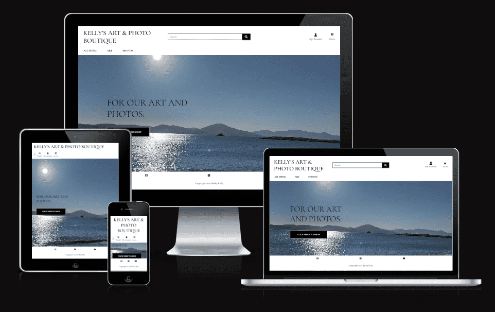
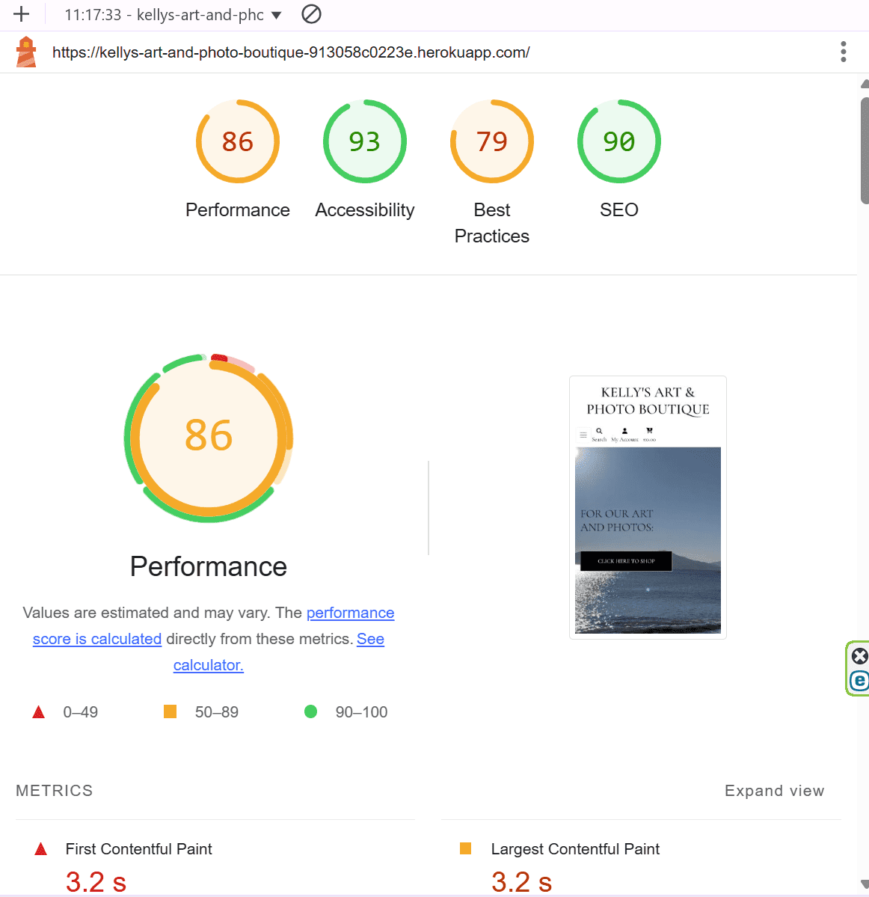
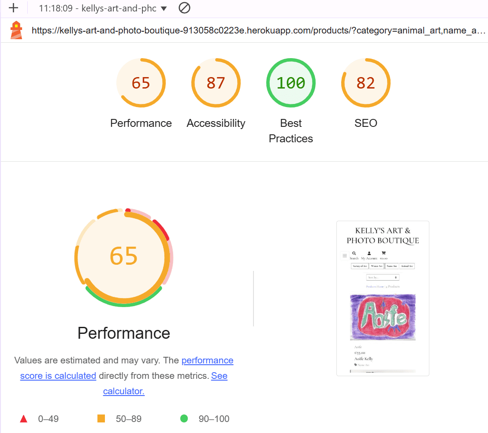
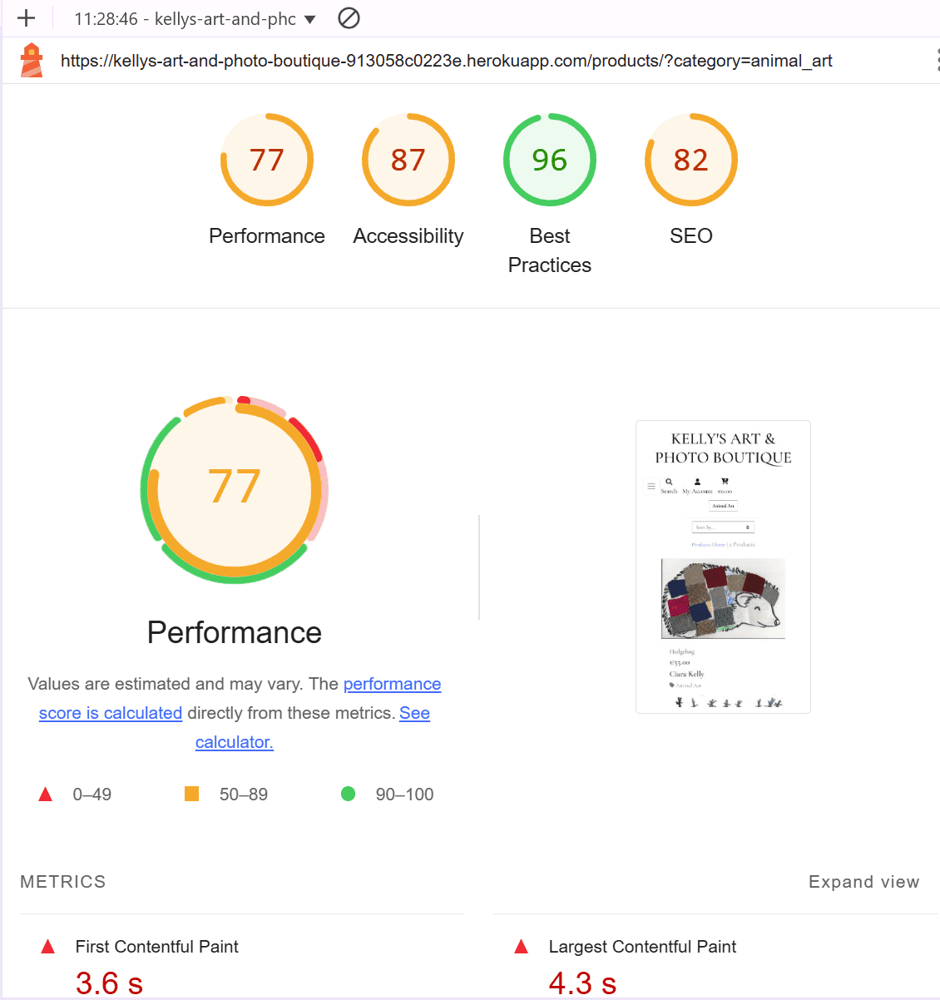
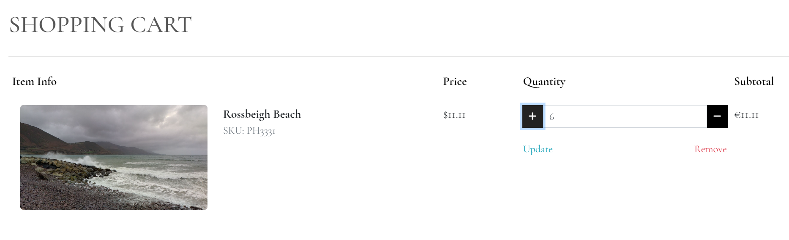
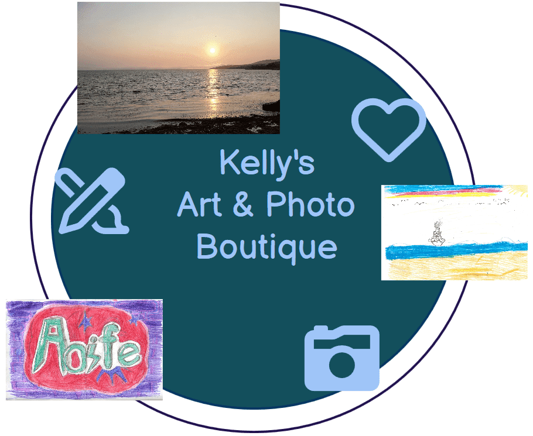

# Project 5 - Kelly's Art & Photo Boutique

This project is created as part of Code Institute's Software Development course.
Layout and code for this project is based on Code Institute's Walk-through project:
[Boutique Ado](https://github.com/Code-Institute-Solutions/boutique_ado_v1_sourcecode).

Kelly's Art & Photo Boutique has no commercial intention. 
Aim of this project was to create a site where various forms of Art and Photos are displayed,
and Site visitors may choose to purchase them (no real purchases).

Deployed site: [Kelly's Art & Photo Boutique](https://kellys-art-and-photo-boutique-913058c0223e.herokuapp.com/)

Github: [link to github](https://github.com/BarbyKelly/project-5)

# Content
- [UX Design](#ux-design)
- [User Stories](#user-stories)
- [Features](#features)
- [Structure](#structure)
- [Testing & Validation](#testing--validation)
- [Deployment](#deployment)
- [References & Credits](#references--credits)
- [Acknowledgements](#acknowledgements)

# UX Design

## User Stories

### Admin can:

- Login
- Access 'Product Management' once logged in
- View 'My Profile'
- Logout

- Add, edit and delete products via django, or directly on website when logged in as Admin (via Product Management)
- Follow SKU system already in place: 
  dr333(add a unique number in the end) for art,
  ph888(add a unique number in the end) for photos

- Admin may change the SKU system if needed
- Admin may click on Shopping cart and see if admin has any products in the cart (for testing)
- Admin can create test purchases and delete them after
- Admin may click on all items on the website like other users

#### Future Features for Admin:

- System would suggest a new unique SKU, based on existing products

### Site User may:

- Click on Logo, which brings user to Home page (All Items)
- Click on NavBar links: All Items, Art, Photos
- Choose to have products displayed by Category, by Price, by Author, or All Items
- Select Art by: Animal Art, Name Art, Winter Art, Variety of Art, or All Art
- Choose photos displayed by: Beach, Rainbows, Animals, Sky, Variety of Photos, or All Photos
- Create an account
- Login with their username and password
- Click on My Account, My Profile, Logout, Cart
- View items in their cart
- Logout

#### Site User may not:

- Add, edit or delete products
- Access Product Management

#### Future Features for Site Users:

- Choose art based on what tools were used eg pencil, paint, water-color, marker
- Choose Art and photos based on seasons, celebrations
- See their Username displayed when logged in
- See their saved details under their account, including name and username
- Fill in Request Form, what type of Art or Photos they would love to see displayed
- 'How to ...' option in Nav Menu, where are selection of videos, articles, tips how to create certain art, 
  or how certain art pieces were created
- Live classes with Site Visitors, creating Art

[Back to the overview](#content)

### Deployments

- Ensure env.py is set up properly
- Check gitignore
- Set "DEBUG = 'DEVELOPMENT' in os.environ" in settings.py
- Login to Heroku
- Click on settings in the Menu
- Click on Reveal Config Vars
- Check if these look ok
- Click on Deploy in the main menu
- Scroll down to the end and click on Deploy Branch
- Once Heroku has finished deploying your app, "View app" appears at the bottom of the page
- Click on "View app"

[Back to the overview](#content)

## Wireframes

- Wireframes created with [Balsamiq](https://balsamiq.com/wireframes/)

### "All Items" (Homepage)

### "Click Here to Shop" page

### Art page

### Photos page

[Back to the overview](#content)

## Colors

- Base color (cornflower) for the website from: [Create.vista.com](https://create.vista.com/colors/color-names/cornflower/)

# Features

## Common Features
- **Navigation Menu**
    - All Items (Home page)
    - Art
    - Photos
  **On the right**
    - My Account
    - Cart 

### Future Navigation Menu Features:
    - Request Form
    - How to ... 
    - Sign Up
    - Sign In

### **Footer**
    - Copyright
    - Social Media links

## Homepage Features
- 

## Future Features

- Registered Site User may save items as their favourites, and see them under their profile

- If Registered Site User pauses their shopping, they can save the shopping cart items, and return next time

- Add an option to search Art and Photos by Holiday eg Easter, Christmas, Halloween

[Back to the overview](#content)

# Testing & Validation

- 

  validated with Google developer tools

- 

- 

- [Lighthouse test, All Photos](docs/readme_images/lighthouse_all_photos_opt_50.png)

- 

  validated with: [W3C Markaup Validation](https://validator.w3.org/)

- 

  validated with: [W3C Markup Validation](https://validator.w3.org/)

- 

  validated with: [codebeautify](https://codebeautify.org/jsvalidate)

## Bugs

- Images uploading mulitple times
- + - buttons not working correctly
- All products not entered into system, only images in Media folder
- Username not showing up when logged in
- And many more bugs, which due to time constraint are not listed here
- Can not add some products into the cart, as cart icon not visible for some products

## Fixed Bugs

- When developer clicked on any of Art or Photos nav-links, 0 items were displayed on all occassions, and NavLinks did not change color, 
therefore it was hard to know which tab was opened:

Developer took these steps to fix main-nav links:

1. Developer realised, in templates/main-nav.html, she had set up different categories for Art and Photos, than categories in categories.json or Django categories:

therefore, Art and Photos categories couldn't display, under Art and Photos NavLinks

2. Developer matched categories in main-nav with Django categories and categories.json

3. Art and Photos displayed now correctly, except for Beach Photos.
None of the 'Beach Photos' were displayed. Developer noticed 'beach-photos' instead of expected: 'beach_photos' in Django Categories:

Developer fixed the category name from 'beach-photo' to 'beach_photo', then Beach Photos were displayed on the website as expected:

4. Developer removed 'photo' from selection of photo titles to make wording look better on the screen (previously: 'Beach photo' title displayed for one photo, and 'Beach photo' displayed for more than one photo, instead of 'Beach Photos')

5. Developer updated all of the new names/titles for Art and Photos in main-nav.html, categories.json, and Django Categories. 

6. 'Sky' photos didn't display under 'All Photos'. Developer checked main-nav.html, and noticed sky_photos and animal_photos were still displayed in category, for 'All Photos'. Developer changed sky_photos for sky, and animal_photos for animal, and 'Sky' photos were displayed under 'All Photos' then.

### Fixed "django.core.serializers.base.DeserializationError: Problem installing fixture"

- Developer ran command: 'python manage.py loaddata categories' and "django.core.serializers.base.DeserializationError: Problem installing fixture..." appeared in the terminal.

- Earlier that day, tutor Oisin guided developer how to fix 'keyword: title' error, relating to json files

- Developer was able to follow similar steps to figure out the error:

- Developer broke down terminal error messages into 3 main (puzzle) pieces, to understand where was the error located:

#### Keyerror: author:

#### No field_name author:

#### Fixtures categories.json:

- Developer had been focusing on field 'author' in categories.json file. Seeing 'author' is in categories.json file, so why would it come up as an error, 'no field_name author'

- After looking at these 3 parts of terminal messages, and checking out fields in Django for Adding 'Categories':

#### Django Add Categories:

developer realised issue was that categories.json had a field 'author', while in admin.py/Django categories there was no 'author' field set up

- Developer removed 'author' field from categories.json and 'python manage.py loaddata categories' command worked then ok:

- Fixing this bug/error was a great lesson for the developer, she learned how to better understand Terminal messages, and saw more value in them

- This error/bug also helped Developer to realize, she had added products to Django and hadn't updated categories.json accordingly, to reflect
changes made via Django Products.

- Product amounts were not updating in the basket: 
developer adjusted 
 and 
 in cart.html. 

Developer was able to update the amount of certain products in the cart, yet couldn't increase or decrease products when putting it into cart:

Button still didn't work, after adusting cart.html, or quantity_input_script.html:

Arrows up and down in Quantity box, worked ok, and increased or decreased Quantity as needed, and Subtotal accordingly.

 
- nothing in the cart when clicking on add to cart

- cart shows €0.00 on the website, but when you click to open the cart, it has items in

- Plus and minus buttons would not work, when developer tried to adjust item quantities in the cart. 
  Developer could only increase the item quantities with arrows:

  

  Developer thought issue is in base.html, scripts must be not correct. As plus and minus buttons had worked when she followed Boutique Ado walk-through for her walk-through project.
  Developer used [Diffchecker](https://www.diffchecker.com/) to compare her project 5's code vs Boutique Ado walk-through lesson,
  and then compared the script codes vs the Boutique Ado version that had worked for the developer:

  

  Developer went back to lesson "Base Template Part 1":

  

  to see where she may have made an error. Developer found that she had used the updated code when she created her walk-through project, but had used different version of code for project 5.

  Developer adjusted block corejs code in her project 5, to match the one that worked for her walk-through project. This fixed the error. Plus and minus buttons were fixed, developer was able to increase or decrease the number of particular item in the cart with plus and minus buttons:

  

  - Developer noticed how "All Photos" and "All Art", showed 0 items, while "All Items" displayed all items. She couldn't find 
    what was causing the error. Developer's coursemate Patrick Hladun found an error: two of the product categories had the same "pk":9 
  

    Developer fixed conflict between pk numbers, and used  to help her to fix rest of categories.json, as "author": "author" was missing under pk:1, and pk:6 "author": "author" was missing one of these: '}':
    
    
    
    After fixing these errors, json file validation worked as expected:

  

- Developer noticed Logo had 'Art', while NavLinks had 'Drawings'. Developer replaced 'Drawing' with 'Art' in fixtures: categories.json, in django categories, and in index.html (Home page), and in main.nav html (templates), and then 'Art' was displayed instead of 'Drawings':

### Known Bugs

### Forking the repository

- Go to [Github](https://github.com/)
- If you want to fork one of your own repos, then DO NOT login under your own name, as fork option is not available

- Search Github or Google for the repo that you would like to fork
- Open the repo you want to fork
- On the same line as the Repo's name, on the right, click on the arrow beside the Fork
- Click on: + Create a new fork

- Choose a name for the repo
- Add description if you desire
- Choose if you want to Copy the main branch only
- Click on: "Create fork"

### Creating the repository

- Code Institute's [template](https://github.com/Code-Institute-Org/ci-full-template) was used to set up this project.
- After clicking on the above template link, click on the green button: "Use this template"
- From there choose: "Create a new repository"
- Fill in "Repository name" with your desired name for the project
- Leave the project Public like the default setting (for Code Institute projects)
- Click on the green button "Create repository"

[Back to the overview](#content)

# References & Credits

## Code:

- Code for Kelly's Art & Photo Boutique is based on Code Institute's Walk-through project ["Boutique Ado"](https://github.com/Code-Institute-Solutions/boutique_ado_v1) 
The developer has credited Walk-through mainly on top of html files, 
due to enourmous number of other files, which are all coded similarl to Walk-through project.

## README:

- General README template derived from developer's Project 4 [BookBlog](https://github.com/BarbyKelly/blog). README for BookBlog was based on: [findMEreadME](https://github.com/brodsa/findMEreadME/blob/main/README.md#content)

## Icons:

- Free Icons for Search and Social Media, from: [fontawesome.com](https://fontawesome.com/search?ic=free)

## Logo:
- As Kelly's Photo & Art Boutique displays Art made by the developer's kids, the developer asked her kids to come up with a logo. 
Website's Logo was designed by developer's 10 year old daughter Aoife. With developer's guidance, Aoife used Balsamiq Wireframes to create the Logo by herself. Aoife chose colors based on Developer's wish for 'cornflower blue'.
Developer used  to check and slightly adjust contrast of colors. And together, developer and Aoife chose icons for Logo. Developer adjusted the layout of the Title on the Logo. Developer's 6 year old daughter Ciara watched every step, and gave her approval.
Logo has Aoife's art work, Ciara's art work, and photo by the developer. 
Website's finalised logo:

## Font:
- Developer read [this article](https://webflow.com/blog/professional-fonts?utm_source=google&utm_medium=search&  utm_campaign=SS-GoogleSearch-Nonbrand-DynamicSearchAds-Tier4&utm_term=dsa-1480385100845___703207072761__&gad_source=1&gclid=Cj0KCQjwzva1BhD3ARIsADQuPnUfvRW_kuHUD-8GkB-9fEIf5ugmRlHpgHIsqWgaPlIm8EvOsCXomWIaAtElEALw_wcB) to figure out which font to use

- Code for "Cormorant Garamond" font from [Google Fonts](https://fonts.google.com/selection/embed)

## am I responsive:

- Responsiveness test/image created with: [am I responsive](https://ui.dev/amiresponsive)

## Wireframes:

- Wireframes created with [Balsamiq](https://balsamiq.com/wireframes/)

## Images

- All of the photos used for the website, were taken by the developer

- All of the Art was made by developer's kids, at school, preschool, in art class, or at home

- Images optimized with [Simple Image Resizer](https://www.simpleimageresizer.com/resize-image-to-50-kb)
  All converted images have 'opt' in the name to show they were optimized

[Back to the overview](#content)

# Acknowledgements

- Developer is grateful for any guidance and support provided by her family and friends, mentor, facilitator, tutors, Slack members, 
  Coursemates, and online content creators.

- Special thank you to developer's daughters Aoife and Ciara, for allowing their beautiful art to be part of this e-commerce       
  project, and for creating a unique Logo

- Developer understands the importance of hiding Secret Keys. Mentor Lauren-Nicole Popich suggested to mention in README, that  
  secret key was visible at the start of the project, as the developer was following the steps from Boutique Ado walk-through.
  Developer changed the key and hid it, as advised by her mentor.

[Back to the overview](#content)