# Project 5 - Kelly's Art & Photo Boutique

[Kelly's Art & Photo Boutique](https://kellys-art-and-photo-boutique-913058c0223e.herokuapp.com/) was created as part of Code Institute's project,
for Diploma in Full Stack Software Development (E-commerce Applications) course.

Developer mainly based her project on Code Institute's Walk-through:
[Boutique Ado](https://github.com/Code-Institute-Solutions/boutique_ado_v1_sourcecode).
 
Aim of Kelly's Art & Photo Boutique:
- built for educational purposes only
- to create a Site where selection of Art and Photos are displayed
- sharing Art made by Developer's kids, and Photos taken by the Developer
- option for Site users to browse products, search and choose products
- test out purchasing products (without real transactions)
- option to Sign up and Sign in
- check out 'How To...?" videos with art lessons by selected YouTubers
- sign up for a Newsletter
- fill in a Contact form

This website has no real-time commercial intention.
No real orders, payments or deliveries.

Deployed site: [Kelly's Art & Photo Boutique](https://kellys-art-and-photo-boutique-913058c0223e.herokuapp.com/)

Github: [https://github.com/BarbyKelly/project-5](https://github.com/BarbyKelly/project-5)

Responsiveness test results created with [Canva.com](https://www.canva.com/mockups/collection/)

- Disclaimer: due to late changes to website design, and finding new time-consuming errors,
  parts of README reflect   previous versions eg future features may already be in place. And previous bugs may be already fixed.
  - Not all README images and links have been checked this time to see if they work or match the updated version,
    due to late changes and time constraint.

# Contents

[Business Model for Kelly's Art & Photo Boutique](#business-model-for-kellys-art--photo-boutique)
- [Direct Audience](#direct-audience)
- [Indirect Audience](#indirect-audience)

[User Experience](#user-experience)
- [User Stories](#user-stories)

[Wireframes](#wireframes)

[ERD, SEO and Marketing](#erd-seo-and-marketing)
- [ERD](#erd-seo-and-marketing)
- [SEO](#seo)
- [Marketing](#marketing)

[Design](#design)
- [Images](#images)
- [Color](#color)
- [Font](#font)

[Features](#features)
- [Existing Features](#existing-features-mobile-first-approach)
- [Future Features](#future-features)

[Languages Used](#languages-used)

[Sites, Apps Used](#sites-apps-used)

[Validation](#validation)
- [Lighthouse](#lighthouse)
- [HTML](#html)
- [CSS](#css)
- [JS](#js)
- [Python](#python)

[Testing](#testing)

[Bugs](#bugs)
- [Fixed Bugs](#fixed-bugs)
- [Known Bugs](#known-bugs)

[Deployment](#deployment)

[Forking Repository](#forking-repository)

[Creating Repository](#creating-repository)

[Credits](#credits)

[Acknowledgements](#acknowledgements)

# Business Model for Kelly's Art & Photo Boutique

## Direct Audience

The following groups are considered Direct Audience, as they are most likely to purchase, commission or order products from Kelly's Art & Photo Boutique:
  
  - Online Users searching for:
    - Original Art (e.g., Name Art, Seasonal Art such as winter, Animal Art etc.) 
    - Children's Art
    - Handmade Art
    - Photos (e.g., Sky, Beach, Animals, Rainbows, Variety etc.)

  - Educational Institutions: 
    - Schools and higher education providers seeking examples of art/photos or decorations for their institutions
    - Crèches and preschools incorporating childrens' art into projects

  - Healthcare and Care Homes:
    - Nursing homes and healthcare Practices searching for artwork or photos for waiting rooms, wards,
      and community spaces
    - Clinics and treatment areas where children and adults are tested or treated, to create a brighter more welcoming, 
      more homely/relatable atmosphere, and maybe inspire patients

  - Treatment Centers, Therapists:
    - Looking for artwork or photos to enhance the ambiance of the waiting rooms, therapy areas or playrooms, sensory sections

  - Hospitality and Accommodation Providers:
    - Restaurants, cafes, hotels, B&B's, Airbnb's, searching art or photos for specific ambiance
  
  - Individuals, couples, families, friends:
    - People seeking handmade and original gifts for variety of occasions eg graduation, first school day, birthday, anniversary, just to say 'Thank you'

  - Beauty and Spa businesses:
    - Salons, spas, wellness centers, looking for certain type of Art/Photos to complement their relaxing atmosphere

## Indirect Audience

Groups that are influenced by the display or recommendation of the products made by Kelly's Art & Photo Boutique:

- Business owners and interior designers:
  - Seeing products of Kelly's Art & Photo Boutique displayed in someone's living space, business,
    accommodation, Healthcare Provider, in Educational institution
  
- Visitors, friends, guests:
  - Individuals or groups exposed to art and photos in homes, schools, hospitality and accommodation places,
    hospitals, nursing homes, businesses, may be interested in requiring art from Kelly's Art & Photo Boutique

- Influencers and Promoters:
  - Influencers or Promoters, who share or recommend products from the boutique, on social media, blogs, 
    local networks, sharing boutique's reels/page

[Back to Business Model](#business-model-for-kellys-art--photo-boutique)

[Back to Contents](#contents)

# User Experience

## User Stories

Users may opt to tap, click, hover, open, fill various items listed below:

### Navbar

- **Logo**
  - Click **Logo** (to bring them back to Home Page or refresh Home Page)

- **Home**
  - Click **Home** NavLink to get back to Home page or to refresh Home page.

- **Art**
  - Hover on Art NavLink (on larger screens) for Art dropdown menu to be displayed
  - Click Art NavLink which opens up Art page with all of the Art available in the Boutique
  - Choose to click any item in dropdown menu, to select Art by specific category
  - Hover on badges (for all screen sizes) to highlight any badge that pointer is on
  - Click badges to choose an Art category
  - Choose to sort Art by Price, Name, Author, or Category
  - Select Art by: Animal, Name, Winter, or Variety

- **Photos**
  - Hover on Photos NavLink (on larger screens) for Photos dropdown menu to be displayed
  - Click Photos NavLink, which opens up Photos page with all of the Photos available in the Boutique
  - Choose to click any item in dropdown menu to select Photos by specific category
  - Hover on badges (for all screen sizes) to highlight any badge that pointer is on
  - Click badges to choose particular Photos category
  - Choose to sort products by Price, Name, Author, or Category
  - Select Art by: Animal, Name, Winter, or Variety
  - Choose photos by: Beach, Rainbow, Animal, Sky, or Variety

- **How To...?**
  - Click **How To...?** NavLink, to access 'How To...?' page
  - Select any of the YouTube links to watch by clicking on them
  - YouTube videos opening up in the new tab, leaving Kelly's Art & Photo Boutique's open in a previous tab

- **Newsletter**
  - Click **Newsletter** NavLink to open up Newsletter page with form
  - Fill in the form (email only) to sign up for Boutique's Newsletter
  - Click **Back to Boutique**
  - Click **Subscribe** to subscribe to the Newsletter

- **Contact Us**
  - Click **Contact Us** NavLink to open up 'Contact Us' page
  - Fill in form to contact Boutique
  - Click **Back to Boutique**
  - Click **Submit Contact Form**

- **User Icon**
  - Click **User Icon**, to access **Sign In** or **Sign Up**

    - **Sign In**

    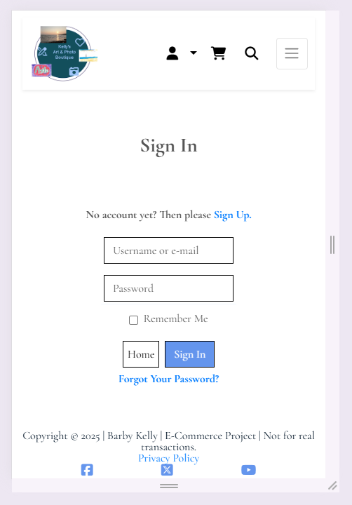

      - Click **Sign In** to access 'Sign In' page with a Sign In Form
      - Click link: **Sign Up**
        - Where Users can create an account
        > Detailed **Sign Up** form features and testing available in [testing.md#sign-up-page-testing](testing.md#sign-up-page-testing) 
      - Fill the 'Sign In' form

      - **Sign In form**
        - Fill in **Username or Email**, and **Password**:
        - Tick **Remember Me** box:
        - Click **Home** button to return to Home page
        - Click **Sign In** button to sign in:
        - Click **Forgot Your Password?**:
            - Fill in **Password Reset** form:
              - Click **Reset My Password**
              - Click **Back to Sign In** button
              > Detailed **Sign In** form features and testing available in [testing.md#sign-in-page-testing](testing.md#sign-in-page-testing)

    - **Sign Up**

      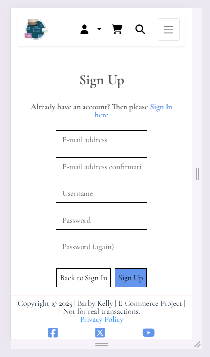

      - Click **Sign Up** to access 'Sign Up' page and 'Sign Up' form:
      - Click **Sign In here**
        > Detailed **Sign In** form features and testing available in [testing.md#sign-in-page-testing](testing.md#sign-in-page-testing)
      - Fill the 'Sign Up' form
        - **Sign Up** form
          - Fill in E-mail address, E-mail address confirmation, Username, Password and Password (again)
          - Opt to click 'Back to Sign In' button to return to 'Sign In' form
          - Click 'Sign Up' button to Sign Up
          > Detailed **Sign Up** form features and testing available in [testing.md#sign-up-page-testing](testing.md#sign-up-page-testing) 

- **Cart**
  - Click **Cart** NavLink to open Shopping Cart page
    - Click **Back to Shopping** if no items in the cart
    - Click **Proceed to Secure Checkout** in the pop-up, after adding an item into the cart:

    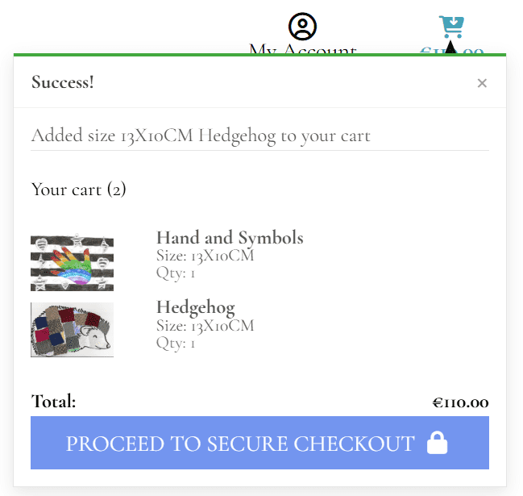

    - Click **Continue Shopping**
    - Click **Secure Checkout**

    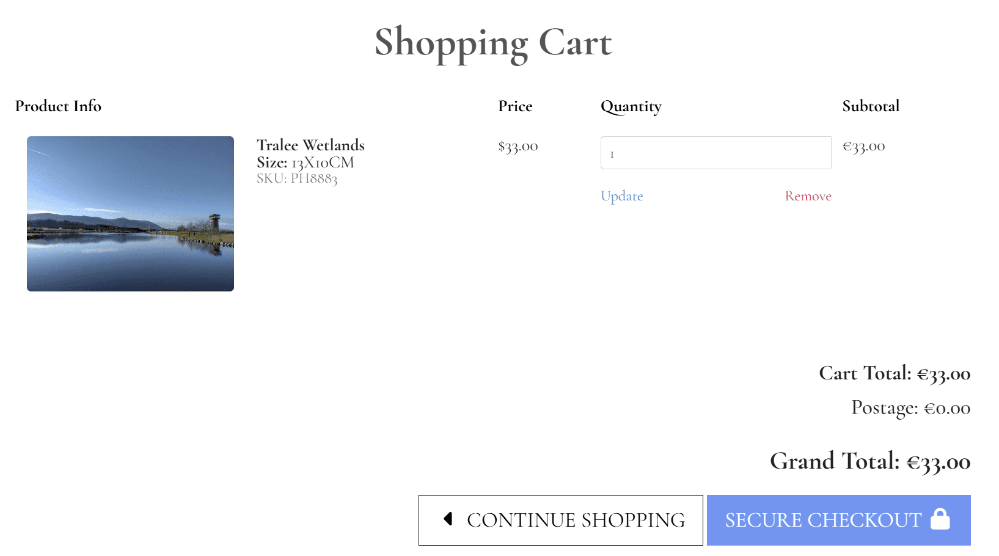

- **Search Icon/Search Form**
  - Click **Search Icon** to open up Search Form
  - Type in Search Form
  - Click Blue Search Icon (part of the form) or press Enter, to start search
  - Search Art and Photos in the Boutique with keywords eg 'rainbow':

    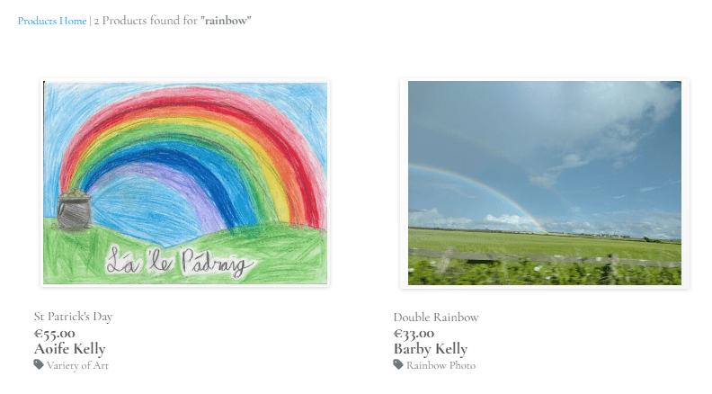

  - Click Blue Search Icon (part of the form) or press Enter, without typing in Search Form
    - Use 'x' in top right corner to close Error alert, when Search Form was left empty
  - Click Search Icon in the Navbar to close Search Form

- **Burger Icon/Menu** (on smaller screens)

  - Click Burger Icon to open dropdown menu
  - Choose any of the items from the dropdown menu and click them

- **User** who is not an Admin of Kelly's Art & Photo Boutique, **may not**:
  - Add, edit or delete products
  - Access Product Management
 
- **Users once signed in** may:
  - Notice a pop up: "Success! Successfully signed in as ..." displayed on top right
  - Access 'My Profile' via 'My Account'
  - Under their profile Update their Default postage information
  - See their Order History
  - Sign Out by clicking on 'Sign Out' under 'Sign In' tab

- **Extra permissions for An Admin**
  Admin may:
  - Access 'Product Management' once signed in
  - Add, edit and delete products via django, or directly on website when logged in as Admin (via Product Management)
  - Follow SKU system already in place: 
    dr33(add a unique number in the end) for Art,
    ph88(add a unique number in the end) for Photos

  - Admin may change the SKU system if needed
  - Admin may click Shopping cart and see if admin has any products in the cart (for testing)
  - Admin can create test purchases and delete them after
  - Admin may click all items on the website like other users

- **Footer**
  - User may click **Privacy Policy** to open it up
  - May click **Social Media** icons to open up their home pages

[Back to User Experience](#user-experience)

[Back to Contents](#contents)

# Wireframes

Wireframes created with [Balsamiq](https://balsamiq.com/wireframes/)

Disclaimer: There may be variations between Wireframes and the finished project.

## Home Page

## All Items Menu

## Art Menu

## Photos Menu

[Back to Wireframes](#wireframes)

[Back to Contents](#contents)

# ERD, SEO and Marketing

## ERD

ERD is created as a visualization of the Kelly's Art & Photo Boutique's database structure.

- ERD steps learned from: [LucidChart Tutorial: How to Create an ERD](https://youtu.be/RBZtPhZkUZM?feature=shared)

- [LucidCharts](https://www.lucidchart.com/pages) used to create ERD

- Disclaimer: There may be variations between ERD and the finished database structure of the project.

  

[Back to Contents](#contents)

## SEO

- SEO tests helped Developer to see robots.txt file was not ok.
  With tutors help, developer fixed robots.txt and sitemap.xml

- Google Lighthouse tests helped Developer to improve SEO score.

[Back to Contents](#contents)

## Marketing

### Facebook Mockup

- Developer set up Facebook Mockup to show how the website would look on Facebook:

  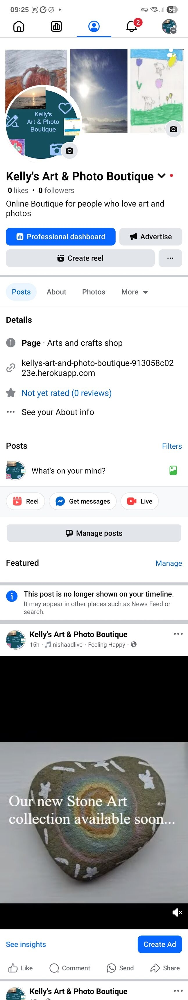

### Facebook Reel

- Developer created a [Facebook Reel](https://youtu.be/F123AhI8RGA), with Stone Art,
  to show one of the options how she would advertise the arrival of a new  collection:

  All of the displayed stone Art in the Reel, was created by Developer's daughter Aoife, age 10

  Disclaimer: Reel is demonstrated via YouTube, in case sample business page for Facebook is taken down by Facebook 

[Back to ERD, SEO and Marketing](#erd-seo-and-marketing)

[Back to Contents](#contents)

### Keyword Research

- Developer used keywords suitable for the project eg photo, art, boutique, shop, handmade, original, Kelly's Art & Photo Boutique, gifts, décor

[Back to ERD, SEO and Marketing](#erd-seo-and-marketing)

[Back to Contents](#contents)

### Similar Businesses

- Developer found the following businesses relevant to her sample business:

  [Gallerix.ie](  https://gallerix.ie/)

  [JamArtFactory.com](https://jamartfactory.com/)

  [Kids and Art](https://kidsandart.org/store-artwork/)

  >To date Developer did not come across a website with same combination as hers: parent's photos and their kids' art in one online shop.

[Back to ERD, SEO and Marketing](#erd-seo-and-marketing)

[Back to Contents](#contents)

# Design

## Images

- **Background** image by the Developer

- **Logo** created together with Developers kids, by using Wireframe and Developer's photo and her kids art:

  

## Color

- Base color **cornflower** for the website from: [Create.vista.com](https://create.vista.com/colors/color-names/cornflower/)

## Font

- From [Google Fonts](https://fonts.google.com/)

  - Main font: **Cormorant Garamond**

  

[Back to Contents](#contents)

# Features

## Existing Features (mobile-first approach)

- **Favicon**

  - Favicon displayed in the browser tab for Kelly's Art & Photo Boutique:

    

- **Navigation Menu**
  - **Navbar**
    - Global navigation appearing on all pages, consisting of:
      - **Logo**:
        - Clicking **Logo** returns user to the **Home** page or refreshes it if already on it
      - **User Icon**:
        - With **Sign In** and **Sign Up** options
      - **Cart**
      - **Search**:
        - Allows Users to search for Products
        - Search Icon displayed on all screen sizes
  
          

        - Clicking the Search Icon opens the Search Form below the Navbar:

          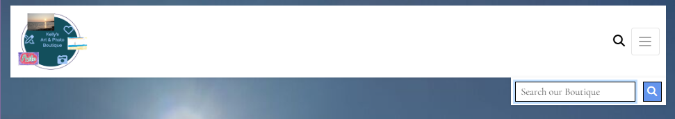

        - Keyword search supported     
        - Empty search results display:
          - All Products
          - Error message near Search Icon: "Search criteria not entered!"
      
      - **Burger Menu**:
        - Dropdown menu of NavLinks
        - On larger screens, NavLinks are displayed instead of the Burger Menu
      - Hovering effect for all Navbar items and dropdowns

- **Footer**:
  - Copyright (year of the project)
  - Developer's name
  - Project type
  - Disclaimer: No real transactions
  - Clickable **Privacy Policy**, opens Privacy Policy in a new tab
  - Social Media links:
    - Clickable **Facebook**, **Twitter** and **YouTube** links: open respective pages in a new tab
      (general pages, not personalised for website)

### Home Page

- Displays all of Boutique's Art and Photos
 
[Back to Features](#features)

[Back to Contents](#contents)

### Art

- **Page Navigation**
  - Hovering effect for Art NavLink (on larger screens) displays dropdown menu of Art categories:
    - Animal Art, Name Art, Winter Art, Variety of Art
  - Clicking Art opens page with all Art

- **Badges**
  - Displayed below Navbar for all Art or selected category
  - Clickable to filter products by category

- **Sorting**
  - 'Sort by' option displayed on the right below badge(s):

    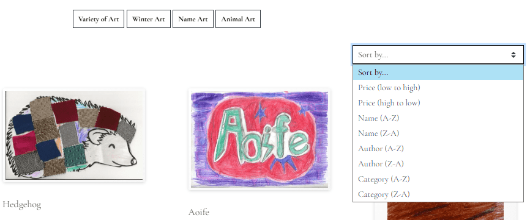

  - Sorting options: Price, Name, Author, Category

- **Product Cards**
  - On hover, pointer appears and product is raised up to highlight which product is hovered 
  - Card includes: Image, Name, Price, Author, Badge
  - Click on card opens product page

- **Product Page**
  - Displays image, name, price in €, badge, author, description
  - Quantity input (1-50) with arrows and manual entry
  - Buttons:
      - **Continue Shopping**: returns User to all Products (Art and Photos)
      - **Add to Cart**: adds product to cart with selected quantity

[Back to Features](#features)

[Back to Contents](#contents)

### Photos

- All features and functionality are identical to [Art](#art), except for categories:

  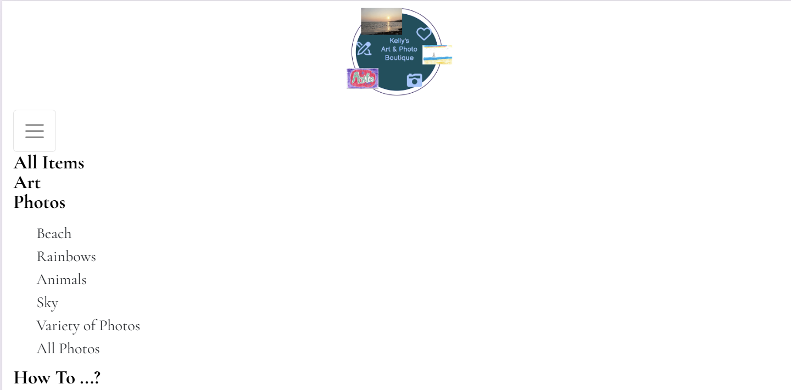

  - Beach, Rainbows, Animals, Sky, Variety of Photos

### How To...?

- 'How To...?' page displays links to various YouTube channels, showing different styles of doing art

  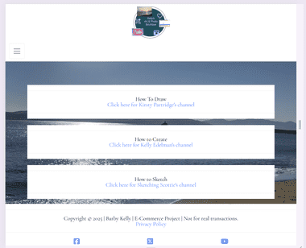

### Newsletter

  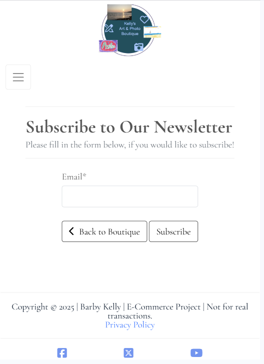

- Subscription form
- Email address field
- Click **Back to Shopping**
- Or click **Subscribe**

### Contact Us

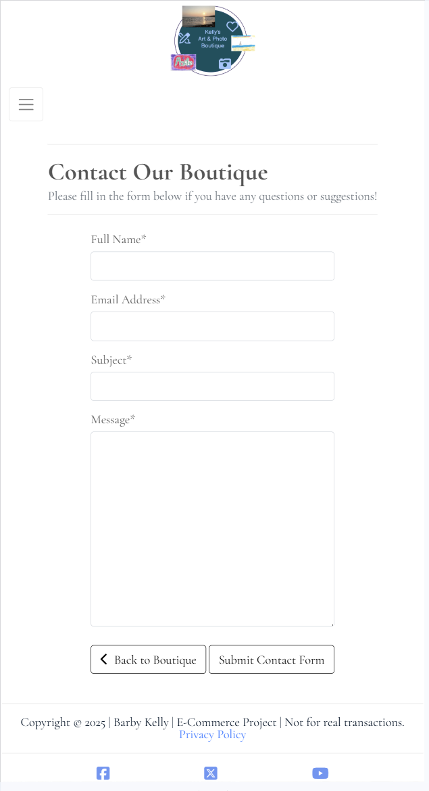

- Clickable **Contact Us**
- Contact Form
- Buttons:
  - **Back to Shopping**
  - **Submit Contact Form**

### User Menu
- **Sign In**

  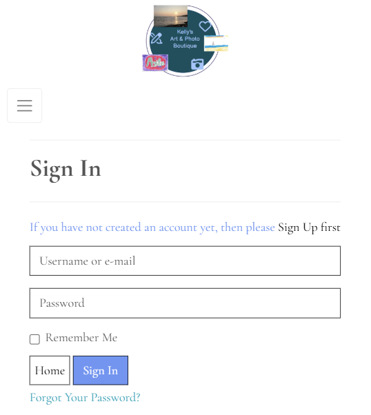

  - Displays **Sign In** form
  - Option to **Sign Up**
  - Buttons:
    - **Home**: returns User to Home page
    - **Sign In**: signs User in (if credentials are correct)
  - Option **Forgot Your Password?**, which opens:
    - **Password Reset** page:
      - Email address field
      - Buttons:
        - **Back to Sign In**: returns User to Sign In page 
        - **Reset My Password**: submits password reset request
  - **Username** displayed for signed in Users, with options:
    - **My Profile**: opens up User's Profile page
      - View and update default postage information
      - View order history
      - Button: **Update Information**
    - **Sign Out**: signs User out

  - **Admin Only** (additional permissions):
    - **Product Management**: add, edit and delete products

- **Sign Up**

  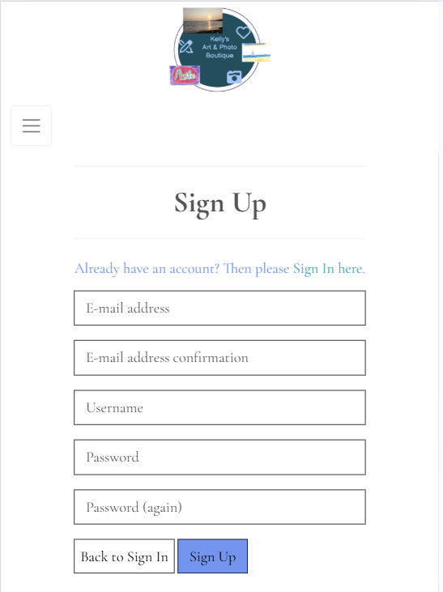

  - Displays **Sign Up** form
  - Option to **Sign In** if User account exist
  - Buttons:
    - **Back to Sign In**: returns User to Sign In page
    - **Sign Up**: register new account

### Cart

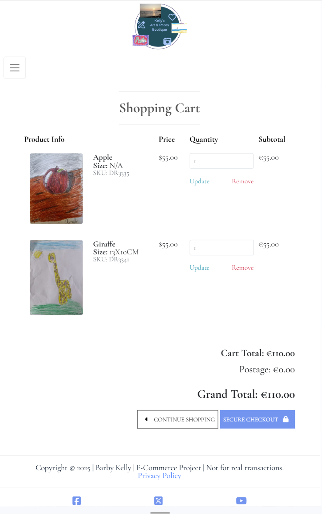

- Displays **Shopping Cart** page
- If cart is empty:
  - Message: **Your cart is empty**
  - Button **Back to shopping** brings User to all Products (Art and Photos)
- If item(s) in cart:
  - List of products with image, title, SKU, price, quantity, subtotal
  - Cart total, postage, and grand total
  - Buttons:
    - **Continue shopping**: returns User to all products
    - **Secure Checkout**: opens up Checkout page

  - **Checkout**
    - Accessible via Cart
    - Users can complete purchase (disclaimer: no real transactions, website for study purposes only)
    - Payment handled via Stripe integration
    - **Order Confirmation**
      - Accessible after completing checkout
      - Displaying order number, summary of purchased items, totals, and postage cost

[Back to Features](#features)

[Back to Contents](#contents)

## Future Features

- **Navigation & UX**

- Active menu item stays highlighted while open
- Option to Search the whole website, not just Products
- Min and Max quantity noted under the relevant field

**User Account Features**
- Registered Site Users may save items for later, or mark as favorites
- Registered Users notified of saved cart items on their return
- Alert before User clicks 'Update Information'
- Prevent from updating when required fields are empty
- Users can Sign Up and Sign In via social media links, Google account and similar
- Improved 'Order History' layout under 'My Account'
- Google Pay, PayPal
- Only downloadable products (which would change the target audience, and marketing)

**Products & Filters**

- Improved product descriptions (removal of unnecessary #'s)
- Search products by special celebrations/occasions
- Filter products using multiple criteria eg Stone Art - Birthday - Age 5
- Filter art based on tools (pencil, paint, water-color, marker, paper, stone, canvas)

**Other Features**
- Live classes with Site Visitors, creating Art, discussing techniques, sharing ideas
- 'How To...?' page to include videos related to Photos, Photography, Art lessons by kids
- Admin: System would suggest a new unique SKU, based on existing products, when Admin is adding a new product
- Admin: option to update prices in bulk for similar products
- 'About' app added to share details about creators, optionally painted images of each creator.

[Back to Features](#features)

[Back to Contents](#contents)

# Languages Used

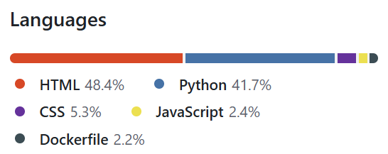

- HTML
- Python
- CSS
- JavaScript
- Dockerfile

[Back to Contents](#contents)

# Sites, Apps Used

Developer used the following Sites/Apps to create Kelly's Art & Photo Boutique:

- [Code Institute](https://codeinstitute.net/)
- [GitHub](https://github.com/)
- [Gitpod](https://www.gitpod.io/)
- [VS Code](https://code.visualstudio.com/)
- [Django](https://www.djangoproject.com/)
- [Heroku](https://www.heroku.com/)
- [Balsamiq Wireframes](https://balsamiq.com/wireframes/)
- [AWS](aws.amazon.com)
- [Stripe](https://stripe.com/)
- [YouTube](https://www.youtube.com/)
- [Simple Image Resizer](https://www.simpleimageresizer.com/)
- [Diffchecker](https://www.diffchecker.com/)
- [Favicon](https://favicon.io/favicon-converter/)
- [Font Awesome](https://fontawesome.com/icons)
- [Chat GPT](https://chatgpt.com/)

  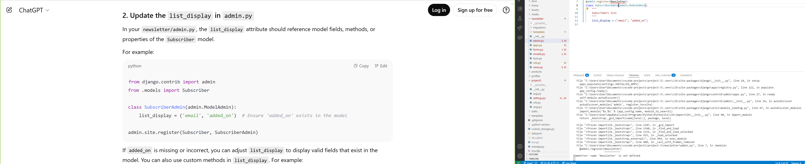

[Back to Contents](#contents)

# Validation

**Lighthouse**

- Lighthouse scores improved after adding lazy-loading for product images, and limiting the number of products displayed on the Home page
- After changing Home page for (Products)Home page, Lighthouse scores declined slightly, as Home page now included images of all the products

- Due to time constraints, Developer did not further optimize performance after the last test

  

## HTML

- HTML validation completed with [W3C Markup Validation](https://validator.w3.org/)
- To validate Django HTML templates, the Developer disabled filters in the W3C validator,
  because templates inherit from base.html.
  Therefore each HTML page would not have 'DOCTYPE', lang="en", which triggers false validation errors

  

## CSS

- CSS validator validation with [W3C Markup Validation](https://validator.w3.org/)
- Similar to HTML validation, the Developer turned off filters when validating CSS,
  to reduce false validation errors
  
  

## JavaScript (JS)

- JS files were linted using ESLINT and [jshint.com](https://jshint.com/)
- Initially with ESLint v9, then reverted to v6 for compatibility
- With ChatGPT's guidance .eslintrc.json configuration file was added, to improve testing efficiency:

  
  
- As guided, Developer ran:

  "$ npx eslint . --fix"

- Final testing showed no JS errors:

  
  
[Back to Validation](#validation)

[Back to Contents](#contents)

## Python

- Developer checked selected Python files using [CI Python Linter Test](https://pep8ci.herokuapp.com/)

  

- All tested files passed without major issues, and mainly indentation adjustments were needed

[Back to Validation](#validation)

[Back to Contents](#contents)

# Testing

Testing is reported in a separate [TESTING_RESULTS.md](TESTING_RESULTS.md) file.

# Bugs

## Fixed Bugs

**NavLinks (Art & Photos)**

- Issue: Clicking Art or Photos NavLinks, displayed 0 items, and NavLinks did not change color,
  therefore it was hard to know which tab was open.
- Reason: Categories in main-nav.html did not match categories in categories.json and Django categories:

  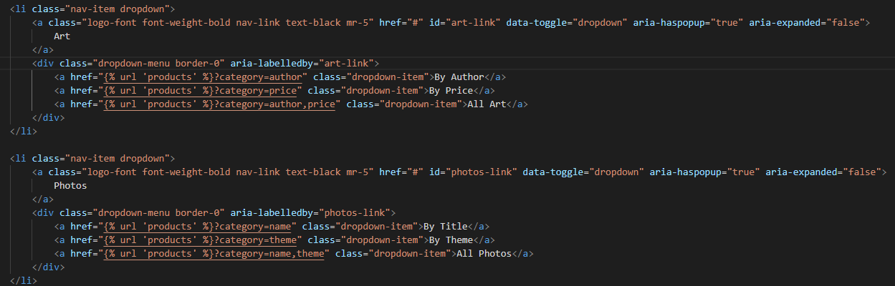

  

- Fix:
  - Matched categories in main-nav with Django categories and categories.json
  - Fixed 'beach-photos' vs 'beach_photos'
  - Updated titles for Art and Photos
- Result: Art and Photos displayed correctly.

**Sign In Menu**

- Issue: when logged in as an Admin, 'Sign In' remained visible in Navbar, and all of the options for Admin were displayed at all times:

   

- Cause: Located in main_nav.html with guidance from ChatGPT, template was always rendering 'Sign In', signed in or not:

- Fix: Adjusted styling for Navbar/NavLinks

- Result: when Admin was signed in:
  - 'Sign In' NavLink was no longer displayed,
  - Username replaced 'Sign In' NavLink,
  - Options for Signed In Admin were available via dropdown menu
  - 'Sign Up' was no longer displayed for Signed in User/Admin

**Fixture Load (django.core.serializers.base.DeserializationError: Problem installing fixture)**

- Issue: Running 'python manage.py loaddata categories' produced "django.core.serializers.base.DeserializationError: Problem installing fixture..." in terminal
- Cause: categories.json had a field 'author', while in admin.py/Django categories there was no 'author' field set up.
- Fix: Removed 'author' field from categories.json and 'python manage.py loaddata categories'
- Result: command worked ok then

**Cart - qty update issue**

- Issue: Product quantities were not updating accurately in the Cart.
  Cart showed €0.00, when it had items in it.
  Plus and Minus buttons didn't work, only Quantity box arrows responded to increase/decrease in Quantity 
- Cause: Incorrect placement of 
 and 
 in cart.html,
  and outdated JavaScript logic in the Cart quantity script
- Fix: 
  - Compared the project's vs Boutique Ado walk-through:

    

  - Replaced the old block corejs with the working version from the walkthrough 
- Result: Plus and minus buttons worked as expected, updating quantities correctly

[Back to Bugs](#bugs)

[Back to Contents](#contents)

## Known Bugs

- **Order Number**
  - The numeric part of the Order Number appears smaller font than the letters on:
    - Order Details page, and 'Success!' pop up: 

    

- **Product Details Page**
  - Buttons are not centered on any screen sizes
  - Product card appears too wide on tablet screens (around 767px and below)
  - Project is mobile-first. Media Queries were primarily written using max-width, which caused slight layout issues
  - Due to time constraints, CSS was not fully adjusted suit background image on all pages

- **404 Page Styling**
  - No background-color box
  - Button green (success) instead of blue to match website.

[Back to Bugs](#bugs)

[Back to Contents](#contents)

# Deployment

- Ensure env.py is set up properly
- Check gitignore
- Set "DEBUG = 'DEVELOPMENT' in os.environ" in settings.py
- Login to Heroku
- Click on settings in the Menu
- Click on Reveal Config Vars
- Check if these look ok
- Click on Deploy in the main menu
- Scroll down to the end and click on Deploy Branch
- Once Heroku has finished deploying your app, "View app" appears at the bottom of the page
- Click on "View app"

[Back to Contents](#contents)

# Forking Repository

- Go to [Github](https://github.com/)
- If you want to fork one of your own repos, then DO NOT login under your own name, as fork option is not available

  

- Search Github or Google for the repo that you would like to fork
- Open the repo you want to fork
- On the same line as the Repo's name, on the right, click on the arrow beside the Fork
- Click on: + Create a new fork

- Choose a name for the repo
- Add description if you desire
- Choose if you want to Copy the main branch only
- Click on: "Create fork"

[Back to Contents](#contents)

# Creating Repository

- Code Institute's [template](https://github.com/Code-Institute-Org/ci-full-template) was used to set up this project.
- After clicking on the above template link, click on the green button: "Use this template"
- From there choose: "Create a new repository"
- Fill in "Repository name" with your desired name for the project
- Leave the project Public like the default setting (for Code Institute projects)
- Click on the green button "Create repository"

[Back to Contents](#contents)

# Credits

**Code/Base Projects**

- Main code for Kelly's Art & Photo Boutique is based on Code Institute's Walk-through project
  ["Boutique Ado"] (https://github.com/Code-Institute-Solutions/boutique_ado_v1) 
- Other helpful projects:
  - ["Seaside Sewing by Kera Cudmore](https://github.com/kera-cudmore/seaside-sewing)
  - ["Vegan Sneaker Store by Denis Klopotan](https://github.com/denisklopotan/vegan-sneaker-store/)
  - [Chirpy Chooks by Kay Welfare](https://chirpy-chooks.herokuapp.com/)

**README**

- Template derived from developer's Project 4 [BookBlog](https://github.com/BarbyKelly/blog) and
  Project 2 ["Estonia Quiz" README](https://raw.githubusercontent.com/BarbyKelly/Estonia-Quiz/refs/heads/main/README.md)
- [Canva](https://www.canva.com/mockups) used to create Mockups

**Images & Media**

- Background image and product photos taken by the Developer
- Art created by developer's children

**Image Optimization**

- Images optimized with [Simple Image Resizer](https://www.simpleimageresizer.com/resize-image-to-50-kb)

**Fonts & Icons**

- Font: "Cormorant Garamond" via [Google Fonts](https://fonts.google.com/selection/embed):

  

- Free Icons from: [fontawesome.com](https://fontawesome.com/search?ic=free)

**Wireframes**

- Created using [Balsamiq](https://balsamiq.com/wireframes/), including Logo

- **Privacy Policy**

- Created with lessons from [Boutique Ado](https://github.com/Code-Institute-Solutions/) and

  [Privacy Policy Generator ](https://www.privacypolicygenerator.info/) was used to create Privacy Policy

- **How To...?' Links**

- YouTube links for art tutorials, shared by Developer. No personal benefit or connection to these sites

- **ChatGPT**

- Used near the end of the project for guidance on fixing code, CSP fix, Bootstrap rules, performance (SEO) improvements, 
  frame for TESTING_RESULTS.md, and README formatting

- **Business Model**

- Inspired by [Sensical.ie project by David Calikes](https://github.com/davidcalikes/sensical.ie#prior-business-model), guided by mentor Lauren-Nicole Popich 

[Back to Credits](#credits)
[Back to Contents](#contents)

# Acknowledgements

- Developer is grateful for guidance and support provided by her mentor Lauren-Nicole Popich;
  Code Institute staff and online resources.

- Special thanks to developer's daughters Aoife and Ciara, for allowing their beautiful art to be part
  of this e-commerce project, and being involved with website's Logo.

- Developer understands the importance of hiding Secret Keys. Mentor Lauren-Nicole Popich suggested noting in README,
  that the secret key was initially visible during development, following Boutique Ado walk-through steps.
  Developer changed and hid the key as advised.

- Special thanks to ChatGPT, for helping Developer near the end of the project. Developer learned a lot through the process and it was great to 
  have faster access to what works with Bootstrap4.

[Back to Contents](#contents)