# Project 5 - Kelly's Art & Photo Boutique

Live Site: [Kelly's Art & Photo Boutique](https://kellys-art-and-photo-boutique-913058c0223e.herokuapp.com/)

Github Repository: [Project 5](https://github.com/BarbyKelly/project-5)

## About

> **_Disclaimer:_** This website has no real-time commercial intention.
> No real orders, payments, deliveries or Newsletters.

Website was created as part of Code Institute's project,
for Diploma in Full Stack Software Development (E-commerce Applications) course.

Developer mainly based her project on Code Institute's walkthrough:
[Boutique Ado](https://github.com/Code-Institute-Solutions/boutique_ado_v1_sourcecode).
 
Aim of Kelly's Art & Photo Boutique:
- Built for educational purposes only
- Create a Site where selection of kids' Art and developer's Photos are displayed

**Summary of Features for Site Users:**
- Browse products, search and choose items
- Test out purchasing products (no real transactions)
- Sign Up and Sign In, to access User Account and Order History
- Check out 'How To...?" videos with art lessons by selected YouTubers
- Subscribe to a Newsletter (no actual Newsletters sent)
- Submit a Contact form

**Responsiveness** test results created with [Canva.com](https://www.canva.com/mockups/collection/):

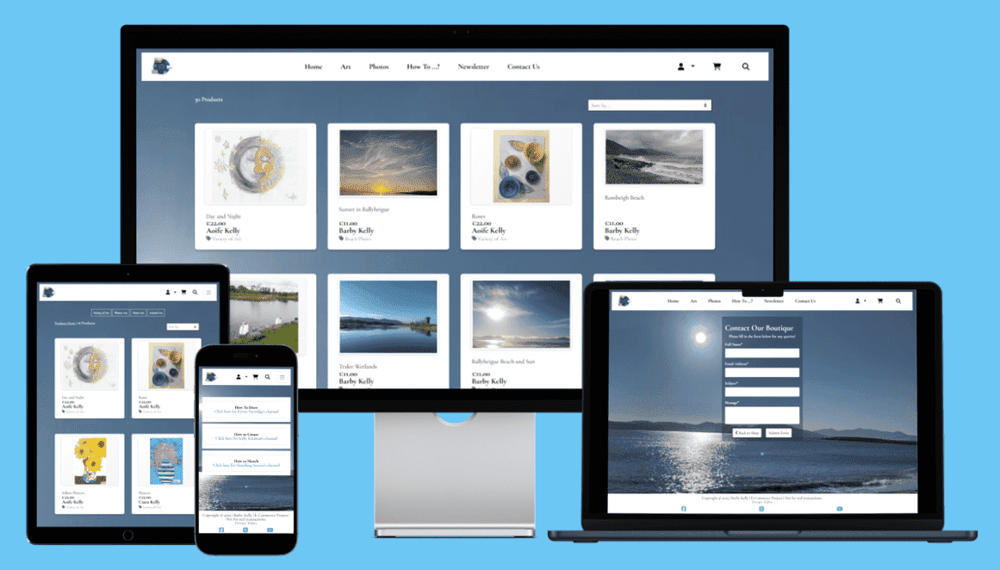

**Kelly's Boutique** Mobile App Icon Preview:

# Contents

[Business Model](#business-model)
- [Direct Audience](#direct-audience)
- [Indirect Audience](#indirect-audience)

[User Experience](#user-experience)
- [User Stories](#user-stories)

[Wireframes](#wireframes)

[ERD, SEO and Marketing](#erd-seo-and-marketing)
- [ERD](#erd-seo-and-marketing)
- [SEO](#seo)
- [Marketing](#marketing)

[Design](#design)

[Features](#features)
- [Existing Features](#existing-features)
- [Future Features](#future-features)

[Languages Used](#languages-used)

[Sites, Apps Used](#sites-apps-used)

[Validation](#validation)

[Testing](#testing)

[Bugs](#bugs)
- [Fixed Bugs](#fixed-bugs)
- [Known Bugs](#known-bugs)

[Deployment](#deployment)

[Forking Repository](#forking-repository)

[Creating Repository](#creating-repository)

[Credits](#credits)

[Acknowledgements](#acknowledgements)

# Business Model

This business model identifies the key audiences (direct and indirect) for Kelly's Art & Photo Boutique, 
and describes how they may interact with or be influenced by the products.

## Direct Audience

The following groups are considered Direct Audience, as they are most likely to purchase, commission or order products from Kelly's Art & Photo Boutique:
  
  - Online users searching for:
    - Original Art (e.g. Name Art, Seasonal Art such as winter, Animal Art etc.) 
    - Children's Art
    - Handmade Art
    - Photos (e.g. Sky, Beach, Animals, Rainbows, Variety etc.)

  - Educational institutions: 
    - Schools and higher education providers seeking examples of art/photos or decorations for their institutions
    - Crèches and preschools incorporating children's art into projects

  - Healthcare and care homes:
    - Nursing homes and healthcare practices searching for artwork or photos for waiting rooms, wards,
      and community spaces
    - Clinics and treatment areas where children and adults are tested or treated, to create a brighter more welcoming, 
      more homely atmosphere

  - Hospitality and accommodation providers:
    - Restaurants, cafes, hotels, B&Bs, Airbnbs seeking art or photos to create a specific ambiance
  
  - Individuals, couples, families, friends:
    - People seeking handmade and original gifts for variety of occasions (e.g. graduation, first school day, birthday, anniversary)

  - Beauty and spa businesses:
    - Salons, spas, wellness centers, looking for certain type of Art/Photos to complement their relaxing atmosphere

## Indirect Audience

Groups that are influenced by the display or recommendation of the products made by Kelly's Art & Photo Boutique:

- Business owners and interior designers:
  - Seeing products of Kelly's Art & Photo Boutique displayed in homes, businesses,
    accommodation, healthcare providers, or educational institutions
  
- Visitors, friends, guests:
  - Individuals or groups exposed to art and photos in homes, schools, hospitality, healthcare or business settings,
    may be interested in purchasing art from Kelly's Art & Photo Boutique

- Influencers and promoters:
  - Share or recommend products from the boutique via social media, blogs, and
    local networks

This business model helps Admin to guide marketing, UX, and future directions for Kelly's Art & Photo Boutique

[Back to Contents](#contents)

# User Experience

## User Stories

Users may opt to tap, click, hover, open, fill various items listed below:

**Navbar**

- **Logo**
  - Click **Logo** (to bring them back to Home Page or refresh Home Page)

- **Home**
  - Click to view all products displayed on the Home page

- **Art**
  - On larger screens, hover to display the dropdown menu
  - Click to open page with all Boutique's Art
  - Sort by Price, Name, Author, or Category
  - Filter by category via dropdown menu or badges (Animal, Name, Winter, or Variety)
  - Signed in Admin has an option to **Edit** and **Delete** products

- **Photos**
  - On larger screens, hover to display the dropdown menu
  - Click to open page with all Boutique's Photos
  - Sort by Price, Name, Author, or Category
  - Filter by category via dropdown menu or badges (Beach, Rainbow, Animal, Sky or Variety)
  - Signed in Admin has an option to **Edit** and **Delete** products

- **How To...?**
  - Click to open page with curated YouTube Art tutorials
  - Click any video link to watch; videos open in a new tab

- **Newsletter**
  - Click to open the Newsletter sign up form (no actual Newsletter sent)
  - Fill in email and click **Subscribe** 
  - Click **Back to Shop** to return Home

- **Contact Us**
  - Click to open page with Contact Form
  - Fill in form and click **Submit Form**
  - Click **Back to Shop** to return Home

- **User Icon**
  - Click to **Sign In** or **Sign Up**

    - **Sign In** Page

      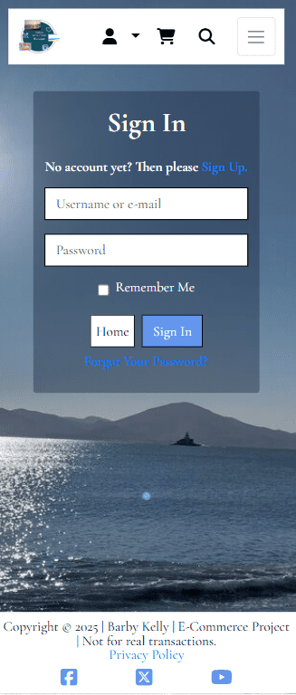

      - Access the Sign In form
      - Optionally reset **Password** or navigate to **Sign Up**
      - Fill in required fields and click **Sign In**
      - Click **Home** button to return Home

    - **Sign Up**

      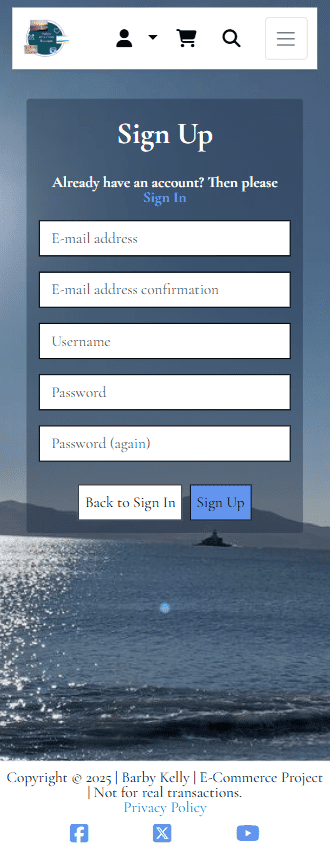

      - Access Sign Up form
      - Option to click **Sign In** if already have an account
      - Fill in required fields and click **Sign Up** to create an account
      - Click on **Back to Sign In** to return to sign in page

- **Cart**
  - Click the **Cart** icon in the Navbar to open the Cart page
  - Add, remove, or update items as desired
  - Click **Back to Shop** to continue browsing
  - Click **Secure Checkout** to proceed with purchase
  - Notice informative pop-ups when user:
    - Adds, Updates, or Removes Cart item    

      

        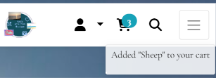
        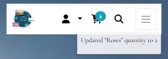
        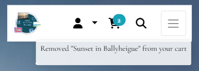
      

- **Search Icon**
  - Click to open **Search Form**
    - Type keywords and click Search or press Enter to search products e.g. 'rainbow':

      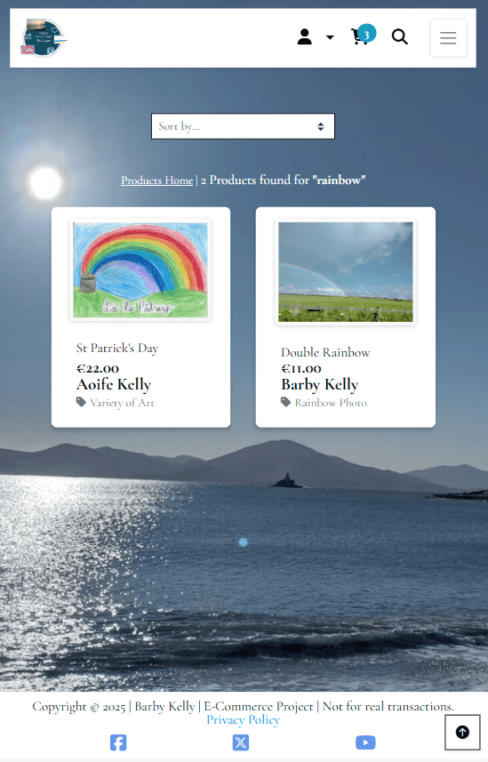

    - 'Empty' search results in pop-up alert
    - Click on Search Icon in the Navbar to close Search Form

- **Burger Icon/Menu** (on smaller screens)

  - Click to open dropdown menu with NavLinks
  - Hover over menu items

**User Permissions**

- **User** who is not an admin of Kelly's Art & Photo Boutique, **may not**:
  - Add, edit or delete products
  - Access Product Management
 
- **Users once signed in** may:
  - Notice a pop up: "Successfully signed in as ..." displayed top right
  - Access **My Profile**
    - **Update** their default postage information
    - See their **Order History**
  - Sign Out by clicking **Sign Out**

- **Admin Access**

  When signed in via the **User** icon on the website, the Admin has additional functionality and permissions not available to regular users:
  - Access **Product Management**
  - Manage products via the **Product Management** page:
    - Add products using the **Add a Product** form
    - Pop-up displayed to notify Admin of product added
  
  Indirect UX for the Admin (via the **Django Admin Panel**):
  - In addition to on-site permissions, the Admin may:
    - Manage products, categories, orders, subscribers, email addresses, groups, users, contact forms, how-to's, sites, and social accounts 
    - Change the SKU system
    - Create test purchases and delete them after testing

- **Footer**
  - Users may click **Privacy Policy** to open it
  - May click **Social Media** icons to open up their respective home pages

[Back to Contents](#contents)

# Wireframes

Wireframes created with [Balsamiq](https://balsamiq.com/wireframes/)

**Disclaimer:**

These Wireframes represent the initial design vision for the Boutique. 
There are variations between the wireframes and the finished project, 
reflecting changes, and refinements made during development.

**Home Page**

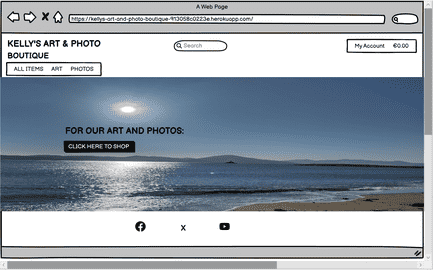

**All Items Menu**

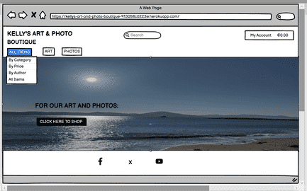

**Art Menu**

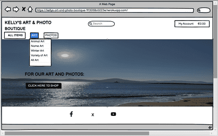

**Photos Menu**

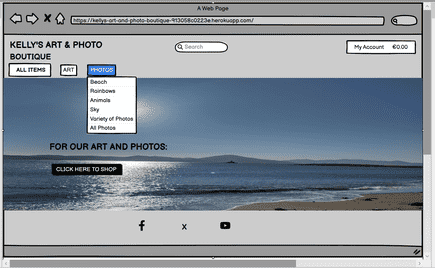

[Back to Contents](#contents)

# ERD, SEO and Marketing

## ERD

**Disclaimer:**

The ERD diagrams were created to visualize the initial database structure of the Kelly's Art & Photo Boutique. 
There may be variations between the ERD and the final database structure implemented in the project.

- ERD steps learned from: [LucidChart Tutorial: How to Create an ERD](https://youtu.be/RBZtPhZkUZM?feature=shared)

- [LucidCharts](https://www.lucidchart.com/pages) used to create ERD

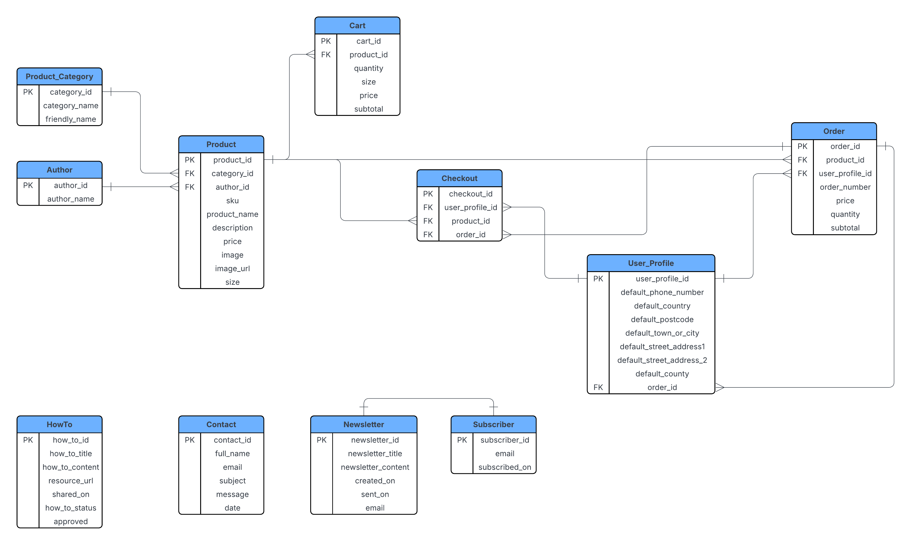

## SEO

- SEO tests helped the developer identify issues with the robots.txt file.
  With tutor guidance, the developer fixed robots.txt and sitemap.xml.

- Google Lighthouse tests, with ChatGPT's guidance, helped the developer to improve the SEO score.

## Marketing

**Facebook Mockup**

- Developer set up a Facebook Mockup page to show how the website would look on Facebook:

  

    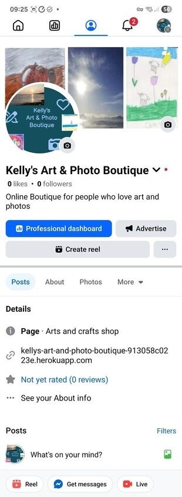
    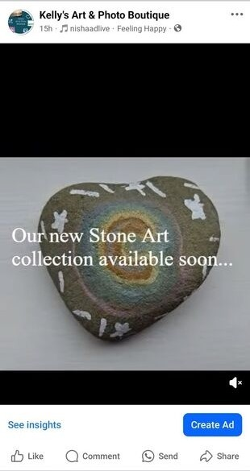
  

  <!-- Note: Code for 
 to make both images align on top in README Marketing section learned from ChatGPT -->

**Disclaimer:**
The mockup images demonstrate the concept for Boutique's Facebook page; 
actual Facebook page may be different

**Facebook Reel**

- **Disclaimer:**

  The reel is hosted on YouTube to demonstrate the concept, in case the sample Facebook page is removed or unavailable

- Developer created a [Facebook Reel](https://youtu.be/F123AhI8RGA) featuring Stone Art,
  to demonstrate how she would advertise the arrival of a new  collection. 
  All displayed Stone Art in the Reel was created by the developer's daughter Aoife, age 10

  
**Keyword Research**

- Developer used keywords suitable for the project, such as: photo, art, boutique,
  shop, handmade, original, Kelly's Art & Photo Boutique, gifts, décor

**Similar Businesses**

- Developer found the following businesses relevant to her sample business:

  [Gallerix.ie](https://gallerix.ie/)

  [JamArtFactory.com](https://jamartfactory.com/)

  [Kids and Art](https://kidsandart.org/store-artwork/)

  > To date, the developer has not found any website combining parent's photos and their kids' art in one online shop.

[Back to Contents](#contents)

# Design

**Images**

- **Background** image: photo taken by the developer

- **Logo** created using a Wireframe, combining Aoife's vision for the Logo, 
  guidance and color suggestions from the developer for Logo to suit the website's color scheme. 
  Input from Ciara on design preferences, a photo taken by the developer, and art by Aoife and Ciara.

  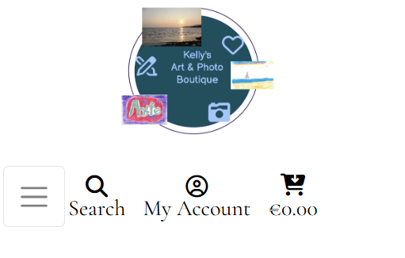

- **Disclaimer**

  Some image quality reduced due to resizing for website, README and TESTING_RESULTS.md

**Color**

- **Base color** for the initial website design: Cornflower. Sourced from [Create.vista.com](https://create.vista.com/colors/color-names/cornflower/)

- **Color Palette** for the website, derived from the actual site colors:

  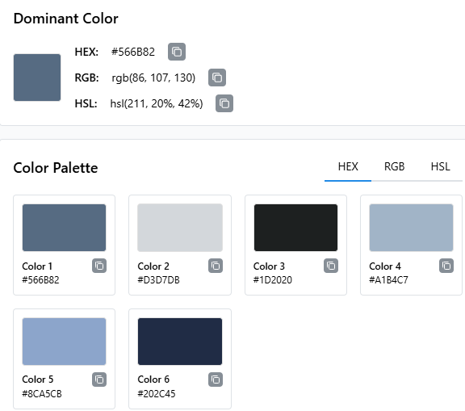

    Palette created with [Website Color Extractor folge.me](https://folge.me/tools/website-color-extractor)

**Font**

- **Main font**: Cormorant Garamond, sourced from [Google Fonts](https://fonts.google.com/)

  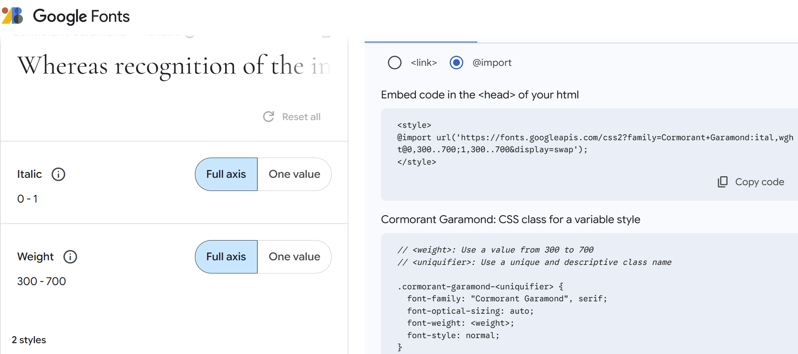

[Back to Contents](#contents)

# Features

## Existing Features

### Favicon

  - Favicon, made of website's Logo, displayed in the browser tab:

    

### Navbar

 - Hovering effect for all Navbar items and dropdowns

- **Logo**

  - Links back to Home

- **User Icon**

  - Clicking the User Icon, opens account options:
    - **Sign In / Sign Up** for new or returning users
      - Sign In page displays the form to enter credentials
      - Sign Up page with a form to create a new account
    - For **Signed-in users** **Username** is displayed, with options:
        - **My Profile**: View and update default postage information, view order history
        - **Sign Out**: Sign Out of the account
        - **Admin** only:
          - **Product Management**: to add products

- **Cart Icon**

  - Click on Cart Icon opens the cart, for user to see if any items in the cart

- **Search Icon**

  - Click on Search Icon opens the **Search Form**, allowing keyword search for products
  - Empty search results Home page displayed with a pop-up Error message

    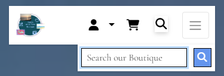
      
- **Burger Menu**:
  
  - Click on Burger Menu opens dropdown menu with NavLinks
  - On larger screens, Burger Menu is replaced with NavLinks

### Home Page

- Displays all of Boutique's products each on their individual Product Card
- Currently called **Home**; referred to as **Shop** on buttons

- **Product Card**:
  - Includes: image, name of the product, price, author, and category badge
  - Hover effect raises the product card and changes the pointer to indicate clickability  
  - Clicking a product card opens the individual **Product Detail Page**
- **Product Detail Page**:
  - Displays the selected product's **image, name, price in €, category badge, author, and description**
  - Includes a Quantity selector (1-50) with arrows and manual input
  - Buttons:
      - **Back to Shop**: returns user to Home page
      - **Add to Cart**: adds product to cart with selected quantity, with a pop-up message
  - **Admin users only**: Product cards include options to **Edit Product** and **Delete Product**

### Art Page

- Click on **Art** NavLink opens page with all Art
- **Products Home** link displayed top left:
  - Click on it returns user to **Home** page
- **Category Navigation**
  - On larger screens, hovering over **Art** in the Navbar displays dropdown options:
    - Animal Art, Name Art, Winter Art, Variety of Art
  - Badges for each Art category are displayed
    - Clicking on a **badge** filters Art by that category:

    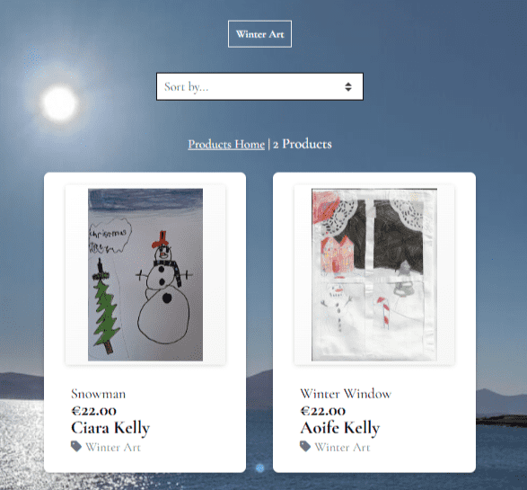

- Hovering effects and clickable product cards work the same as on the **Home Page**
- **Sorting Options**
  - 'Sort by' is displayed in the middle of the screen (on the right for larger screens) below badges:
    - Sort products by **Price, Name, Author**, or **Category**

### Photos Page

- Click on **Photos** NavLink opens page with all Photos
- **Category Navigation**
  - On larger screens, hovering over **Photos** in the Navbar displays dropdown options:
    - Beach, Rainbows, Animals, Sky, Variety of Photos
  - Badges for each Photo category are displayed
    - Clicking on a **badge** filters Photos by that category
- Hovering effects, clickable product cards, and sorting options work the same way as on the **Art Page**
 

### How To...? Page

- Selection of clickable **YouTube channels**, to demonstrate various styles of creating Art

- **Disclaimer**:
  Developer has no personal connection or input to any of the channels promoted on this page

  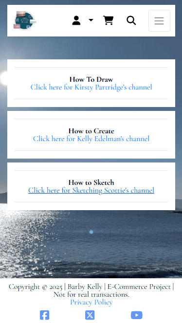

### Newsletter Page

- **Subscription form** displayed with email address field
- Buttons to click on: **Back to Shop** or **Subscribe**

  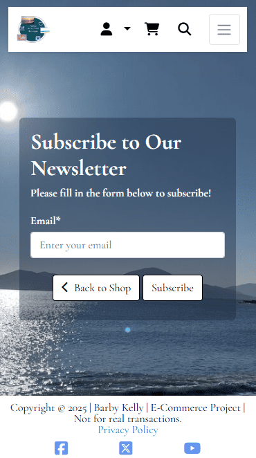

- Feedback to user on the screen after subscribing
- Confirmation email sent

  

    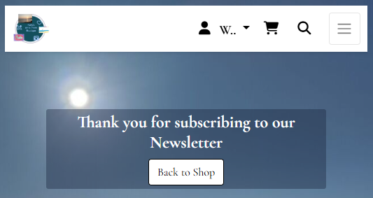
    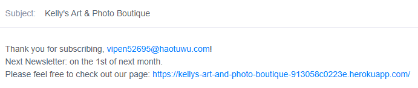
  

### Contact Us Page

- **Contact Our Boutique** form displayed, with required fields
- Buttons: **Back to Shop** and **Submit Form**

  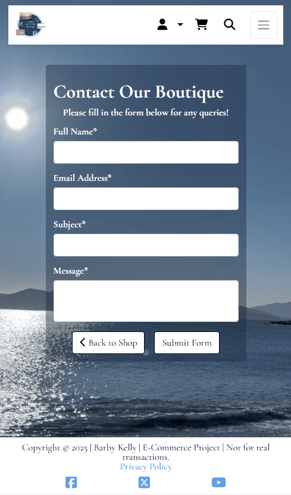

- Feedback on the screen after submitting form
- **Message** available to Admin via Django Admin panel
- No instant confirmation email to user

  

    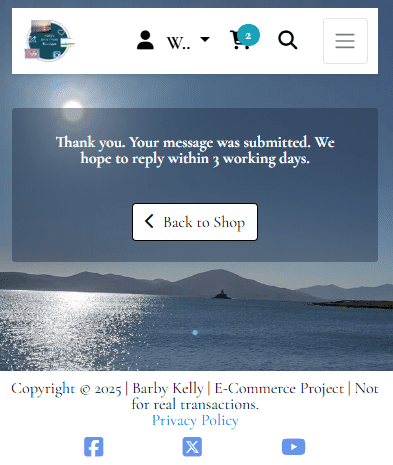
    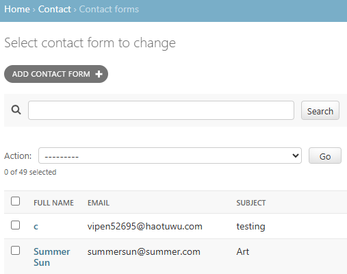
  

### Cart Page

- Displays the user's **Cart**

  **Empty Cart**
  - Message: **Your cart is empty**
  - Button: **Back to Shop** returns user to Home page

  **Cart with Products**
  - Lists products with **image, price, quantity,** and **total**
  - **X** beside Total to remove any product from the Cart
  - Adjustable **Quantity** box (1-50) 
  - Displays **Cart Total, Postage,** and **Grand Total**
  - Buttons:
    - **Back to Shop**: returns user to all products aka **Home Page**
    - **Secure Checkout**: opens **Checkout Page**
  - Note: Refreshing the page or ending the browser session, may empty the Cart (expected for session-based Cart)

  **Postage**
  - Charged when **Cart Total** is less than €55 
  - Free **Postage** if Cart Total at least €55

    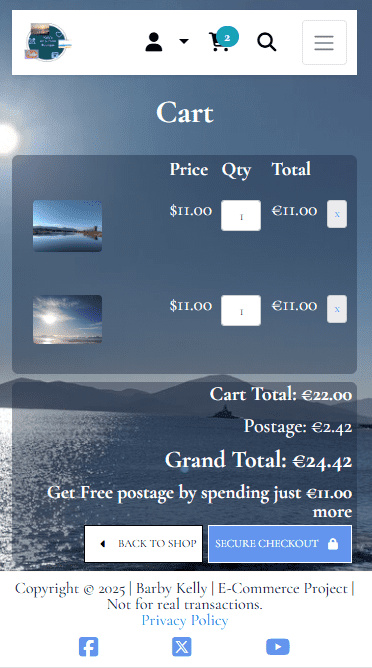

### Checkout
  - Accessible via Cart: **Secure Checkout** button
  - **Order Summary** and **Checkout Form** displayed
    - User cannot make changes to **Order Summary** in **Checkout**
    - User may click on **Adjust Cart** if they wish to edit Order details

    - **Checkout Form** includes: Name, Email, Phone Number; Postage Details; and Payment field
      - Form includes required and optional fields
      - Users can complete purchase (**Disclaimer**: no real transactions, website for study purposes only)
      - Payment handled via Stripe integration
      - Click on **Complete Order** button completes the Order

    - **Order Confirmation**
      - Displayed after completing checkout, including Thank you message with User's email address, pop-up, and **Order Details**
      - **Order Details**: order number, summary of purchased items, totals, and postage cost
      - Confirmation email sent to User

        

          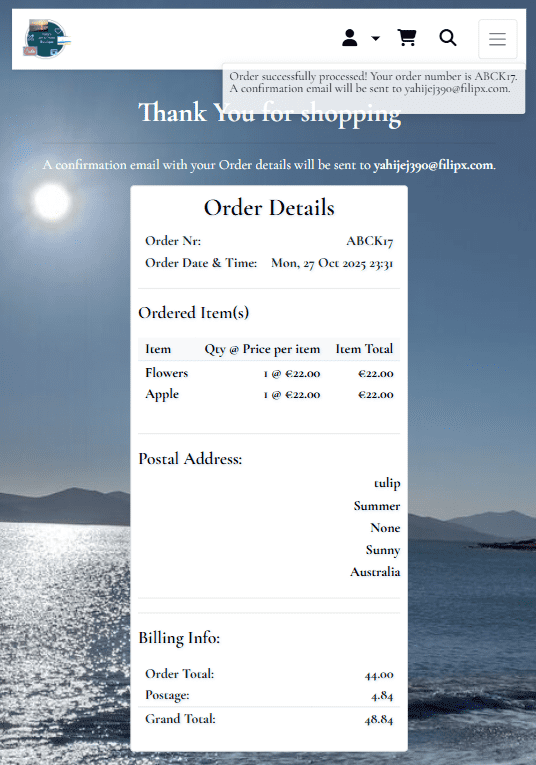
          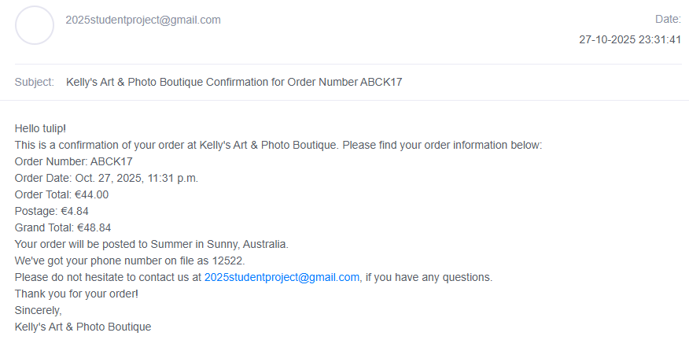
        

### Footer

  - At the bottom of each screen, and consists of:
    - Copyright (year of the project)
    - Developer's name, and Project type
    - Disclaimer: No real transactions
    - Clickable **Privacy Policy**; Privacy Policy opens in a new tab
    - Social Media links:
      - Clickable **Facebook**, **Twitter** and **YouTube** links: open respective pages in a new tab
        (general pages, not personalized for website)

### Error Page

  - **404 Page: Page Not Found**
    - Customized 404 Error Page, with website's background image and color scheme
    - Displays instructions what might help to fix the Error, and a button **Back to Shop**
    - Tested to ensure it displays for invalid URLs and when typed 404 at the end of the website's URL

[Back to Contents](#contents)

## Future Features

**Rename "Home" to "Shop"**

  - As the current Home page displays all products, and several buttons reference **Back to Shop**, 
    renaming Home page would improve consistency across the site.
  - Due to time constraints before submission, the developer retained the "Home" NavLink as is for now

**Navigation & UX**

- Active menu item stays highlighted while open
- Option to Search the whole website, not just Products
- Min and Max quantity noted under the relevant field

**User Account Features**
- Registered Site users may save items for later, or mark as favorites
- Registered users notified of saved cart items on their return
- Alert before user clicks 'Update Information'
- Prevent from updating when required fields are empty
- Users can Sign Up and Sign In via social media links, Google account and similar
- Improved 'Order History' layout under 'My Account'
- Options to pay via Google Pay, PayPal

**Products & Filters**

- Improved product descriptions (removal of unnecessary #'s)
- Search products by special celebrations or occasions
- Filter products using multiple criteria eg Stone Art - Birthday - Age 5
- Filter art based on tools (pencil, paint, water-color, marker, paper, stone, canvas)
- Only downloadable products (which would change the target audience, and marketing)

**Other Features**
- Live classes with Site Visitors, creating Art, discussing techniques, sharing ideas
- 'How To...?' page to include videos related to Photos, Photography, Art lessons by kids
- Admin: System would suggest a new unique SKU, based on existing products, when admin is adding a new product
- Admin: option to update prices in bulk for similar products
- 'About' app added to share details about creators, optionally painted images of each creator

**500 Server Error Page**
- Set up personalized **500 Server Error Page** with a link for users to access Kelly's Art & Photo Boutique
- Matching the scheme of the website

[Back to Contents](#contents)

# Languages Used

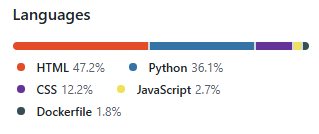

- HTML
- Python
- CSS
- JavaScript
- Dockerfile

[Back to Contents](#contents)

# Sites, Apps Used

The following Sites/Apps were the main ones used to create Kelly's Art & Photo Boutique:

- [Code Institute](https://codeinstitute.net/)
- [GitHub](https://github.com/)
- [Gitpod](https://www.gitpod.io/)
- [VS Code](https://code.visualstudio.com/)
- [Django](https://www.djangoproject.com/)
- [Heroku](https://www.heroku.com/)
- [Balsamiq Wireframes](https://balsamiq.com/wireframes/)
- [AWS](aws.amazon.com)
- [Stripe](https://stripe.com/)
- [YouTube](https://www.youtube.com/)
- [Simple Image Resizer](https://www.simpleimageresizer.com/)
- [Diffchecker](https://www.diffchecker.com/)
- [Favicon](https://favicon.io/favicon-converter/)
- [Font Awesome](https://fontawesome.com/icons)
- [Chat GPT](https://chatgpt.com/)

[Back to Contents](#contents)

# Validation

**Lighthouse**

- Lighthouse scores improved after adding lazy-loading for product images, and limiting the number of products displayed on the Home page
- After changing Home page for (Products) Home page, Lighthouse scores declined slightly, as Home page now included images of all the products

- Due to time constraints, developer did not further optimize performance after the last test

  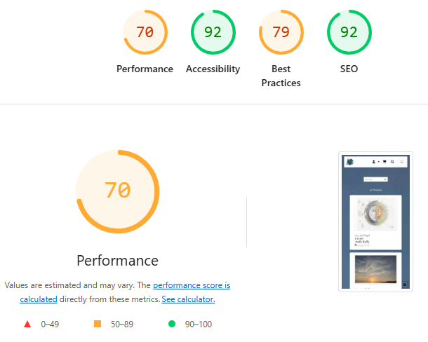

**HTML**

- HTML validation completed with [W3C Markup Validation](https://validator.w3.org/)
- To validate Django HTML templates, the developer disabled filters in the W3C validator,
  because templates inherit from base.html.
  Therefore each HTML page would not have 'DOCTYPE', lang="en", which triggers false validation errors

  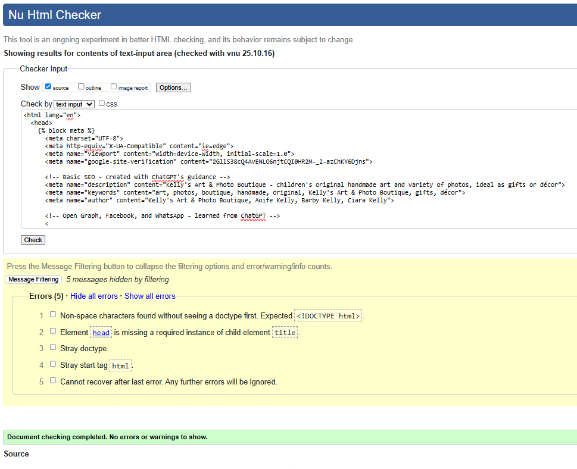

**CSS**

- CSS validator validation with [W3C Markup Validation](https://validator.w3.org/)
- Similar to HTML validation, the developer turned off filters when validating CSS,
  to reduce false validation errors
  
  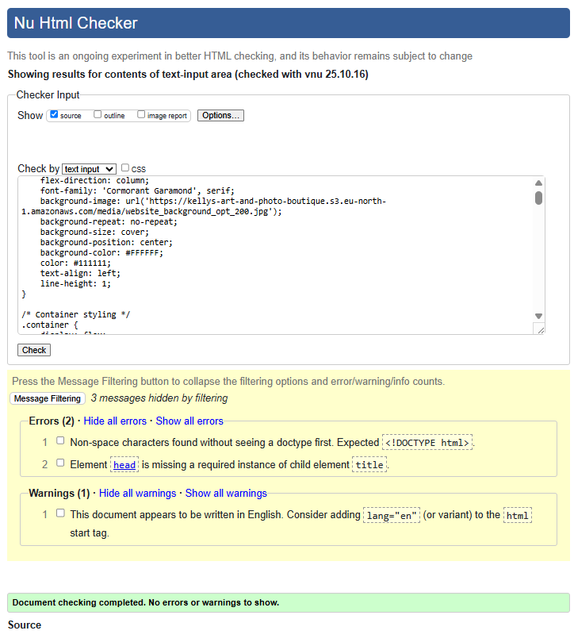

**JavaScript (JS)**

- JS files were linted using ESLINT and [jshint.com](https://jshint.com/)
- Initially with ESLint v9, then reverted to v6 for compatibility
- With ChatGPT's guidance .eslintrc.json configuration file was added, to improve testing efficiency:

  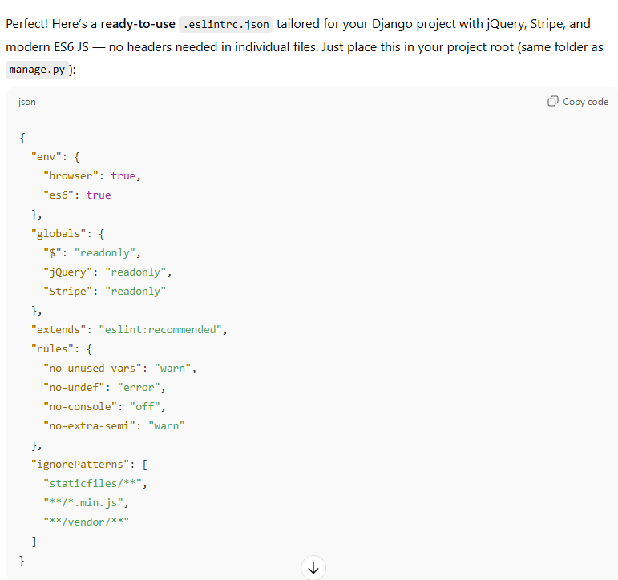
  
- As guided, developer ran:

  "$ npx eslint . --fix"

- Final testing showed no JS errors:

  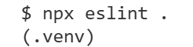

**Python**

- Developer checked selected Python files using [CI Python Linter Test](https://pep8ci.herokuapp.com/)

  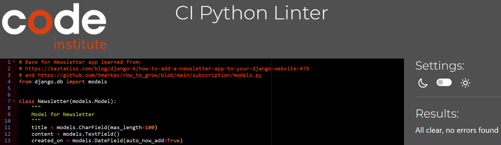

- All tested files passed without major issues, and mainly indentation adjustments were needed

[Back to Contents](#contents)

# Testing

Testing is reported in a separate [TESTING_RESULTS.md](TESTING_RESULTS.md) file.

[Back to Contents](#contents)

# Bugs

## Fixed Bugs

**NavLinks (Art & Photos)**

- Issue: Clicking Art or Photos NavLinks, displayed 0 items, and NavLinks did not change color,
  therefore it was hard to know which tab was open.
- Reason: Categories in main-nav.html did not match categories in categories.json and Django categories:

  

  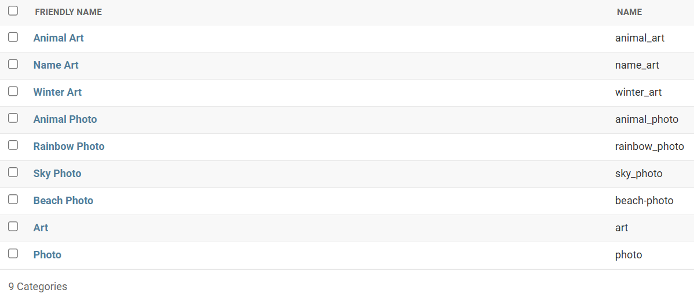

- Fix:
  - Matched categories in main-nav with Django categories and categories.json
  - Fixed 'beach-photos' vs 'beach_photos'
  - Updated titles for Art and Photos
- Result: Art and Photos displayed correctly.

**Sign In Menu**

- Issue: when logged in as an admin, 'Sign In' remained visible in Navbar, and all of the options for admin were displayed at all times:

   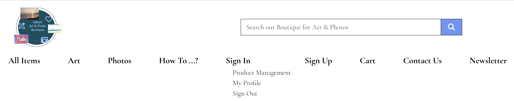

- Cause: Located in main_nav.html with guidance from ChatGPT, template was always rendering 'Sign In', signed in or not:

- Fix: Adjusted styling for Navbar/NavLinks

- Result: when admin was signed in:
  - 'Sign In' NavLink was no longer displayed,
  - Username replaced 'Sign In' NavLink,
  - Options for Signed In admin were available via dropdown menu
  - 'Sign Up' was no longer displayed for Signed in user/admin

**Fixture Load (django.core.serializers.base.DeserializationError: Problem installing fixture)**

- Issue: Running 'python manage.py loaddata categories' produced "django.core.serializers.base.DeserializationError: Problem installing fixture..." in terminal
- Cause: categories.json had a field 'author', while in admin.py/Django categories there was no 'author' field set up.
- Fix: Removed 'author' field from categories.json and 'python manage.py loaddata categories'
- Result: command worked ok then

**Cart - qty update issue**

- Issue: Product quantities were not updating accurately in the Cart.
  Cart showed €0.00, when it had items in it.
  Plus and Minus buttons didn't work, only Quantity box arrows responded to increase/decrease in Quantity 
- Cause: Incorrect placement of 
 and 
 in cart.html,
  and outdated JavaScript logic in the Cart quantity script
- Fix: 
  - Compared the project's vs Boutique Ado walk-through:

    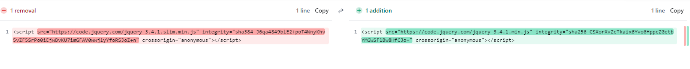

  - Replaced the old block corejs with the working version from the walkthrough 
- Result: Plus and minus buttons worked as expected, updating quantities correctly

[Back to Contents](#contents)

## Known Bugs

**Disclaimer** Due to approaching the submission date, the following bugs are still present on the website

- **Order Number**
  - The numeric part of the Order Number appears in a smaller font than the letters on:
    - Order Details page, and 'Success!' pop up: 

      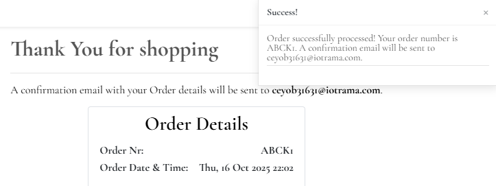

- **Product Details Page**
  - Buttons are not centered on any screen sizes
  - Product card appears too wide on tablet screens (around 767px and below)
  - Project is mobile-first. Media Queries were primarily written using max-width, which caused slight layout issues
  - CSS was not fully adjusted to suit the late addition of background image to all pages

- **Pop-ups and Dropdown Menus**
  - Occasionally, pop-ups or dropdown menus remain open when the user clicks elsewhere on the page, instead of them closing automatically

- **Alignment issues**
  - Some text and buttons are not properly centered on certain Forms or Pages, and some Forms could be lower from the Navbar

- **Cart missing product name**
  - Late changes to the cart layout (to fit all items on mobile screens without image disappearing),
    resulted in the product name no longer being displayed beside the product.
  - Essential details eg product image, price, and quantity are still visible 

- **Cart pop-up missing Checkout button (UX change/possible regression)**
  - Users must click on **Cart** to access Checkout
  - Previous version displayed **Checkout** link in toast

- **Keyword Search**
  - On some occasions, **Keyword Search** displays "0 Products" when there should be at least one result
    - Example: searching for **"animal"** returns 0 products
    - Other keywords, like **"rainbow"** and **"winter"**, work correctly

- **Sign Up page, Back to Sign In button**
  - **Back to Sign In** button becomes highlighted after filling in password details on **Sign Up** form, instead of highlighting **Sign Up** button more 

- **Confirm email address**
  - Email address displayed in Cornflower blue, while "text-white" is set up in html
  - After clicking on the link in verification email, **Confirm email address** page opens asking to confirm again.
  - User account is confirmed after click on **Confirm**

- **Color of Order Number in Order History, Forgot your password link, Sign Up link and Sign In link**
  - Current blue shade is hard to see against the new background and border-box. Hover effect improves visibility for some, but not all

[Back to Contents](#contents)

# Deployment

To deploy this project to Heroku:

- Ensure **env.py** is set up properly
- Confirm **.gitignore** excludes sensitive files
- Set in settings.py: **DEBUG = 'DEVELOPMENT' in os.environ**
- Ensure **Procfile** and **requirements.txt** are present and up to date  
- Login to **Heroku**
- Navigate to the **Settings** tab
- Click **Reveal Config Vars** and verify that all environment variables are correct
- Go to the **Deploy** tab
- Scroll down and click **Deploy Branch**
- Once deployment finishes, click **View App** to open the live site

This project's deployment was tested with **Django 4.2**

[Back to Contents](#contents)

# Forking Repository

- Go to [Github](https://github.com/)
- If you want to fork one of your own repos, then DO NOT login under your own name,
  as fork option is not available (as per the developer's experience)
- Search Github or Google for the repo that you would like to fork
- Open the repo you want to fork
- On the same line as the Repo's name, on the right, click on the arrow beside the Fork
- Click on: + Create a new fork
- Choose a name for the repo
- Add description if you desire
- Choose if you want to Copy the main branch only
- Click on: "Create fork"

[Back to Contents](#contents)

# Creating Repository

- Code Institute's [template](https://github.com/Code-Institute-Org/ci-full-template) was used to set up this project.
- After clicking on the above template link, click on the green button: "Use this template"
- From there choose: "Create a new repository"
- Fill in "Repository name" with your desired name for the project
- Leave the project Public like the default setting (for Code Institute projects)
- Click on the green button "Create repository"

[Back to Contents](#contents)

# Credits

**Code/Base Projects**

  - Main code for Kelly's Art & Photo Boutique was based on Code Institute's walkthrough project
    ["Boutique Ado"] (https://github.com/Code-Institute-Solutions/boutique_ado_v1) 
  - Other helpful projects:
    - ["Seaside Sewing by Kera Cudmore](https://github.com/kera-cudmore/seaside-sewing)
    - ["Vegan Sneaker Store by Denis Klopotan](https://github.com/denisklopotan/vegan-sneaker-store/)

**README**

  - Template derived from developer's Project 4 [BookBlog](https://github.com/BarbyKelly/blog) and
    Project 2 ["Estonia Quiz" README](https://raw.githubusercontent.com/BarbyKelly/Estonia-Quiz/refs/heads/main/README.md)
  - [Canva](https://www.canva.com/mockups) was used to create mockups

**Images & Media**

  - Background image and product photos were taken by the developer
  - Art was created by developer's children

**Image Optimization**

- Images were optimized using [Simple Image Resizer](https://www.simpleimageresizer.com/resize-image-to-50-kb)

**Fonts & Icons**

  - Font: "Cormorant Garamond" via [Google Fonts](https://fonts.google.com/selection/embed):

    

  - Free Icons were sourced from: [fontawesome.com](https://fontawesome.com/search?ic=free)

**Wireframes**

  - Created using [Balsamiq](https://balsamiq.com/wireframes/), including the Logo

- **Privacy Policy**

  - Created using lessons from [Boutique Ado](https://github.com/Code-Institute-Solutions/) and

    [Privacy Policy Generator ](https://www.privacypolicygenerator.info/)

- **How To...?' Links**

  - YouTube links for art tutorials were shared by the developer. No personal benefit or connection to these sites

- **ChatGPT**

  - Used near the end of the project for guidance on fixing code, CSP fix, Bootstrap rules, performance (SEO) improvements, 
    the frame for TESTING_RESULTS.md, and README formatting.
  - Credited in all files where guidance from ChatGPT was applied, even if the changes were minor

- **Business Model**

  - Inspired by [Sensical.ie project by David Calikes](https://github.com/davidcalikes/sensical.ie#prior-business-model), guided by mentor Lauren-Nicole Popich 

[Back to Contents](#contents)

# Acknowledgements

- Developer is grateful for guidance and support provided by her mentor Lauren-Nicole Popich,
  **Code Institute's** staff, and online resources.

- Special thanks to the developer's daughters, Aoife and Ciara, for allowing their beautiful art to be part
  of this e-commerce project, and for being involved with website's **Logo**.

- Developer understands the importance of hiding **Secret Keys**. Mentor Lauren-Nicole Popich suggested noting in the README,
  that the secret key was initially visible during development, following Boutique Ado walk-through steps.
  Developer changed and hid the key as advised.

- Special thanks to **ChatGPT**, for helping the developer near the end of the project.
  The developer learned a lot through the process and appreciated the faster access to what works with Bootstrap4.

[Back to Contents](#contents)

--------

**Disclaimer:**
Every effort has been made by the developer to ensure this README accurately reflects the current version of "Kelly's Art & Photo Boutique".
As the project has evolved, details such as UX, features, design elements, or file structures may have been updated.
All links, setup instructions, and forking or cloning steps were correct at the time of writing the README.
However, future updates, platform changes may affect the accuracy of some details.