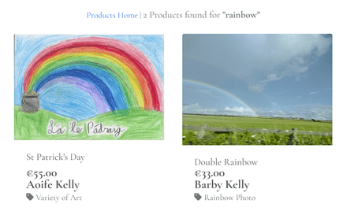
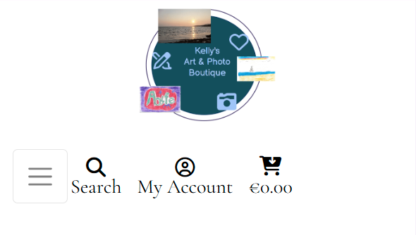

# Project 5 - Kelly's Art & Photo Boutique

This e-commerce project was created as part of Code Institute's Software Development course.
Layout and code for based on Code Institute's Walk-through project:
[Boutique Ado](https://github.com/Code-Institute-Solutions/boutique_ado_v1_sourcecode).
 
Aim of this project:
- to create a Site where selection of Art and Photos displayed,
- option for Site users to browse products, search and choose products,
- test out purchasing products (without real-time purchase or without any real-time transactions).

Kelly's Art & Photo Boutique has no real-time commercial intention.

Deployed site: [Kelly's Art & Photo Boutique](https://kellys-art-and-photo-boutique-913058c0223e.herokuapp.com/)

Github: [link to github](https://github.com/BarbyKelly/project-5)

## Contents

[User Experience](#user-experience)
- [User Stories](#user-stories)

[Wireframes](#wireframes)

[Design](#design)
- [Images](#images)
- [Color](#color)
- [Font](#font)

[Features](#features)
- [Existing Features](#existing-features)
- [Future Features](#future-features)

[Languages Used](#languages-used)

[Sites, Apps Used](#sites-apps-used)

[Validation & Testing](#validation-and-testing)
- [Lighthouse](#lighthouse)
- [HTML](#html)
- [CSS](#css)
- [Favicon](#favicon)
- [Logo](#logo)
- [Search Bar](#search-bar)
- [My Account](#my-account)
- [Cart](#cart)
- [NavBar, NavLinks, NavButtons](#navbar-navlinks-navbuttons)
- [Home Page](#home-page)
- [All Items](#all-items)
- [Art](#art)
- [Photos](#photos)
- [Social Media](#social-media)
- [Footer](#footer)

[Bugs](#bugs)
- [Fixed Bugs](#fixed-bugs)
- [Known Bugs](#known-bugs)

[Deployment](#deployment)

[Forking Repository](#forking-repository)

[Creating Repository](#creating-repository)

[Credits](#credits)
- [Code](#code)
- [README](#readme)
- [Icons](#icons)
- [Logo](#logo)
- [Font](#font)
- [am I responsive](#am-i-responsive)
- [Wireframes](#wireframes)
- [Products/Images](#productsimages)

[Acknowledgements](#acknowledgements)

# User Experience

- User Stories

## Users may:

- Click on Logo (to bring them back to Home Page or refresh Home Page)
- Use Search bar
- Click on My Account:
  - Click on 'Sign In'
    - Click on link: 'Sign Up first' (steps for 'Sign Up' described below), if no account
    - Fill in a Username or Email, and a password:
      - Even if they don't have an account. Only User with an account will be signed in
      - Users without account will be reminded to 'Please fill in this field'
    - Tick 'Remember Me' box:
      - Even if they don't have an account. Only User with an account will be Remembered
      - User without an account will be reminded to 'Please fill in this field'
    - Click on 'Home' button to get back to Home page
    - Click on 'Sign In' button to sign in:
      - Even if they don't have an account. Only User with an account will be signed in
      - User without an account will be reminded to 'Please fill in this field'
    - Click on 'Forgot Your Password?':
      - Even if they don't have an account.
      - Fill in 'Password Reset' form:
        - Click on 'Reset My Password'
        - Only User with an account will receive an email to reset their password
        - Click on 'Back to Sign In' button
    - Click on 'Home' below 'Sign In' form
    - 
  - Click on 'Sign Up'
- Click on Cart
- 

## Site User may:

- Click on Logo, which brings user to Home page (All Items)
- Click on NavBar links: All Items, Art, Photos
- Choose to have products displayed by Category, by Price, by Author, or All Items
- Select Art by: Animal Art, Name Art, Winter Art, Variety of Art, or All Art
- Choose photos displayed by: Beach, Rainbows, Animals, Sky, Variety of Photos, or All Photos
- Create an account
- Login with their username and password
- Click on My Account, My Profile, Logout, Cart
- View items in their cart
- Logout

## Site User may not:

- Add, edit or delete products
- Access Product Management

[Back to Contents](#contents)
 

## Users once signed in may:
- Notice a pop up: 'Success! Successfully signed in as ...' displayed on top right
- Access 'My Profile' via 'My Account'
- Under their profile Update their Default postage information
- See their Order History
- Sign Out by clicking 'My Account', and then 'Sign Out' 

## Extra permissions for An Admin. Admin may:
- Access 'Product Management' once signed in
- View 'My Profile'
- Sign out

- Add, edit and delete products via django, or directly on website when logged in as Admin (via Product Management)
- Follow SKU system already in place: 
  dr333(add a unique number in the end) for art,
  ph888(add a unique number in the end) for photos

- Admin may change the SKU system if needed
- Admin may click on Shopping cart and see if admin has any products in the cart (for testing)
- Admin can create test purchases and delete them after
- Admin may click on all items on the website like other users

[Back to Contents](#contents)

# Wireframes

- Wireframes created with [Balsamiq](https://balsamiq.com/wireframes/)

## Home Page

## All Items Menu

## Art Menu

## Photos Menu

## "My Account" Page

## "Cart" Page

## Checkout Page

[Back to Contents](#contents)

# Design

## Images

## Color

- Base color (cornflower) for the website from: [Create.vista.com](https://create.vista.com/colors/color-names/cornflower/)

## Font

[Back to Contents](#contents)

# Features

## Favicon

Favicon displayed in the browser tab for Kelly's Art & Photo Boutique:

  

## Logo

- Logo displayed on all pages of the website, and on all screen sizes
- Click on Logo brings user back to Home page

  

[Back to Features](#features)

[Back to Contents](#contents)

## Search Bar, Button, Icon

- Search bar or icon displayed on all pages:

  

- Button to activate search
- User can search for Products: Art & Photos
- User can search for eg 'rainbow', and products from both Art and Photos are displayed:

  

- If user enters nothing in Search box, error message pops up:

  

- On smaller screens, Search Icon is displayed:

  

[Back to Features](#features)

[Back to Contents](#contents)

- **Navigation Menu**
    - All Items (Home page)
    - Art
    - Photos
  **On the right**
    - My Account
    - Cart 

### Future Navigation Menu Features:
    - Request Form
    - How to ... 

### **Footer**
    - Copyright
    - Social Media links

## Homepage Features
- 

[Back to Features](#features)

[Back to Contents](#contents)

# Future Features

- Registered Site User may save items for later, or as their favorites, and see them under their profile
- If Registered Site User pauses their shopping, shopping cart items stay in the cart 
- Registered User is notified of items in their cart when they return to the website

- Improved Descriptions for all products, to improve search for Users
- Add an option to search Art and Photos by special celebrations: Easter, Christmas, Halloween, Birthday, Anniversary, Valentine's Day etc.
  (with improved Descriptions, this option will work, like now when looking for Winter, rainbow)
- Filter to search products with multiple options eg Stone Art - Birthday - Age 5
- Option to choose art based on what tools were used eg pencil, paint, water-color, marker, paper, stone, canvas

- Users Username is displayed when signed in
- Fill in Request Form, what type of Art or Photos User would love to see displayed/made
- 'How to ...' option in Nav Menu, with selection of videos, articles, tips how to create certain art, 
  or how certain art pieces were made

- Live classes with Site Visitors, creating Art, discussing techniques, sharing ideas
- Users can use search box to search all of the website, not just products

- Password Reset form would notify User if their email is not registered for an Account. Presently any email address is accepted on Password Reset form 

- Clickable Contact details below 'Password Reset' form, instead of just text as it is at the moment: 

  

- Clickable Contact details below 'Password Reset' email notice, instead of just text as it is at the moment:

  

- For Admin: System would suggest a new unique SKU, based on existing products, when Admin is adding a new product

[Back to Features](#features)

[Back to Contents](#contents)

# Languages Used

[Back to Contents](#contents)

# Sites, Apps Used

[Back to Contents](#contents)

# Testing

Note: for testing, in many places developer used "Kelly's Boutique" instead of "Kelly's Art & Photo Boutique", to reduce the number of characters, and make it an easier read.

## Lighthouse

- 

  validated with Google developer tools

- 

- 

- 

[Back to Testing](#testing)

[Back to Contents](#contents)

## HTML, CSS, JS Validation

- 

  validated with: [W3C Markup Validation](https://validator.w3.org/)

- 

  validated with: [W3C Markup Validation](https://validator.w3.org/)

- 

  validated with: [codebeautify](https://codebeautify.org/jsvalidate)

[Back to Testing](#testing)

[Back to Contents](#contents)

## Favicon

| Tested Item | Expected Outcome                                      | Outcome     |
| ----------- | ----------------------------------------------------- | ----------- |
| Favicon     | Reduced image of the Logo                             | as expected |
|             | Displayed in browser tab for all pages of the website | as expected |

[Back to Testing](#testing)

[Back to Contents](#contents)

## Logo

| Tested Item | Expected Outcome                               | Outcome     |
| ----------- | ---------------------------------------------- | ----------- |
| Logo        | Displayed top left for larger screens          | as expected |
|             | Displayed top center for smaller screens       | as expected |
|             | Displayed on all pages of the website          | as expected |
|             | Text 'Kelly's Art & Photos Boutique' is        |             |
|             | displayed big enough on all screen sizes       | as expected |
|             | Art and Photos on the Logo are                 |             |
|             | displayed big enough on all screen sizes       | as expected |
|             | Logo matches the theme of the website          | as expected |
|             | Clicking on Logo brings user back to Home page | as expected |  

[Back to Testing](#testing)

[Back to Contents](#contents)

## Search

### Search Bar

| Tested Item | Expected Outcome                                                                   | Outcome     |
| ----------- | ---------------------------------------------------------------------------------- | ----------- |
| Search Bar  | Displayed top center for larger screens                                            | as expected |
|             | Placeholder is faded in Search box                                                 | as expected |
|             | Personalized Placeholder                                                           | as expected |
|             | Placeholder text 'Search our Boutique for Art & Photos'                            | as expected |
|             | User can type in the Search box                                                    | as expected |
|             | Placeholder is no longer displayed, when first character is entered in Search Box  | as expected |
|             | Search button is clickable                                                         | as expected |
|             | User can click on Search button to activate Search                                 | as expected |
|             | If user enters a valid Search term, those products are displayed                   | as expected |
|             | When user enters eg number 9, all products made by 9 year old, are displayed       | as expected |         
|             | If user clicks on Search button without entering any value in Search Box,          |             |
|             | An error message "Search criteria not entered!" pops up                            | as expected |
|             | When user searches for eg 'rainbow', photo and art with rainbow are displayed      | as expected |
|             | When user types in random characters eg 'jjjj',                                    |             |
|             | '0' Products found for 'jjjj' is displayed                                         | as expected |
|             |                                                                                    |             |
|             | Search option is displayed on all pages of the website                             | as expected |
|             | User can search Products only: Art & Photos, not rest of the website               | as expected |

### Search Icon

| Tested Item | Expected Outcome                                                                   | Outcome     |
| ----------- | ---------------------------------------------------------------------------------- | ----------- |
|             |                                                                                    |             |
| Search Icon | Displayed on smaller screens                                                       | as expected |
|             | Search icon replaces the Search bar for smaller screens                            | as expected |
|             | Search icon is clickable                                                           | as expected |
|             | Displayed between burger-menu and 'My Account' icon                                | as expected |
|             | Search icon with Search bar below it, is displayed when user clicks on Search icon | as expected |
|             | Search bar that is displayed, responds same way as Search Bar test results above   | as expected |
|             | Second click on Search icon, closes Search bar, and only Search icon is displayed  | as expected |
|             |                                                                                    |             |
|             | Search option is displayed on all pages of the website                             | as expected |
|             | User can search Products only: Art & Photos, not rest of the website               | as expected |

[Back to Testing](#testing)

[Back to Contents](#contents)

## My Account

[Back to Testing](#testing)

[Back to Contents](#contents)

## Cart

[Back to Testing](#testing)

[Back to Contents](#contents)

## NavBar, NavLinks, NavButtons

[Back to Testing](#testing)

[Back to Contents](#contents)

## Home Page

[Back to Testing](#testing)

[Back to Contents](#contents)

## All Items

[Back to Testing](#testing)

[Back to Contents](#contents)

## Art

[Back to Testing](#testing)

[Back to Contents](#contents)

## Photos

[Back to Testing](#testing)

[Back to Contents](#contents)

## Social Media

[Back to Testing](#testing)

[Back to Contents](#contents)

## Footer

[Back to Testing](#testing)

[Back to Contents](#contents)

## 404 Error Page

| Tested Item | Expected Outcome                                       | Outcome     |
| ----------- | ------------------------------------------------------ | ----------- |
| Error Page  | Personalized Error page 404 is displayed               | as expected |
|             | Tips how to fix this error are displayed               | as expected |
|             | Background image of the KAP Boutique is displayed      | as expected |
|             | Link to get back to KAP Boutique page    | as expected |
|             | KAP Boutique page opens when user clicks on the link   | as expected |         

[Back to Testing](#testing)

[Back to Contents](#contents)

# Bugs

## Fixed Bugs

- When developer clicked on any of Art or Photos nav-links, 0 items were displayed on all occasions, and NavLinks did not change color, 
  therefore it was hard to know which tab was open. Screenshot of when Developer expected to see 'All Art' displayed, 
  instead displayed were '0 products, with a heading 'All items':

    

  Developer took these steps to fix main-nav links:

  1. Developer realised, in templates/main-nav.html, she had set up different categories for Art and Photos, than categories in categories.json or Django categories:

    

    

  therefore, Art and Photos categories couldn't display, under Art and Photos NavLinks

  2. Developer matched categories in main-nav with Django categories and categories.json

  3. Art and Photos displayed now correctly, except for Beach Photos.
  None of the 'Beach Photos' were displayed. Developer noticed 'beach-photos' instead of expected: 'beach_photos' in Django Categories:

    

  Developer fixed the category name from 'beach-photo' to 'beach_photo', then Beach Photos were displayed on the website as expected:

    

  4. Developer removed 'photo' from selection of photo titles to make wording look better on the screen (previously: 'Beach photo' title displayed for one photo, and 'Beach photo' displayed for more than one photo, instead of 'Beach Photos')

  5. Developer updated all of the new names/titles for Art and Photos in main-nav.html, categories.json, and Django Categories. 

  6. 'Sky' photos didn't display under 'All Photos'. Developer checked main-nav.html, and noticed sky_photos and animal_photos were still displayed in category, for 'All Photos'. Developer changed sky_photos for sky, and animal_photos for animal, and 'Sky' photos were displayed under 'All Photos' then.

[Back to Contents](#contents)

[Back to Bugs](#bugs)

### Fixed "django.core.serializers.base.DeserializationError: Problem installing fixture"

- Developer ran command: 'python manage.py loaddata categories' and "django.core.serializers.base.DeserializationError: Problem installing fixture..." appeared in the terminal.

- Earlier that day, tutor Oisin guided developer how to fix 'keyword: title' error, relating to json files

- Developer was able to follow similar steps to figure out the error:

- Developer broke down terminal error messages into 3 main (puzzle) pieces, to understand where was the error located:

#### Keyerror: author:

  

#### No field_name author:

  

#### Fixtures categories.json:

  

- Developer had been focusing on field 'author' in categories.json file. Seeing 'author' is in categories.json file, so why would it come up as an error, 'no field_name author'

- After looking at these 3 parts of terminal messages, and checking out fields in Django for Adding 'Categories':

#### Django Add Categories:

  

developer realised issue was that categories.json had a field 'author', while in admin.py/Django categories there was no 'author' field set up

- Developer removed 'author' field from categories.json and 'python manage.py loaddata categories' command worked then ok:

  

- Fixing this bug/error was a great lesson for the developer, she learned how to better understand Terminal messages, and saw more value in them

- This error/bug also helped Developer to realize, she had added products to Django and hadn't updated categories.json accordingly, to reflect
changes made via Django Products.

- Product amounts were not updating in the basket: 
developer adjusted 
 and 
 in cart.html. 

Developer was able to update the amount of certain products in the cart, yet couldn't increase or decrease products when putting it into cart:

  

Button still didn't work, after adusting cart.html, or quantity_input_script.html:

  

Arrows up and down in Quantity box, worked ok, and increased or decreased Quantity as needed, and Subtotal accordingly.

 
- nothing in the cart when clicking on add to cart

- cart shows €0.00 on the website, but when you click to open the cart, it has items in

- Plus and minus buttons would not work, when developer tried to adjust item quantities in the cart. 
  Developer could only increase the item quantities with arrows:

  

  Developer thought issue is in base.html, scripts must be not correct. As plus and minus buttons had worked when she followed Boutique Ado walk-through for her walk-through project.
  Developer used [Diffchecker](https://www.diffchecker.com/) to compare her project 5's code vs Boutique Ado walk-through lesson,
  and then compared the script codes vs the Boutique Ado version that had worked for the developer:

  

  Developer went back to lesson "Base Template Part 1":

  

  to see where she may have made an error. Developer found that she had used the updated code when she created her walk-through project, but had used different version of code for project 5.

  Developer adjusted block corejs code in her project 5, to match the one that worked for her walk-through project. This fixed the error. Plus and minus buttons were fixed, developer was able to increase or decrease the number of particular item in the cart with plus and minus buttons:

  

  - Developer noticed how "All Photos" and "All Art", showed 0 items, while "All Items" displayed all items. She couldn't find 
    what was causing the error. Developer's coursemate Patrick Hladun found an error: two of the product categories had the same "pk":9 
  

    Developer fixed conflict between pk numbers, and used  to help her to fix rest of categories.json, as "author": "author" was missing under pk:1, and pk:6 "author": "author" was missing one of these: '}':
    
    
    
    After fixing these errors, json file validation worked as expected:

  

- Developer noticed Logo had 'Art', while NavLinks had 'Drawings'. Developer replaced 'Drawing' with 'Art' in fixtures: categories.json, in django categories, and in index.html (Home page), and in main.nav html (templates), and then 'Art' was displayed instead of 'Drawings':

  

  

[Back to Bugs](#bugs)

[Back to Contents](#contents)

## Known Bugs

- Username not showing up when logged in
- Can not add some products into the cart, as cart icon not visible for some products

[Back to Bugs](#bugs)

[Back to Contents](#contents)

# Deployment

- Ensure env.py is set up properly
- Check gitignore
- Set "DEBUG = 'DEVELOPMENT' in os.environ" in settings.py
- Login to Heroku
- Click on settings in the Menu
- Click on Reveal Config Vars
- Check if these look ok
- Click on Deploy in the main menu
- Scroll down to the end and click on Deploy Branch
- Once Heroku has finished deploying your app, "View app" appears at the bottom of the page
- Click on "View app"

[Back to Contents](#contents)

# Forking Repository

- Go to [Github](https://github.com/)
- If you want to fork one of your own repos, then DO NOT login under your own name, as fork option is not available

  

- Search Github or Google for the repo that you would like to fork
- Open the repo you want to fork
- On the same line as the Repo's name, on the right, click on the arrow beside the Fork
- Click on: + Create a new fork

- Choose a name for the repo
- Add description if you desire
- Choose if you want to Copy the main branch only
- Click on: "Create fork"

[Back to Contents](#contents)

# Creating Repository

- Code Institute's [template](https://github.com/Code-Institute-Org/ci-full-template) was used to set up this project.
- After clicking on the above template link, click on the green button: "Use this template"
- From there choose: "Create a new repository"
- Fill in "Repository name" with your desired name for the project
- Leave the project Public like the default setting (for Code Institute projects)
- Click on the green button "Create repository"

[Back to Contents](#contents)

# Credits

## Code

- Code for Kelly's Art & Photo Boutique is based on Code Institute's Walk-through project ["Boutique Ado"](https://github.com/Code-Institute-Solutions/boutique_ado_v1) 
The developer has credited Walk-through mainly on top of html files, 
due to enormous number of other files, which are all coded similarly to Walk-through project.

[Back to Credits](#credits)

[Back to Contents](#contents)

## README

- General README template derived from developer's Project 4 [BookBlog](https://github.com/BarbyKelly/blog). README for BookBlog was based on: [findMEreadME](https://github.com/brodsa/findMEreadME/blob/main/README.md#content)

- Final README based on Developer's Project 2 ["Estonia Quiz" README](https://raw.githubusercontent.com/BarbyKelly/Estonia-Quiz/refs/heads/main/README.md)

[Back to Credits](#credits)

[Back to Contents](#contents)

## Icons

- Free Icons for Search and Social Media, from: [fontawesome.com](https://fontawesome.com/search?ic=free)

[Back to Credits](#credits)

[Back to Contents](#contents)

## Logo

- As Kelly's Photo & Art Boutique displays Art made by the developer's kids, the developer asked her kids to come up with a logo. 
Website's Logo was designed by developer's 10 year old daughter Aoife. With developer's guidance, Aoife used Balsamiq Wireframes to create the Logo by herself. Aoife chose colors based on Developer's wish for 'cornflower blue'.
Developer used  to check and slightly adjust contrast of colors. And together, developer and Aoife chose icons for Logo. Developer adjusted the layout of the Title on the Logo. Developer's 6 year old daughter Ciara watched every step, and gave her approval.
Logo has Aoife's art work, Ciara's art work, and photo by the developer. 
Website's finalised logo:

  

[Back to Credits](#credits)

[Back to Contents](#contents)

## Font

- Developer read [this article](https://webflow.com/blog/professional-fonts?utm_source=google&utm_medium=search&  utm_campaign=SS-GoogleSearch-Nonbrand-DynamicSearchAds-Tier4&utm_term=dsa-1480385100845___703207072761__&gad_source=1&gclid=Cj0KCQjwzva1BhD3ARIsADQuPnUfvRW_kuHUD-8GkB-9fEIf5ugmRlHpgHIsqWgaPlIm8EvOsCXomWIaAtElEALw_wcB) to figure out which font to use

- Code for "Cormorant Garamond" font from [Google Fonts](https://fonts.google.com/selection/embed):

  

[Back to Credits](#credits)

[Back to Contents](#contents)

## am I responsive

- Responsiveness test/image created with: [am I responsive](https://ui.dev/amiresponsive)

[Back to Credits](#credits)

[Back to Contents](#contents)

## Wireframes

- Wireframes created with [Balsamiq](https://balsamiq.com/wireframes/)

[Back to Credits](#credits)

[Back to Contents](#contents)

# Products/Images

- All of the photos used for the website, were taken by the developer

- All of the Art was made by developer's kids, at school, preschool, in art class, or at home

- Images optimized with [Simple Image Resizer](https://www.simpleimageresizer.com/resize-image-to-50-kb)
  All converted images have 'opt' in the name to show they were optimized

[Back to Credits](#credits)

[Back to Contents](#contents)

# Acknowledgements

- Developer is grateful for any guidance and support provided by her family and friends, mentor, facilitator, tutors, Slack members, 
  Coursemates, and online content creators.

- Special thank you to developer's daughters Aoife and Ciara, for allowing their beautiful art to be part of this e-commerce       
  project, and for creating a unique Logo

- Developer understands the importance of hiding Secret Keys. Mentor Lauren-Nicole Popich suggested to mention in README, that  
  secret key was visible at the start of the project, as the developer was following the steps from Boutique Ado walk-through.
  Developer changed the key and hid it, as advised by her mentor.

[Back to Contents](#contents)