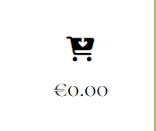

# Project 5 - Kelly's Art & Photo Boutique

This project is created as part of Code Institute's Software Development course.
Layout and code for this project is based on Code Institute's Walk-through project:
[Boutique Ado]("https://github.com/Code-Institute-Solutions/boutique_ado_v1").

Kelly's Art & Photo Boutique has no commercial intention.
Aim of this project was to create a .... where Site Users can ....,  

...Boutique's theme:  

Deployed site: [Kelly's Art & Photo Boutique](...)

Github: [link to github](https://github.com/BarbyKelly/project-5)

# Content
- [UX Design](#ux-design)
- [User Stories](#user-stories)
- [Features](#features)
- [Structure](#structure)
- [Testing & Validation](#testing--validation)
- [Deployment](#deployment)
- [References & Credits](#references--credits)
- [Acknowledgements](#acknowledgements)

# UX Design

## User Stories

### Admin can:

- Add, edit and delete products via django admin

- Follow SKU system already in place: 
  dr333(add a unique number in the end) for drawings,
  ph888(add a unique number in the end) for photos

- Admin may change the SKU system if needed

#### Future Features for Admin:

- System would suggest a new unique number appropriate for photos and drawings

### Site User can:

- Choose drawings based on what tools were used eg pencil, paint, water-color, marker

#### Future Features for Site Users:

- 

### Visitor may:

- 

#### Future Features for Visitors:

- 

[Back to the overview](#content)

### Deployments

- Ensure env.py is set up properly
- Check gitignore
- Set DEBUG=False in settings.py
- Login to Heroku
- Click on settings in the Menu
- Click on Reveal Config Vars
- Check if these look ok
- Click on Deploy in the main menu
- Scroll down to the end and click on Deploy Branch
- Once Heroku has finished deploying your app, "View app" appears at the bottom of the page
- Click on "View app"

[Back to the overview](#content)

## Wireframes

- Wireframes created with [Balsamiq](https://balsamiq.com/wireframes/)

### Homepage

### Shop Here page

### Contact page

### Request page

### How To page

### Signup page

### Login page

[Back to the overview](#content)

## Colors

- Base color (cornflower) for the website from: [Create.vista.com](https://create.vista.com/colors/color-names/cornflower/)

# Features

## Common Features
- **Navigation Menu**
    - Home
    - 
    - Request
    - Contact
    - Sign up
    - Login

- **Footer**
    - Copyright
    - Social Media links

## Homepage Features
- 

## Future Features

- Registered Site User may save items as their favourites, and see them under their profile

- If Registered Site User pauses their shopping, they can save the shopping cart items, and return next time

- Add an option to search Drawings and Photos by Holiday eg Easter, Christmas, Halloween

[Back to the overview](#content)

# Testing & Validation

- 

  validated with Google developer tools

- 

  validated with: [W3C Markaup Validation](https://validator.w3.org/)

- 

  validated with: [W3C Markup Validation](https://validator.w3.org/)

- 

  validated with: [codebeautify](https://codebeautify.org/jsvalidate)

- 

## Bugs

- Products would not display. Nothing happened when the developer clicked on All Items to see the products.

- Drawings and Photos have same words, for searching specific items, need to ensure unique names?

- When clicking on "Drawings: by price, by author or All drawings, by price, by author, All Photos or latest drawings, latest photos or All Latest", 
  nothing is displayed. Only "All Items"link works.

- nothing in the cart when clicking on add to cart

- cart shows €0.00 on the website, but when you click to open the cart, it has items in

- Plus and minus buttons would not work, when developer tried to adjust item quantities in the cart. 
  Developer could only increase the item quantities with arrows:

  

  Developer thought issue is in base.html, scripts must be not correct. As plus and minus buttons had worked when she followed Boutique Ado walk-through for her walk-through project.
  Developer used [Diffchecker](https://www.diffchecker.com/) to compare her project 5's code vs Boutique Ado walk-through lesson,
  and then compared the script codes vs the Boutique Ado version that had worked for the developer:

  

  Developer went back to lesson "Base Template Part 1":

  

  to see where she may have made an error. Developer found that she had used the updated code when she created her walk-through project, but had used different version of code for project 5.

  Developer adjusted block corejs code in her project 5, to match the one that worked for her walk-through project. This fixed the error. Plus and minus buttons were fixed, developer was able to increase or decrease the number of particular item in the cart with plus and minus buttons:

  

  - Developer noticed how "All Photos" and "All Drawings", showed 0 items, while "All Items" displayed all items. She couldn't find 
    what was causing the error. Developer's coursemate Patrick Hladun found an error: two of the product categories had the same "pk":9 
  

    Developer fixed conflict between pk numbers, and used  to help her to fix rest of categories.json, as "author": "author" was missing under pk:1, and pk:6 "author": "author" was missing one of these: '}':
    
    
    
    After fixing these errors, json file validation worked as expected:

  

  All Photos and All Drawings still showing 0 products

### Known Bugs

- 

- 

### Forking the repository

- Go to [Github](https://github.com/)
- If you want to fork one of your own repos, then DO NOT login under your own name, as fork option is not available

- Search Github or Google for the repo that you would like to fork
- Open the repo you want to fork
- On the same line as the Repo's name, on the right, click on the arrow beside the Fork
- Click on: + Create a new fork

- Choose a name for the repo
- Add description if you desire
- Choose if you want to Copy the main branch only
- Click on: "Create fork"

### Creating the repository

- Code Institute's [template](https://github.com/Code-Institute-Org/ci-full-template) was used to set up this project.
- After clicking on the above template link, click on the green button: "Use this template"
- From there choose: "Create a new repository"
- Fill in "Repository name" with your desired name for the project
- Leave the project Public like the default setting (for Code Institute projects)
- Click on the green button "Create repository"

[Back to the overview](#content)

# References & Credits

- All of the code for Kelly's Art & Photo Boutique is based on Code Institute's Walk-through project ["Boutique Ado"](https://github.com/Code-Institute-Solutions/boutique_ado_v1) 
  The developer has credited Walk-through mainly on top of html files, 
  due to enourmous number of other files, which are all coded like Walk-through project.

- General ReadMe template derived from developer's Project 4 [Blog](), that README was originally based on: [findMEreadME](https://github.com/brodsa/findMEreadME/blob/main/README.md#content)

- Search icon from: [fontawesome.com](https://fontawesome.com/v4/icon/search)

- As Kelly's Photo & Art Boutique sells drawings made by the developer's kids, the developer asked her kids to come up with a logo. 
  Website's Logo was designed by developer's 10 year old daughter Aoife. With developer's guidance, Aoife used Balsamiq Wireframes to create the Logo by herself. Aoife chose colors based on Developer's wish for 'cornflower blue'.
  Developer used  to check and slightly adjust contrast of colors. And together, developer and Aoife chose icons for Logo. Developer adjusted the layout of the Title on the Logo. Developer's 6 year old daughter Ciara watched every step, and gave her approval. Website's finalised logo:

add image here!!!

- Developer chose "Cart-arrow-down" icon from [Font Awesome](<i class="fa-solid fa-cart-arrow-down"></i>) to hightlight there's only 
  an option to download items from Kelly's Art & Photo Boutique, no physical items sold

     

- (<i class="fa-solid fa-caret-left"></i>) from font awesome. place all font awesome credits together!! arrow cart.html

- (<i class="fa-solid fa-lock"></i>) secure checkout lock cart.html and toast_success.html

- Developer read [this article](https://webflow.com/blog/professional-fonts?utm_source=google&utm_medium=search& utm_campaign=SS-GoogleSearch-Nonbrand-DynamicSearchAds-Tier4&utm_term=dsa-1480385100845___703207072761__&gad_source=1&gclid=Cj0KCQjwzva1BhD3ARIsADQuPnUfvRW_kuHUD-8GkB-9fEIf5ugmRlHpgHIsqWgaPlIm8EvOsCXomWIaAtElEALw_wcB) to figure out which font to use

- Code for "Cormorant Garamond" font from [Google Fonts](https://fonts.google.com/selection/embed)

- Fontawesome circle-arrow-up icon from: [Fontawesome.com](https://fontawesome.com/icons/circle-arrow-up?f=classic&s=solid)

- Responsiveness test/image created with: [am I responsive](https://ui.dev/amiresponsive)

- Wireframes created with [Balsamiq](https://balsamiq.com/wireframes/)

- 
 
- How to add favicon: [W3 Schools](https://www.w3schools.com/html/html_favicon.asp)

## Images

- All of the photos used for the website, were taken by the developer

- All of the drawings were made by developer's kids, at school, preschool, or at home

- Images optimized with [Simple Image Resizer](https://www.simpleimageresizer.com/resize-image-to-500-kb)
  All converted images have 'opt' in the name to show they were optimized

- Logo created by Developer's 10 year old daughter Aoife, with wireframe, under developer's guidance and Aoife's design idea. 
  Screenshot image of the logo:
  
  

[Back to the overview](#content)

# Acknowledgements

- Developer is grateful for any guidance and support provided by her family and friends, mentor, facilitator, tutors, Slack members, 
  Coursemate Patrick Hladun, and online content creators.

- Special thank you to developer's daughters Aoife and Ciara, for allowing their beautiful art to be part of this e-commerce       
  website, and for creating a unique Logo

- Developer understands the importance of hiding Secret Keys. Mentor Lauren-Nicole Popich suggested to mention in README, that  
  secret key was visible at the start of the project, as the developer was following the steps from Boutique Ado walk-through. Developer changed the key and hid it, as advised by her mentor.

[Back to the overview](#content)