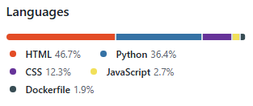

# Project 5 - Kelly's Art & Photo Boutique

[Kelly's Art & Photo Boutique](https://kellys-art-and-photo-boutique-913058c0223e.herokuapp.com/) was created as part of Code Institute's project,
for Diploma in Full Stack Software Development (E-commerce Applications) course.

Developer mainly based her project on Code Institute's Walk-through:
[Boutique Ado](https://github.com/Code-Institute-Solutions/boutique_ado_v1_sourcecode).
 
Aim of Kelly's Art & Photo Boutique:
- built for educational purposes only
- to create a Site where selection of Art and Photos are displayed
- sharing Art made by Developer's kids, and Photos taken by the Developer
- option for Site users to browse products, search and choose products
- test out purchasing products (without real transactions)
- option to Sign up and Sign in
- check out 'How To...?" videos with art lessons by selected YouTubers
- sign up for a Newsletter
- fill in a Contact form

This website has no real-time commercial intention.
No real orders, payments or deliveries.

Deployed site: [Kelly's Art & Photo Boutique](https://kellys-art-and-photo-boutique-913058c0223e.herokuapp.com/)

Github: [https://github.com/BarbyKelly/project-5](https://github.com/BarbyKelly/project-5)

Responsiveness tested with [am I responsive](https://ui.dev/amiresponsive)

# Contents

[Business Model for Kelly's Art & Photo Boutique](#business-model-for-kellys-art--photo-boutique)
- [Direct Audience](#direct-audience)
- [Indirect Audience](#indirect-audience)

[User Experience](#user-experience)
- [User Stories](#user-stories)

[Wireframes](#wireframes)

[ERD, SEO and Marketing](#erd-seo-and-marketing)
- [ERD](#erd-seo-and-marketing)
- [SEO](#seo)
- [Marketing](#marketing)

[Design](#design)
- [Images](#images)
- [Color](#color)
- [Font](#font)

[Features](#features)
- [Existing Features](#existing-features)
- [Future Features](#future-features)

[Languages Used](#languages-used)

[Sites, Apps Used](#sites-apps-used)

[Validation](#validation)
- [Lighthouse](#lighthouse)
- [HTML](#html)
- [CSS](#css)
- [Python](#python)

[Testing](#testing)

[Bugs](#bugs)
- [Fixed Bugs](#fixed-bugs)
- [Known Bugs](#known-bugs)

[Deployment](#deployment)

[Forking Repository](#forking-repository)

[Creating Repository](#creating-repository)

[Credits](#credits)

[Acknowledgements](#acknowledgements)

# Business Model for Kelly's Art & Photo Boutique

## Direct Audience

The following groups are considered Direct Audience, as they are most likely to purchase, commission or order products from Kelly's Art & Photo Boutique:
  
  - Online Users searching for:
    - Original Art (e.g., Name Art, Seasonal Art such as winter, Animal Art etc.) 
    - Children's Art
    - Handmade Art
    - Photos (e.g., Sky, Beach, Animals, Rainbows, Variety etc.)

  - Educational Institutions: 
    - Schools and higher education providers seeking examples of art/photos or decorations for their institutions
    - Crèches and preschools incorporating childrens' art into projects

  - Healthcare and Care Homes:
    - Nursing homes and healthcare Practices searching for artwork or photos for waiting rooms, wards,
      and community spaces
    - Clinics and treatment areas where children and adults are tested or treated, to create a brighter more welcoming, 
      more homely/relatable atmosphere, and maybe inspire patients

  - Treatment Centers, Therapists:
    - Looking for artwork or photos to enhance the ambiance of the waiting rooms, therapy areas or playrooms, sensory sections

  - Hospitality and Accommodation Providers:
    - Restaurants, cafes, hotels, B&B's, Airbnb's, searching art or photos for specific ambiance
  
  - Individuals, couples, families, friends:
    - People seeking handmade and original gifts for variety of occasions eg graduation, first school day, birthday, anniversary, just to say 'Thank you'

  - Beauty and Spa businesses:
    - Salons, spas, wellness centers, looking for certain type of Art/Photos to complement their relaxing atmosphere

## Indirect Audience

Groups that are influenced by the display or recommendation of the products made by Kelly's Art & Photo Boutique:

- Business owners and interior designers:
  - Seeing products of Kelly's Art & Photo Boutique displayed in someone's living space, business,
    accommodation, Healthcare Provider, in Educational institution
  
- Visitors, friends, guests:
  - Individuals or groups exposed to art and photos in homes, schools, hospitality and accommodation places,
    hospitals, nursing homes, businesses, may be interested in requiring art from Kelly's Art & Photo Boutique

- Influencers and Promoters:
  - Influencers or Promoters, who share or recommend products from the boutique, on social media, blogs, 
    local networks, sharing boutique's reels/page

[Back to Business Model](#business-model-for-kellys-art--photo-boutique)

[Back to Contents](#contents)

# User Experience

## User Stories

Users may opt to use various features:

### Navbar

- Click on Navbar items/links:

### Logo

- Click on Logo (to bring them back to Home Page or refresh Home Page)

### Home

- Click on Home NavLink to get back to Home page or to refresh Home page
- Click on 'Click Here To Shop' button on Home page

### Art

- Hover on Art NavLink (on larger screens) for Art dropdown menu to be displayed
- Click on Art NavLink which opens up Art page with all of the Art available in the Boutique
- Choose to click on any item in dropdown menu, to select Art by specific category
- Hover on badges (for all screen sizes) to highlight any badge that pointer is on
- Click on badges to choose an Art category
- Choose to sort Art by Price, Name, Author, or Category
- Select Art by: Animal, Name, Winter, or Variety

### Photos

- Hover on Photos NavLink (on larger screens) for Photos dropdown menu to be displayed
- Click on Photos NavLink, which opens up Photos page with all of the Photos available in the Boutique
- Choose to click on any item in dropdown menu to select Photos by specific category
- Hover on badges (for all screen sizes) to highlight any badge that pointer is on
- Click on badges to choose particular Photos category
- Choose to sort products by Price, Name, Author, or Category
- Select Art by: Animal, Name, Winter, or Variety
- Choose photos by: Beach, Rainbow, Animal, Sky, or Variety

### Cart

- Click on Cart NavLink to open Shopping Cart page
  - Click on 'Back to Shopping' if no items in the cart
  - Click on "Proceed to Secure Checkout" in the pop-up, after adding an item into the cart:

  

  - Click on 'Continue Shopping'
  - Click on 'Secure Checkout'

  

### How To...?

- Click on 'How To...?' NavLink, to access 'How To...?' page
- Select any of the YouTube links to watch by clicking on them
- YouTube videos opening up in the new tab, leaving Kelly's Art & Photo Boutique's open in a previous tab

### Newsletter

- Click on Newsletter NavLink to open up Newsletter page with form
- Fill in the form (email only) to sign up for Boutique's Newsletter
- Click on 'Back to Boutique'
- Click on 'Subscribe' to subscribe to the Newsletter

### Contact Us

- Click on 'Contact Us' NavLink to open up 'Contact Us' page
- Fill in form to contact Boutique
- Click on 'Back to Boutique'
- Click on 'Submit Contact Form'

### Sign In

- Click on 'Sign In' NavLink to access 'Sign In' page with a Sign In Form
- Click on link: 'Sign Up' if User does not have an account yet
  - Sign Up page opens after click, and User may fill in Sign Up form (steps below under 'Sign Up')
- User may choose to fill the 'Sign In' form or not

#### Sign In form

- Fill in Username or Email, and a password:
    - Even if they don't have an account. Only User with an account will be signed in
    - Users will be reminded to 'Please fill in this field', if they have not filled either of the 'Sign In' boxes correctly, 
      or if they do not have an account
  - Option to tick 'Remember Me' box:
    - Even if they don't have an account. Only User with an account will be Remembered (depending on their cookie settings)
  - Click on 'Home' button to return to Home page
  - Click on 'Sign In' button to sign in:
    - Even if they don't have an account or have not entered correct details, they can click on the button.
      Only User with an account and valid Username/e-mail and Password, will be signed in
    - User without an account or user who has not entered correct details, will be reminded to "Please fill in this field"
  - Click on 'Forgot Your Password?':
    - Even if they don't have an account.
      - Fill in 'Password Reset' form:
        - Click on 'Reset My Password'
        - Only User with an account and valid email address, will receive an email to reset their password
        - Click on 'Back to Sign In' button

### Sign Up

- Click on 'Sign Up' NavLink to access 'Sign Up' page and 'Sign Up' form:
- Click on: 'Sign In here' (which opens up 'Sign In' form (steps for 'Sign In' form described above))
  if they already have an account set up
- User may choose to fill the 'Sign Up' form or not

#### Sign Up form

- Fill in E-mail address, E-mail address confirmation, Username, Password and Password (again)
- Users are reminded: 'Please fill in this field' if they leave a required field blank
- Opt to click on 'Back to Sign In' button to return to 'Sign In' form
- Click on 'Sign Up' button to Sign Up

#### Search Icon/Search Form

- Click on Search Icon to open up Search Form
- Type in Search Form
- Click on Blue Search Icon (part of the form) or press Enter, to start search
- Search Art and Photos in the Boutique with keywords eg 'rainbow':

  

- Click on Blue Search Icon (part of the form) or press Enter, without typing in Search Form
  - Use 'x' in top right corner to close Error alert, when Search Form was left empty
- Click on Search Icon in the Navbar to close Search Form

#### Burger Icon/Menu (on smaller screens)

- Click on Burger Icon to open dropdown menu
- Choose any of the items from the dropdown menu and click on them

### User who is not an Admin of Kelly's Art & Photo Boutique, may not:

- Add, edit or delete products
- Access Product Management
 
### Users once signed in may:
- Notice a pop up: "Success! Successfully signed in as ..." displayed on top right
- Access 'My Profile' via 'My Account'
- Under their profile Update their Default postage information
- See their Order History
- Sign Out by clicking on 'Sign Out' under 'Sign In' tab

### Extra permissions for An Admin. Admin may:
- Access 'Product Management' once signed in
- Add, edit and delete products via django, or directly on website when logged in as Admin (via Product Management)
- Follow SKU system already in place: 
  dr33(add a unique number in the end) for Art,
  ph88(add a unique number in the end) for Photos

- Admin may change the SKU system if needed
- Admin may click on Shopping cart and see if admin has any products in the cart (for testing)
- Admin can create test purchases and delete them after
- Admin may click on all items on the website like other users

### Footer

- User may click on Privacy Policy to open it up
- May click on Social Media icons to open up their home pages

[Back to User Experience](#user-experience)

[Back to Contents](#contents)

# Wireframes

Wireframes created with [Balsamiq](https://balsamiq.com/wireframes/)

Disclaimer: There may be variations between Wireframes and the finished project.

## Home Page

## All Items Menu

## Art Menu

## Photos Menu

[Back to Wireframes](#wireframes)

[Back to Contents](#contents)

# ERD, SEO and Marketing

## ERD

ERD is created as a visualization of the Kelly's Art & Photo Boutique's database structure.

- ERD steps learned from: [LucidChart Tutorial: How to Create an ERD](https://youtu.be/RBZtPhZkUZM?feature=shared)

- [LucidCharts](https://www.lucidchart.com/pages) used to create ERD

- Disclaimer: There may be variations between ERD and the finished database structure of the project.

  

[Back to Contents](#contents)

## SEO

- SEO tests helped Developer to see robots.txt file was not ok.
  With tutors help, developer fixed robots.txt and sitemap.xml

- Google Lighthouse tests helped Developer to improve SEO score.

[Back to Contents](#contents)

## Marketing

### Facebook Mockup

- Developer set up Facebook Mockup to show how her site would look on Facebook:

### Facebook Reel

- Developer created a [Facebook Reel](https://youtu.be/F123AhI8RGA), with Stone Art,
  to show one of the options how she would advertise the arrival of a new  collection:

  All of the displayed stone Art in the Reel, was created by Developer's daughter Aoife, age 10

  Disclaimer: Reel is demonstrated via YouTube, in case sample business page for Facebook is taken down by Facebook 

[Back to ERD, SEO and Marketing](#erd-seo-and-marketing)

[Back to Contents](#contents)

### Keyword Research

Developer used keywords suitable for the project eg photo, art, boutique, shop, handmade, original, Kelly's Art & Photo Boutique, gifts, décor>

[Back to ERD, SEO and Marketing](#erd-seo-and-marketing)

[Back to Contents](#contents)

### Similar Businesses

Developer found the following businesses relevant to her sample business, and their sites relatable:

[Gallerix.ie](  https://gallerix.ie/)

[JamArtFactory.com](https://jamartfactory.com/)

[Kids and Art](https://kidsandart.org/store-artwork/)

To date Developer did not come across a website with same combination as hers: parent's photos and their kids' art in one online shop.

[Back to ERD, SEO and Marketing](#erd-seo-and-marketing)

[Back to Contents](#contents)

# Design

## Images

- Background image by the Developer

- Logo image created together with Developers kids, using Wireframe and Developer's photo and her kids art

## Color

- Base color (cornflower) for the website from: [Create.vista.com](https://create.vista.com/colors/color-names/cornflower/)

## Font

- Code for "Cormorant Garamond" font from [Google Fonts](https://fonts.google.com/selection/embed):

  

[Back to Contents](#contents)

# Features

## Existing Features

### Home Page

  

  - Displayed on Home page:
    - Logo
    - Navbar
    - NavLinks or Burger Menu (depending on screen size)
    - Search Icon
    - 'Click here to shop' button
    - Footer:
      - Copyright
      - Developer's name
      - Project type
      - Disclaimer: no real transactions
      - Privacy Policy
      - Social Media links

  - Hovering effect for all Navbar items i.e. hovered item is raised, and pointer is indicating item is clickable
  - NavLinks have a line under while hovered, to highlight them more
  - No active line under Logo, Search Icon or Burger Menu on hover
  - Home page has a background image
  - No products displayed on Home page
  
  #### 'Click here to shop' button

  - Clickable button to start to shop
  - All of the products are displayed on scrollable page after clicking on 'Click here to shop'
  - Button is displayed near bottom left

### Favicon

Favicon displayed in the browser tab for Kelly's Art & Photo Boutique:

  

### Logo

- Logo displayed on all pages of the website, and on all screen sizes
- On hover, Logo is raised, and pointer appears
- Logo is clickable
- Click on Logo brings user back to Home page or refreshes Home page if User is already on the Home page

  

[Back to Features](#features)

[Back to Contents](#contents)

### Art

- Hovering effect for Art NavLink (on larger screens) displays dropdown menu of Art categories
- Clickable Art NavLink
- Clickable dropdown menu options
- Hover effect for dropdown menu items
- Click on Art NavLink opens up Art page with all of the Art available in the Boutique
- Click on Art category from dropdown menu, opens up page with the selected category of Art
- When Art page is open with all or some of the products:
  - 'Products Home' link (below Navbar, above products on the left) is clickable
  - Click on it opens up page with all of the Boutique's products, Art and Photos
  - Number of products eg 18 products, is displayed beside 'Products Home' link

#### Badges

- Displayed below Navbar for all Art or selected category of Art
- For all screen sizes
- Change color when hovered
- Pointer appears on badge when hovered
- Clickable
- Click on badge opens up selected Art category
- Or refreshes the page if only one category of Art is displayed
- Options for Badges if all Art displayed: Variety of Art, Winter Art, Name Art, Animal Art 

#### Sorting

- 'Sort by' option displayed on the right below badge(s):

- Placeholder 'Sort by...' is displayed
- Options to sort by:
  - Price (low to high)
  - Price (high to low)
  - Name (A-Z)
  - Name (Z-A)
  - Author (A-Z)
  - Author (Z-A)
  - Category (A-Z)
  - Category (Z-A)
- Sorting options is highlighted on hover
- Click on Sorting option sorts products as required, and all of the Art is displayed in requested order
- User may choose eg 'Variety of Art', 10 products displayed, and then opt to sort the category by Author (A-Z),
  which results in all 10 Variety of Art products sorted by Author A-Z

#### Art/product cards

- On hover, pointer appears and Art product is raised up to highlight which product is hovered 
- Card includes:
  - Image
  - Name
  - Price
  - Author
  - Badge
- Product card is clickable
- Click on product card opens up a page with the selected product
- Details displayed on product page:
  - Image
  - Name
  - Price
  - Author
  - Badge
  - Description
  - Size options:
    - Default size option - 13x10cm
    - 13x10cm
    - 10x13cm
    - 18x13cm
    - 13x18cm
    - 45x30cm
    - 30x45cm

  - Quantity:
    - By default quantity of 1 is displayed in the input field
    - Quantity can be increased/decreased using either arrows or by typing
    - Arrows:
      - On hover, arrows appear at the right end of input box
      - Arrows are clickable
      - Arrow up increases Quantity by 1
        - Max quantity 50 per product:
          - Arrow up is still clickable, when Quantity 50 is displayed
          - Blue background color appears behind 50, when User clicks on arrow up while 50 is displayed
          - Quantity would not increase beyond 50
          - [Future feature below to improve feedback to User re Quantity](#quantity)
      - Arrow down decreases Quantity by 1
        - Min quantity 1:
          - Arrow down is still clickable, when Quantity 1 is displayed
          - Blue background color appears behind 1, when User clicks down arrow to reduce below 1
          - Quantity would not dencrease below 1
          - [Future feature below to improve feedback to User re Quantity](#quantity)

    - Typing Quantity values:
      - User can click in input box and type in any number
      - If value entered is more than 50, pop up appears: "Value must be less than or equal to 50.":

        

      - If User leaves the value above 50, and clicks on 'Add to Cart', same pop up appears

      - When User types a value less than 1, pop up appears: "Value must be greater than or equal to 1.":

        

  - Buttons below quantity:
    - 'Continue Shopping' and 'Add to Cart'
      - Click on 'Continue Shopping' brings User to the page with all of the Products, Art and Photos
      - Click and 'Add to Cart', adds the product to the cart, with selected size and quantity

### Search Icon/Search Form

- Search is for Products only, not for the whole site
- Search Icon displayed on all screen sizes
  - On the right, at the end of the Navbar - for larger screens
  - On smaller screens, on the left of Burger Menu button, close to the right side

  

- Search Form opens when User clicks on Search Icon:

  

  - Search Form opens below the Search Icon and Burger Menu, below the Navbar
  - User may type in Search Form
  - Placeholder 'Search our Boutique' is displayed in Search Form, unless User types in at least one character
  - User may use Search Form to find Art and Photos in the Boutique, with keywords eg 'hedgehog':

    

  - Blue Search Icon at the end of the Form is clickable to start search
  - Or User can press 'Enter' on keyboard to start search or tap on screen
  - Empty search can be started without typing anything in Search Form:
    - Empty search results in:
      - All of the Products being displayed, and
      - An error message near Search Icon notifying User: "Search criteria not entered!"
      - User has an option to click on 'x' in top right corner of the message, to close Error alert

      

  - Click on Search Icon in the Navbar closes Search Form (unless User chooses to activate Search)

[Back to Features](#features)

[Back to Contents](#contents)

### Navigation Menu

#### Navbar

- All Navigation Menu items are clickable and displayed below Logo on a larger screens, beside each other:

  

- Collapsed/burger-menu is displayed on smaller screens:

  

- When User clicks on 'All Items', dropdown opens:
  - All Items
    - By Category
    - By Price
    - By Author
    - All Items

- Previously opened dropdown menu closes, if another Button is clicked 

### Art

- When User clicks on 'Art', dropdown opens:

- Art
  - Animal Art
  - Name Art
  - Winter Art
  - Variety of Art
  - All Ar

### Photos

- When User clicks on 'Art', dropdown opens:

- Photos
  - Beach
  - Rainbows
  - Animals
  - Sky
  - Variety of Photos
  - All Photos

### How To...?

- 'How To...?' page displays links to various YouTube channels, showing different styles of doing art

### Sign In

- Displaying 'Sign In' form
- And an option to 'Sign Up'
- To click on 'Home' button
- Or 'Sign In' button
- And to choose 'Forgot Your Password?", which opens up:
  - 'Password Reset' page:
    - User can enter email address,
    - Click on 'Back to Sign In', 
    - Or click on 'Reset My Password'

### Sign Up

- Displaying 'Sign Up' form
- And an option to 'Sign In' if User already has an account
- Option to click on 'Back to Sign In' button
- Or 'Sign Up' button

### Cart

- Displaying 'Shopping Cart' page:
  - If cart is empty:
    - Message: 'Your cart is empty'
    - with a button below: 'Back to shopping'
  - If items placed in the cart by User:
    - list of products in the cart with image, title, size, and SKU
    - price of each item
    - quantity of each item
    - option to update quantity or remove product
    - cost of subtotal of each type of item
    - cart total
    - postage cost
    - grand total
    - buttons below: 'Continue shopping' and 'Secure Checkout'

### Contact Us

- User can click on Contact Us
- Fill in Contact Form
- Click on 'Back to Shopping'
- Or click on 'Submit Contact Form'

### Newsletter

- Newsletter page has an option to fill in Subscription form
- User can enter their email address
- Click on 'Back to Shopping'
- Or click on 'Subscribe'

### Footer

  - Copyright with year of the project
  - Developer's name
  - Stating it is an E-commerce Project
  - Disclaimer: Site is not for real transactions
  - Privacy policy:
    - User can click on 'Privacy Policy' to access it
  - Social Media links:
    - Clickable
    - General Facebook, Twitter and YouTube pages open after click/tap
    - Mock Facebook page has been set up for the site. Developer understands Facebook can delete the Mock up page,
      therefore Developer kept the general Facebook link instead
  - Footer is same for all pages
  - Footer is displayed for all pages

[Back to Features](#features)

[Back to Contents](#contents)

## Future Features

- Active/chosen Menu Item is underlined or otherwise highlighted
- Registered Site User may save items for later, or as their favorites, to access these under their account
- Registered User is notified of saved items in their cart when they return to the website

- 'How To...?' page to include videos related to Photos, Photography
- Improved Descriptions for all products, to improve search for Users, and add more keywords
- Add an option to search Art and Photos by special celebrations: Easter, Christmas, Halloween, Birthday, Anniversary, Valentine's Day etc.
  (with improved Descriptions, this option will work, like now when looking for Winter, rainbow)
- Filter to search products with multiple options eg Stone Art - Birthday - Age 5
- Option to choose art based on what tools were used eg pencil, paint, water-color, marker, paper, stone, canvas

- Username is displayed when signed in

- Live classes with Site Visitors, creating Art, discussing techniques, sharing ideas

- Users can use search box to search all parts of the website, not just products

- Password Reset form would notify User if their email is not registered for an Account. Presently any email address is accepted on Password Reset form 

- Clickable Contact details below 'Password Reset' form, instead of just text as it is at the moment: 

  

- Clickable Contact details below 'Password Reset' email notice, instead of just text as it is at the moment:

  

- For Admin: System would suggest a new unique SKU, based on existing products, when Admin is adding a new product

- All required fields marked with asterisk

- On smaller screens, Search Icon was displayed before:

  

  Due to Developer changing Nav bar items around, Search Icon is no longer displayed on smaller screens. Developer is aware this needs to be fixed.

- When User has added an item into Cart, at the moment 'Proceed to Secure Checkout' is displayed below the cart content. 'Back to shopping' button needs to be added beside it.

- Asterisks to mark all mandatory fields on all forms.

- 'Sign In' form: if incorrect details entered, pop up to display: 'The Username/email and/or password entered are incorrect. Please try again.'
At the moment default message mentions only username and/or password being incorrect.

- Links in 'How To ...?' to include lessons how to take better photos

- Users can Sign Up and Sign In via social media links, Google account and similar

### About Creators

- App added to share details about the people who created Art & Photos for the Boutique. Maybe painted images of each creator.

### 'My Profile'

- to include email field

- fields to have a label above them or on the left

- alert set up to notify User that they are about to change their 'Default Postage Information'

- 'Phone Number' field to accept numbers only

- Set up restrictions, so User can not delete all 'Default Postage Information' and click on 'Update Information' when fields are left blank

- Instead of displaying 'Thank You for shopping' when User clicks on previous Order, in Order History, would be nice to display: "Your Order nr ..."

### Size options

- Limited to Landscape style or Portrait style, instead of both options available like now
- Image to reflect the size option that User has chosen, before they add the product into cart 

### Quantity

- Message to pop up for User: "Minimum quantity 1", when User tries to reduce minimum quantity below 1
- Alert to pop up: "Maximum quantity 50 per product", when User has quantity of 50 in insert box, and tries to click on upward arrow to quantity beyond 50 

[Back to Features](#features)

[Back to Contents](#contents)

# Languages Used

- HTML
- Python
- CSS
- JavaScript
- Dockerfile

[Back to Contents](#contents)

# Sites, Apps Used

Developer used the following Sites/Apps to create Kelly's Art & Photo Boutique:

- [Code Institute](https://codeinstitute.net/)
- [GitHub](https://github.com/)
- [Gitpod](https://www.gitpod.io/)
- [VS Code](https://code.visualstudio.com/)
- [Django](https://www.djangoproject.com/)
- [Heroku](https://www.heroku.com/)
- [Balsamiq Wireframes](https://balsamiq.com/wireframes/)
- [AWS](aws.amazon.com)
- [Stripe](https://stripe.com/)
- [YouTube](https://www.youtube.com/)
- [Simple Image Resizer](https://www.simpleimageresizer.com/)
- [Diffchecker](https://www.diffchecker.com/)
- [Favicon](https://favicon.io/favicon-converter/)
- [Font Awesome](https://fontawesome.com/icons)
- [Chat GPT](https://chatgpt.com/)

  Chat GPT only used near the end of the project, to:
  - fix Newsletter app error. It was not used to generate the code itself
  - understand why responsiveness test would not work

  

[Back to Contents](#contents)

# Validation

* For testing, in many places developer used "Kelly's Boutique" instead of "Kelly's Art & Photo Boutique", to reduce the number of characters, and make it easier read.

## Lighthouse

Lighthouse tests with Google developer tools:

- Kelly's Art & Photo Boutique 'Home' Page lighthouse test:

  

- Kelly's Art & Photo Boutique 'All Products' Page lighthouse test:

  

- Kelly's Art & Photo Boutique 'Art' Page lighthouse test:

  

- Kelly's Art & Photo Boutique 'Photos' Page lighthouse test:

  

- Kelly's Art & Photo Boutique 'How To...?' Page lighthouse test:

  

- Kelly's Art & Photo Boutique 'Sign In' Page lighthouse test:

  

- Kelly's Art & Photo Boutique 'Sign Up' Page lighthouse test:

  

- Kelly's Art & Photo Boutique 'Cart' Page lighthouse test:

  

- Kelly's Art & Photo Boutique 'Contact Us' Page lighthouse test:

  

- Kelly's Art & Photo Boutique 'Newsletter' Page lighthouse test:

  

[Back to Validation](#validation)

[Back to Contents](#contents)

## HTML

- HTML validator test with [W3C Markup Validation](https://validator.w3.org/) failed

## CSS

- CSS validator validation with [W3C Markup Validation](https://validator.w3.org/) failed

## Python

- Developer checked some of Python files with [CI Python Linter Test](https://pep8ci.herokuapp.com/)

[Back to Validation](#validation)

[Back to Contents](#contents)

# Testing

Due to large volume of Tests done, Testing is reported in a separate [Testing.md](TESTING.md) file.

# Bugs

## Fixed Bugs

- When developer clicked on any of Art or Photos nav-links, 0 items were displayed on all occasions, and NavLinks did not change color, 
  therefore it was hard to know which tab was open. Screenshot of when Developer expected to see 'All Art' displayed, 
  instead displayed were '0 products, with a heading 'All items':

    

  Developer took these steps to fix main-nav links:

  1. Developer realised, in templates/main-nav.html, she had set up different categories for Art and Photos, than categories in categories.json or Django categories:

    

    

  therefore, Art and Photos categories couldn't display, under Art and Photos NavLinks

  2. Developer matched categories in main-nav with Django categories and categories.json

  3. Art and Photos displayed now correctly, except for Beach Photos.
  None of the 'Beach Photos' were displayed. Developer noticed 'beach-photos' instead of expected: 'beach_photos' in Django Categories:

    

  Developer fixed the category name from 'beach-photo' to 'beach_photo', then Beach Photos were displayed on the website as expected:

    

  4. Developer removed 'photo' from selection of photo titles to make wording look better on the screen (previously: 'Beach photo' title displayed for one photo, and 'Beach photo' displayed for more than one photo, instead of 'Beach Photos')

  5. Developer updated all of the new names/titles for Art and Photos in main-nav.html, categories.json, and Django Categories. 

  6. 'Sky' photos didn't display under 'All Photos'. Developer checked main-nav.html, and noticed sky_photos and animal_photos were still displayed in category, for 'All Photos'. Developer changed sky_photos for sky, and animal_photos for animal, and 'Sky' photos were displayed under 'All Photos' then.

  7. When logged in as an admin, Sign In was still showing in the Navbar, and all of the options for admin were displayed at all times:

   
  
  Click on other NavLinks, opened those links, yet Sign In menu remained open, and blocked top of other pages:

  

  When Developer clicked on Sign In NavLink to see if that would close the Sign In menu, Homepage opened instead.

  Solving:

  Issue located in main_nav.html with Chat GPT's help:

  

  ChatGPT guided Developer to see she was always rendering 'Sign In', signed in or not. 
  Which meant after being signed in, extra links were added as inside the same <li>.

  Developer fixed the styling for Navbar/NavLinks, to see if all would work together after Sign In fix, and ChatGPT guided Developer to reduce repetition of styling in main-nav.html.

  Sign In before and after fix, including updated styling:

  

  As a result of the fix, when Admin was signed in:
  - 'Sign In' NavLink was no longer displayed,
  - Username replaced 'Sign In' NavLink,
  - Options for Signed In Admin were available via dropdown menu
  - 'Sign Up' was no longer displayed for Signed In user/admin

  ChatGPT was a great help for fixing this error, and improving styling to match Django and Bootstrap.

[Back to Contents](#contents)

[Back to Bugs](#bugs)

### Fixed "django.core.serializers.base.DeserializationError: Problem installing fixture"

- Developer ran command: 'python manage.py loaddata categories' and "django.core.serializers.base.DeserializationError: Problem installing fixture..." appeared in the terminal.

- Earlier that day, tutor Oisin guided developer how to fix 'keyword: title' error, relating to json files

- Developer was able to follow similar steps to figure out the error:

- Developer broke down terminal error messages into 3 main (puzzle) pieces, to understand where was the error located:

#### Keyerror: author:

  

#### No field_name author:

  

#### Fixtures categories.json:

  

- Developer had been focusing on field 'author' in categories.json file. Seeing 'author' is in categories.json file, so why would it come up as an error, 'no field_name author'

- After looking at these 3 parts of terminal messages, and checking out fields in Django for Adding 'Categories':

#### Django Add Categories:

  

developer realised issue was that categories.json had a field 'author', while in admin.py/Django categories there was no 'author' field set up

- Developer removed 'author' field from categories.json and 'python manage.py loaddata categories' command worked then ok:

  

- Fixing this bug/error was a great lesson for the developer, she learned how to better understand Terminal messages, and saw more value in them

- This error/bug also helped Developer to realize, she had added products to Django and hadn't updated categories.json accordingly, to reflect
changes made via Django Products.

- Product amounts were not updating in the basket: 
developer adjusted 
 and 
 in cart.html. 

Developer was able to update the amount of certain products in the cart, yet couldn't increase or decrease products when putting it into cart:

  

Button still didn't work, after adusting cart.html, or quantity_input_script.html:

  

Arrows up and down in Quantity box, worked ok, and increased or decreased Quantity as needed, and Subtotal accordingly.

 
- nothing in the cart when clicking on add to cart

- cart shows €0.00 on the website, but when you click to open the cart, it has items in

- Plus and minus buttons would not work, when developer tried to adjust item quantities in the cart. 
  Developer could only increase the item quantities with arrows:

  

  Developer thought issue is in base.html, scripts must be not correct. As plus and minus buttons had worked when she followed Boutique Ado walk-through for her walk-through project.
  Developer used [Diffchecker](https://www.diffchecker.com/) to compare her project 5's code vs Boutique Ado walk-through lesson,
  and then compared the script codes vs the Boutique Ado version that had worked for the developer:

  

  Developer went back to lesson "Base Template Part 1":

  

  to see where she may have made an error. Developer found that she had used the updated code when she created her walk-through project, but had used different version of code for project 5.

  Developer adjusted block corejs code in her project 5, to match the one that worked for her walk-through project. This fixed the error. Plus and minus buttons were fixed, developer was able to increase or decrease the number of particular item in the cart with plus and minus buttons:

  

  - Developer noticed how "All Photos" and "All Art", showed 0 items, while "All Items" displayed all items. She couldn't find 
    what was causing the error. Developer's coursemate Patrick Hladun found an error: two of the product categories had the same "pk":9 
  

    Developer fixed conflict between pk numbers, and used  to help her to fix rest of categories.json, as "author": "author" was missing under pk:1, and pk:6 "author": "author" was missing one of these: '}':
    
    
    
    After fixing these errors, json file validation worked as expected:

  

- Developer noticed Logo had 'Art', while NavLinks had 'Drawings'. Developer replaced 'Drawing' with 'Art' in fixtures: categories.json, in django categories, and in index.html (Home page), and in main.nav html (templates), and then 'Art' was displayed instead of 'Drawings':

  

  

[Back to Bugs](#bugs)

[Back to Contents](#contents)

## Known Bugs

- Username not showing up when logged in

- Sign In menu closes after person has signed in. At the moment dropdown stays open even when other nav links are clicked on:

- Search icon not displayed for smaller screens

[Back to Bugs](#bugs)

[Back to Contents](#contents)

# Deployment

- Ensure env.py is set up properly
- Check gitignore
- Set "DEBUG = 'DEVELOPMENT' in os.environ" in settings.py
- Login to Heroku
- Click on settings in the Menu
- Click on Reveal Config Vars
- Check if these look ok
- Click on Deploy in the main menu
- Scroll down to the end and click on Deploy Branch
- Once Heroku has finished deploying your app, "View app" appears at the bottom of the page
- Click on "View app"

[Back to Contents](#contents)

# Forking Repository

- Go to [Github](https://github.com/)
- If you want to fork one of your own repos, then DO NOT login under your own name, as fork option is not available

  

- Search Github or Google for the repo that you would like to fork
- Open the repo you want to fork
- On the same line as the Repo's name, on the right, click on the arrow beside the Fork
- Click on: + Create a new fork

- Choose a name for the repo
- Add description if you desire
- Choose if you want to Copy the main branch only
- Click on: "Create fork"

[Back to Contents](#contents)

# Creating Repository

- Code Institute's [template](https://github.com/Code-Institute-Org/ci-full-template) was used to set up this project.
- After clicking on the above template link, click on the green button: "Use this template"
- From there choose: "Create a new repository"
- Fill in "Repository name" with your desired name for the project
- Leave the project Public like the default setting (for Code Institute projects)
- Click on the green button "Create repository"

[Back to Contents](#contents)

# Credits

- CODE

  - Code for Kelly's Art & Photo Boutique is mainly based on Code Institute's Walk-through project ["Boutique Ado"] (https://github.com/Code-Institute-Solutions/boutique_ado_v1) 
  The developer has credited Walk-through mainly on top of html files, 
  due to enormous number of files.

  - Other projects, that Developer found helpful to make this project, have been credited in some files and below:

  ["Seaside Sewing by Kera Cudmore](https://github.com/kera-cudmore/seaside-sewing)

  ["Vegan Sneaker Store by Denis Klopotan](https://github.com/denisklopotan/vegan-sneaker-store/)

  [Chirpy Chooks by Kay Welfare](https://chirpy-chooks.herokuapp.com/)

[Back to Credits](#credits)

[Back to Contents](#contents)

- README

  - General README template derived from developer's Project 4 [BookBlog](https://github.com/BarbyKelly/blog). README for BookBlog was based on: [findMEreadME](https://github.com/brodsa/findMEreadME/blob/main/README.md#content)

  - Final README based on Developer's Project 2 ["Estonia Quiz" README](https://raw.githubusercontent.com/BarbyKelly/Estonia-Quiz/refs/heads/main/README.md)

[Back to Credits](#credits)

[Back to Contents](#contents)

- ICONS

  - Free Icons for Search and Social Media, from: [fontawesome.com](https://fontawesome.com/search?ic=free)

[Back to Credits](#credits)

[Back to Contents](#contents)

- LOGO

  - As Kelly's Photo & Art Boutique displays Art made by the developer's kids, the developer asked her kids to come up with a logo. 
  Website's Logo was designed by developer's 10 year old daughter Aoife. With developer's guidance, Aoife used Balsamiq Wireframes to create the Logo. Aoife chose colors based on Developer's wish for 'cornflower blue'.
  Developer used  to check and slightly adjust contrast of colors. And together, developer and Aoife chose icons for Logo. Developer adjusted the layout of the Title on the Logo. Developer's 6 year old daughter Ciara watched every step, and gave her approval.
  Logo has Aoife's art work, Ciara's art work, and photo by the developer. 
  Website's finalised logo:

  

[Back to Credits](#credits)

[Back to Contents](#contents)

- FONT

  - Developer read [this article](https://webflow.com/blog/professional-fonts?utm_source=google&utm_medium=search&  utm_campaign=SS-GoogleSearch-Nonbrand-DynamicSearchAds-Tier4&utm_term=dsa-1480385100845___703207072761__&gad_source=1&gclid=Cj0KCQjwzva1BhD3ARIsADQuPnUfvRW_kuHUD-8GkB-9fEIf5ugmRlHpgHIsqWgaPlIm8EvOsCXomWIaAtElEALw_wcB) to figure out which font to use

  - Code for "Cormorant Garamond" font from [Google Fonts](https://fonts.google.com/selection/embed):

  

[Back to Credits](#credits)

[Back to Contents](#contents)

- WIREFRAMES

  - Wireframes created with [Balsamiq](https://balsamiq.com/wireframes/)

[Back to Credits](#credits)

[Back to Contents](#contents)

- PRIVACY POLICY

  - Privacy Policy created based on lessons for Code Institute's walk-through [Boutique Ado](https://github.com/Code-Institute-Solutions/) 

  [Privacy Policy Generator ](https://www.privacypolicygenerator.info/) was used to create Privacy Policy.

[Back to Credits](#credits)

[Back to Contents](#contents)

- 'HOW TO...?' LINKS

  - Disclaimer: Boutique's admin shared selection of YouTube video links that she or her kids found helpful for creating art. No personal benefit from those or any other youtube channels shared on this website

[Back to Credits](#credits)

[Back to Contents](#contents)

- PRODUCTS AND IMAGES

  - All of the photos used for the website, were taken by the developer

  - All of the Art was made by developer's kids, at school, preschool, in art class, or at home

  - Images optimized with [Simple Image Resizer](https://www.simpleimageresizer.com/resize-image-to-50-kb)
    All converted images have 'opt' in the name to show they were optimized

[Back to Credits](#credits)

[Back to Contents](#contents)

- ChatGPT

  - Closer to the end of the project 5, Developer found out it is ok to check code and get guidance from ChatGPT.
  Developer had no previous coding experience with ChatGPT, as she thought students were supposed to avoid it.
  Learning to use ChatGPT was an interesting experience.
  ChatGPT helped to understand the updated guidelines for Django, Bootstrap, styling, and even helped to solve git commit issue, when
  security changes started to see vs code as a threat, and commits wouldn't go through.
  Changing permissions, and path with ChatGPT's guidance, git commit error got fixed.
  Something similar, would have usually been fixed with tutor's help.
  
  Developer found ChatGPT helpful in general.
  Even with all of the knowledge packed into ChatGPT, it was very important to check if suggestions matched Developer's vision,
  and trying to solve the issues first herself.
  Treating ChatGPT like a tutor, was useful.
  Before ChatGPT, Developer couldn't imagine getting so many errors fixed without tutor's help.
  It was lovely to be able to ask guidance at any time.

  - Performance improvement (after Lighthouse test)

    - Starting Performance score: 71

      

    - Developer shared initial Lighthouse score results with ChatGPT
    - Steps the Developer implemented based on ChatGPT's guidance:
      - Added 'defer' to the Stripe JS script in base.html
      - Updated  loops in products.html, to improve loading time for images
      - Optimized background image file size (472KB to 190KB)
      - Uploaded optimized image to AWS S3
      - Deleted previous background image from both local media and AWS
      - In base.css, replaced the original local background image:

        background-image: url('/media/website_background.jpg');

        with the optimized AWS-hosted image:

        background-image: url('https://kellys-art-and-photo-boutique.s3.eu-north-1.amazonaws.com/media/website_background_opt_200.jpg');

      - Result: Lighthouse Performance score improved to 93

        

  - Best Practices Score improved with ChatGPT's guidance

    - Starting Lighthouse score: 79

      
    
    - Steps suggested by ChatGPT to improve Content Security Policy(CSP):

      

      

- Business Model

  - Developer learned from [Sensical.ie project by David Calikes](https://github.com/davidcalikes/sensical.ie#prior-business-model) how to write Business Model for Kelly's Art & Photo Boutique. Mentor Lauren-Nicole Popich guided developer to this project, as an example for Business model.
   

# Acknowledgements

- Developer is grateful for any guidance and support provided by her family and friends; mentor Lauren-Nicole Popich; Student Care, especially Kim, facilitator Kay Welfare, tutors, Slack members, chatGPT, and online content creators.

- Special thank you to developer's daughters Aoife and Ciara, for allowing their beautiful art to be part of this e-commerce project, for creating a unique Logo based on Developer's ideas for the project, and Aoife's vision for the logo. Great team effort. And for asking Developer to increase prices for their Art. 

- Developer understands the importance of hiding Secret Keys. Mentor Lauren-Nicole Popich suggested to mention in README, that the secret key was visible at the start of the project, as the developer was following the steps from Boutique Ado walk-through, where Secret key was hidden at a later stage.
Developer changed the key asap and hid it, as advised by her mentor.

[Back to Contents](#contents)