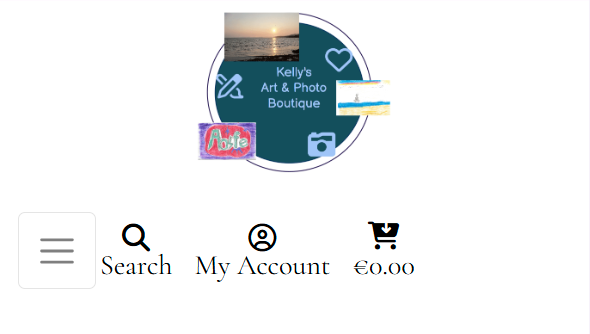
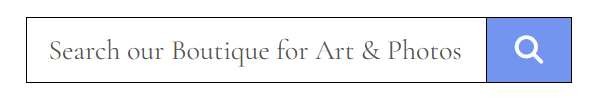
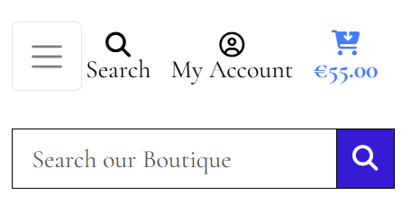

## List of Parts Tested:

- [Favicon](#favicon-testing)

- [Logo](#logo-testing)

- [Search Bar](#search-bar-testing)

- [All Items](#all-items-page-testing)

- [Art](#art-page-testing)

- [Photos](#photos-page-testing)

- [How To ...?](#how-to-page-testing)

- [Sign In](#sign-in-page-testing)

   - [Admin Sign In](#admin-sign-in-page-testing)

   - [Sign Out](#sign-out-page-testing)

   - [Password Reset](#password-reset-page-testing)

- [Sign Up](#sign-up-page-testing)

- [Cart](#cart-page-testing)

   - [Checkout](#checkout-page-testing)

   - [Thank You for Shopping](#thank-you-for-shopping-page-testing)

- [Contact Us](#contact-us-page-testing)

- [Newsletter](#newsletter-page-testing)

- [404 Error Page](#404-error-page-testing)

### Favicon Testing

| Tested Item | Expected Outcome                                      | Outcome     |
| ----------- | ----------------------------------------------------- | ----------- |
| Favicon     | Reduced image of the Logo                             | as expected |
|             | Displayed in browser tab for all pages of the website | as expected |

[Back to the List](#list-of-parts-tested)

### Logo Testing

| Tested Item | Expected Outcome                               | Outcome     |
| ----------- | ---------------------------------------------- | ----------- |
| Logo        | Displayed top left for larger screens          | as expected |
|             | Displayed top center for smaller screens       | as expected |
|             | Displayed on all pages of the website          | as expected |
|             | Text 'Kelly's Art & Photos Boutique' is        |             |
|             | displayed big enough on all screen sizes       | as expected |
|             | Art and Photos on the Logo are                 |             |
|             | displayed big enough on all screen sizes       | as expected |
|             | Logo matches the theme of the website          | as expected |
|             | Clicking on Logo brings user back to Home page | as expected |  

[Back to the List](#list-of-parts-tested)

### Search Bar Testing

Color changes when Hovering over Search Button:

| Tested Item | Expected Outcome                                                                   | Outcome     |
| ----------- | ---------------------------------------------------------------------------------- | ----------- |
| Search Bar  | Displayed top center for larger screens                                            | as expected |
|             | Placeholder is faded in Search box                                                 | as expected |
|             | Personalized Placeholder                                                           | as expected |
|             | Placeholder text 'Search our Boutique for Art & Photos'                            | as expected |
|             | User can type in the Search box                                                    | as expected |
|             | Placeholder is no longer displayed, when first character is entered in Search Box  | as expected |
|             | Search button is clickable                                                         | as expected |
|             | Hovering over 'Search Icon' that is placed on the right of 'Search Bar' button,    | as expected |
|             | changes color of the button                                                        | as expected |
|             | User can click on Search button to activate Search                                 | as expected |
|             | If user enters a valid Search term, those products are displayed                   | as expected |
|             | When user enters eg number 9, all products made by 9 year old, are displayed       | as expected |         
|             | If user clicks on Search button without entering any value in Search Box,          |             |
|             | An error message "Search criteria not entered!" pops up                            | as expected |
|             | When user searches for eg 'rainbow', photo and art with rainbow are displayed      | as expected |
|             | When user types in random characters eg 'jjjj',                                    |             |
|             | '0' Products found for 'jjjj' is displayed                                         | as expected |
|             |                                                                                    |             |
|             | Search option is displayed on all pages of the website                             | as expected |
|             | User can search Products only: Art & Photos, not rest of the website               | as expected |

[Back to the List](#list-of-parts-tested)

### 'All Items' Page Testing

[Back to the List](#list-of-parts-tested)

### Art Page Testing

[Back to the List](#list-of-parts-tested)

### Photos Page Testing

[Back to the List](#list-of-parts-tested)

### 'How To...?' Page Testing

| Tested Item | Expected Outcome                                                            | Outcome     |
| ----------- | --------------------------------------------------------------------------- | ----------- |
| How To Page | 'How To...?' page opens when the user clicks on the NavLink 'How To ...?'   | as expected |
|             | Website's background image is displayed behind the links at all times       | as expected |
|             | Responsive to different screen sizes                                        | as expected |
|             | 'How To...?' NavLink remains the same color and style as rest of the Navbar | as expected |
|             | Website's Logo is displayed on top left for larger screens,                 | as expected |
|             | and in the middle for smaller screens.                                      | as expected |
|             | Search bar is displayed in the middle for larger screens                    | as expected |
|             | All Navbar items are displayed on larger screens, below Logo                | as expected |
|             | Collapsed Navbar Menu displayed on the left for smaller screens             | as expected |
|             | 'How To...?' boxes are displayed in the center of the screen                | as expected |
|             |                                                                             |             |
|             | Each 'How To...?' link is displayed in a separate box                       | as expected |
|             | All video links are displayed in blue                                       | as expected |
|             | Line appears below the link when pointer is on the link                     | as expected |
|             | 'How To...?' video links are clickable                                      | as expected |
|             | Click on each 'How To...?' link opens the appropriate video                 | as expected |
|             | Videos open in a new tab                                                    | as expected |
|             | 'How To...?' page remains open in a previous tab                            | as expected |
|             |                                                                             |             |
|             | Footer is displayed at the bottom on all screen sizes,                      | as expected |
|             | on smaller screen might need to scroll to see Footer                        | as expected |

[Back to the List](#list-of-parts-tested)

### Sign In Page Testing

| Tested Item   | Expected Outcome                                                                                            | Outcome     |
| ------------- | ----------------------------------------------------------------------------------------------------------- | ----------- |
|               |                                                                                                             |             |
| Sign In       | 'Sign In' can be accessed by click on NavLink in the Navbar                                                 | as expected |
| Page          | or when 'Sign In' link is clicked via Side Menu (on smaller screens)                                        | as expected |
|               | Website's background image is not displayed behind the page                                                 | as expected |
|               | Page is Responsive to different screen sizes                                                                | as expected |
|               | 'Sign In' NavLink remains the same color and style as rest of the Navbar                                    | fix |
|               | Website's Logo is displayed on top left for larger screens,                                                 | as expected |
|               | and in the middle for smaller screens.                                                                      | as expected |
|               | Search bar is displayed in the middle for larger screens                                                    | as expected |
|               | All Navbar items are displayed on larger screens, below Logo                                                | as expected |
|               | Collapsed Navbar Menu displayed on the left for smaller screens                                             | as expected |
|               | Click on 'Sign In' opens 'Sign In' form                                                                     | as expected |
|               |                                                                                                             |             |
| 'Sign Up'     | 'Sign Up' option is displayed below the heading, for Users without an account                               | as expected |
|               | Paragraph with a link displayed: 'No account yet? Then please Sign Up.'                                     | as expected |
|               | 'Sign Up' part is highlighted in a different color                                                          | as expected |
|               | 'Sign Up' is a clickable link                                                                               | as expected |
|               | Line appears below 'Sign Up' when a pointer is on it                                                        | as expected |
|               | Click on 'Sign Up' link opens up 'Sign Up' page                                                             | as expected |
|               |                                                                                                             |             |
| Placeholders  | Placeholder 'Username or e-mail' is displayed in top field                                                  | as expected |
|               | Placeholder 'Password' is displayed in a Password field                                                     | as expected |
|               | User can type in 'Username or e-mail' and 'Password' field                                                  | as expected |
|               | Placeholder is no longer displayed in a field, where User has entered a character                           | as expected |
|               |                                                                                                             |             |
| Fields        | 'Username or e-mail' and 'Password' are required fields                                                     | as expected |
|               | No * to mark fields are mandatory (as per allauth's default set up)                                         | as expected |
|               |                                                                                                             |             |
|               | As the top field is for Username or email, there are no email validation errors popping up                  | as expected |       
|               | User can type any characters in both fields                                                                 |             |
|               |                                                                                                             |             |
|               | If User leaves either of the fields without a character, and clicks 'Sign In',                              |             |
|               | 'Please fill in this field' pops up, near the mandatory field that was left with placeholder                | as expected |
|               |                                                                                                             |             |
|               | If User types in incorrect username/email or password,                                                      |             |
|               | 'The username and/or password you specified are not correct.' is displayed above the Username/e-mail field  | as expected |
|               |                                                                                                             |             |
| 'Remember Me' | 'Remember Me' checkbox is optional                                                                          | as expected |
| checkbox      | Checkbox is displayed below required fields                                                                 | as expected |
|               | Click on Checkbox ticks the box                                                                             | as expected |
|               | Clicking on Checkbox again, removes the tick, if box already ticked                                         | as expected |
|               | Checkbox can be ticked/unticked multiple times                                                              | as expected |
|               | User may remove tick before submitting the form,                                                            | as expected |
|               | or leave the box ticked                                                                                     | as expected |
|               |                                                                                                             |             |
| 'Home' button | 'Home' button is displayed on the left of 'Sign In' button                                                  | as expected |
|               | 'Home' button is clickable                                                                                  | as expected |
|               | Hovering over 'Home' button, changes color of the button                                                    | as expected |
|               | Click on 'Home' button opens Home Page                                                                      | as expected |
|               | If either of the required fields have no character typed in,                                                | as expected |
|               | On smallest screens, 'Home' button is is displayed on top of 'Sign In' button                               | as expected |
|               |                                                                                                             |             |
| 'Sign In'     | 'Sign In' button is clickable                                                                               | as expected |
| button        | Hovering over 'Sign In' button, changes color of the button                                                 | as expected |
|               | Click on 'Sign In' button Signs User in, if entered details are correct                                     | as expected |
|               | If either of the required fields is left empty, "Please fill in this field" pops up                         | as expected |
|               | If entered details are incorrect, pop up is displayed:                                                      | as expected |
|               | "The username and/or password you specified are not correct"                                                | as expected |
|               | User may enter details again, and try to 'Sign In' again                                                    | as expected |
|               |                                                                                                             |             |
| Signed In     | When Admin enters correct details, Admin will be signed in                                                  | as expected |
| Admin         | Options for signed In Admin: 'Product Management', 'My Profile', 'Sign Out'                                 | as expected |
|               |                                                                                                             |             |
| Signed In     | When User enters correct details, User will be signed in                                                    | as expected |
| User          | Signed In User has an option to view 'My Profile', and to 'Sign Out'                                        | as expected |
|               | No option to access 'Product Management'                                                                    | as expected |
|               |                                                                                                             |             |
|               | 'My Profile' and 'Sign Out' are clickable                                                                   | as expected |
|               | Click on 'My Profile' opens up User's profile page                                                          | as expected |
|               | 'My Profile' includes 'Default Postage information',                                                        | as expected |
|               | and 'Order History' if User has any order(s).                                                               | as expected |
|               | User may type on all Postage info fields, and edit them.                                                    | as expected |
|               | User may delete all info in Postage info fields                                                             | as expected |
|               | Postage info fields visible to User:                                                                        | as expected |
|               | Phone, Street 1, Street 2, Town or City, County/State, Postal Code and a Country                            | as expected |
|               | To update a Country, it can be selected from a dropdown list                                                | as expected |
|               | User may click on 'Update Information' to update postage details.                                           | as expected |
|               | 'Profile successfully updated!' pops-up top right corner of the screen, after click on 'Update Information' | as expected |
|               |                                                                                                             |             |
|               | Signed in User may click on Order number, if there are any orders                                           | as expected |
|               | Clickable Order number is in a different color                                                              | as expected |
|               | and a line appears under Order number when a pointer is on it.                                              | as expected |
|               | User may view all the details of any order                                                                  | as expected |
|               | Order details look similar to Confirmation page, when User place the order                                  | as expected |
|               | User has no option to edit Order details                                                                    | as expected |
|               | Alert top right corner:                                                                                     | as expected |
|               | notifies User of this being a past Confirmation                                                             | as expected |
|               | 'Back to Profile' button is placed below 'Order Confirmation' details                                       | as expected |
|               | Button changes color when a pointer is on it                                                                | as expected |
|               | 'Back to Profile' button is clickable                                                                       | as expected |
|               | Click on it brings User back to 'My Profile' page                                                           | as expected |
|               |                                                                                                             |             |
| 'Forgot Your  | 'Forgot Your Password?' is displayed below 'Home' and 'Sign In' buttons                                     | as expected |
| Password?'    | or below 'Sign In' button for smallest screens.                                                             | as expected |
|               | 'Forgot Your Password?' is clickable,                                                                       | as expected |
|               | And different color to highlight it's clickable                                                             | as expected |
|               | Line appears under 'Forgot Your Password?' when pointer is on it                                            | as expected |
|               | Click on 'Forgot Your Password?' opens up 'Password Reset' form                                             | as expected |
|               |                                                                                                             |             |
|               | User can fill the 'Password Reset' form even if they don't have an account                                  | as expected |
|               | Only User with an account and valid email address,                                                          |             |
|               | will receive an email to reset their password                                                               | as expected |
|               | 'Reset My Password' button is clickable                                                                     | as expected |
|               | Hovering on the 'Reset My Password' button, changes the color of the button                                 | as expected |
|               |                                                                                                             |             |
|               | If entered email address meets the requirements,                                                            |             |
|               | and User has clicked on 'Reset My Password' button, message appears:                                        |             |
|               | "We have sent you an e-mail. If you have not received your Password Reset email,                            | as expected |
|               | please check your spam folder. Otherwise contact us"                                                        |             |
|               |                                                                                                             |             |
|               | 'Back to Sign In' button is displayed beside 'Reset My Password' button                                     | as expected |
|               | 'Back to Sign In' button is clickable                                                                       | as expected |
|               | Hovering on the 'Back to Sign In' button, changes the color of the button                                   | as expected |
|               | Click on 'Back to Sign In' button opens up 'Sign In' form                                                   | as expected |
|               |                                                                                                             |             |
|               | Second click on 'My Account' closes dropdown menu                                                           | as expected |
|               |                                                                                                             |             |
|               | Footer is displayed below the form, at the bottom of the screen,                                            | as expected |
|               | on smaller screens User might need to scroll for Footer to appear                                           | as expected |
       

[Back to the List](#list-of-parts-tested)

#### Admin Sign In Page Testing

[Back to the List](#list-of-parts-tested)

#### 'Password Reset' Page Testing

[Back to the List](#list-of-parts-tested)

### 'Sign Out' Page Testing

[Back to the List](#list-of-parts-tested)

### 'Sign Up' Page Testing

[Back to the List](#list-of-parts-tested)

### Cart Page Testing

[Back to the List](#list-of-parts-tested)

#### Checkout Page Testing

[Back to the List](#list-of-parts-tested)

#### 'Thank You for Shopping' Page Testing

[Back to the List](#list-of-parts-tested)

### Contact Us Page Testing

| Tested Item      | Expected Outcome                                                                       | Outcome     |
| ---------------- | -------------------------------------------------------------------------------------- |------------ |
| Contact Us       | 'Contact Us' page opens when user clicks on the NavLink 'Contact Us'                   | as expected |
| Page             | or when 'Contact Us' link clicked via Side Menu (on smaller screens)                   | as expected |
|                  |                                                                                        |             |
|                  | Website's background image is not displayed behind the page                            | as expected |
|                  | Page is Responsive to different screen sizes                                           | as expected |
|                  | 'Contact Us' NavLink remains the same color and style as rest of the Navbar            | as expected |
|                  | Website's Logo is displayed on top left for larger screens,                            | as expected |
|                  | and in the middle for smaller screens.                                                 | as expected |
|                  | Search bar is displayed in the middle for larger screens                               | as expected |
|                  | All Navbar items are displayed on larger screens, below Logo                           | as expected |
|                  | Collapsed Navbar Menu displayed on the left for smaller screens                        | as expected |
|                  |                                                                                        |             |
| Form             | Form is centered on all screen sizes                                                   | as expected |
| "Contact Our     | Form is responsive to various screen sizes                                             | as expected |
| Boutique"        | Heading "Contact Our Boutique" is displayed above the form                             | as expected |
|                  | Guideline is displayed below the heading                                               | as expected |
|                  | Full Name, Email Address, Subject and Message fields are displayed                     | as expected |
|                  | All fields are mandatory                                                               | as expected |
|                  | All mandatory fields are marked with an asterisk                                       | as expected |
|                  |                                                                                        |             |
| Message box      | Maximum 400 characters long                                                            | as expected |
|                  | User may use arrows to scroll up and down within Message box, if text is longer        | as expected |
|                  |                                                                                        |             |
| Buttons          | 'Back to Boutique' and 'Submit Contact Form' buttons are displayed                     | as expected |
|                  | at the bottom of the form                                                              | as expected |
|                  |                                                                                        |             |
|'Back to Boutique'| Displayed below Message* box, and                                                      | as expected |
|button            | button changes color when a pointer is on it.                                          | as expected |
|                  | Click on 'Back to Boutique' button opens up Boutique's Home page                       | as expected |
|                  | Displayed on the left of the 'Submit Contact Form' button, on larger screens.          | as expected |
|                  | On smaller screens, displayed below 'Back to Boutique' button                          | as expected |
|                  |                                                                                        |             |
| 'Submit Contact  | Displayed below Message* box                                                           | as expected |
|  Form' button    | Button changes color when pointer is on it                                             | as expected |
|                  | If all mandatory fields have a character in them, and email address is valid,          |             |
|                  | click on 'Submit Contact Form' button submits the form                                 | as expected |
|                  |                                                                                        |             |
| Format           | If User leaves any mandatory field empty, and clicks on 'Submit Contact Form',         |             |
| Validation       | 'Please fill in this field' pops up, near the mandatory field that was left empty.     | as expected |
|                  |                                                                                        |             |
|                  | If User types eg '124' in email box, and clicks 'Submit Contact Form', pop up:         |             |
|                  | "Please include an '@' in the email address.                                           | as expected |
|                  | '124' is missing an '@' ", is displayed                                                | as expected |
|                  |                                                                                        |             |
|                  | If User types eg '124@' in email box, pop up is displayed:                             |             |
|                  | "Please enter a part following '@'.'124@' is incomplete".                              | as expected |
|                  |                                                                                        |             |
|                  | If User types eg '124@5.' in email field, pop up is displayed:                         | as expected |
|                  | " '.' is used at a wrong position in '5'."                                             | as expected |
|                  |                                                                                        |             |
|                  | When User enters a valid email address,                                                |             |
|                  | and User has entered at least one character in all other fields,                       | as expected |
|                  | 'Contact Us' Page is no longer displayed.                                              | as expected |
|                  | Instead, confirmation message is displayed:                                            | as expected |
|                  | 'Thank you. Your message was submitted. We hope to reply within 3 working days.'       | as expected |
|                  | Confirmation is in a different color than Navbar and the Button                        | as expected |
|                  | 'Back to Boutique' button is displayed below the confirmation                          | as expected |
|                  | When a pointer is on 'Back to Boutique' button, it changes color                       | as expected |
|                  | Click on 'Back to Boutique' button brings user back to Home page                       | as expected |
|                  | No instant email confirmation sent to User                                             | as expected |
|                  |                                                                                        |             |
|                  | Footer is displayed below the form, at the bottom of the screen,                       | as expected |
|                  | on smaller screens User might need to scroll for Footer to appear                      | as expected |

[Back to the List](#list-of-parts-tested)

### Newsletter Page Testing

[Back to the List](#list-of-parts-tested)

### 404 Error Page Testing

| Tested Item | Expected Outcome                                       | Outcome     |
| ----------- | ------------------------------------------------------ | ----------- |
| Error Page  | Personalized Error page 404 is displayed               | as expected |
|             | Tips how to fix this error are displayed               | as expected |
|             | Background image of the KAP Boutique is displayed      | as expected |
|             | Link to get back to KAP Boutique page    | as expected |
|             | KAP Boutique page opens when user clicks on the link   | as expected |         

[Back to the List](#list-of-parts-tested)

[Back to README.md](README.md)