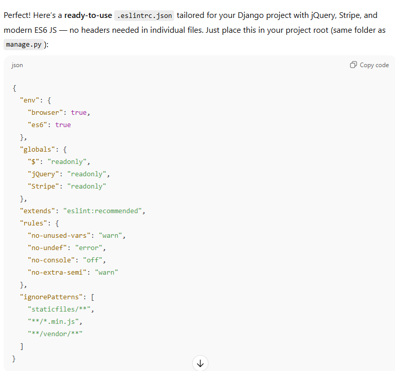

# Testing
* Frame for Testing Results copied from ChatGPT; all tests, notes, observations, screenshots done by the Developer
* Disclaimer: due to late changes to website design, and having to fix new errors eg toasts before deadline,
    testing results are more compact than previous testing file (TESTING.md).

## Pages & Core Features

- [V] Favicon displays correctly
- [V] 'Back to 'Shop' button works on all pages where it is displayed

### Navbar & Logo
- [V] Logo displays correctly and links to Home
- [V] All Navbar links visible, clickable, and responsive
- [V] Collapsed Navbar menu works on small screens
- [V] Search Icon displayed on all screens
- [V] Search Bar opens correctly via Search Icon
- [V] Search Bar: placeholder visible, disappears on typing
- [V] Search Bar: returns correct results for valid input
- [V] Search Bar: error message for empty/invalid input

### Home (Products) / Art / Photos Pages
- [V] Products display with image, name, price
- [V] Clicking product links to detail page
- [V] Filters / categories work correctly
- [V] Responsive layout on all screen sizes

### How To...? Page
- [V] All links open the correct video
- [V] Video opens in a new tab
- [V] Layout and links responsive

### Contact Us Page
- [V] Form fields display (Full Name, Email, Subject, Message)
- [V] Required validation works for all fields
- [V] Confirmation message appears after submission

### Newsletter
- [V] Email field visible and required
- [V] Confirmation message appears after submitting
- [V] Error message for invalid email

### 404 Page
- [V] Custom error page displayed
- [V] Link back to Home works

## User Account

### Sign In / Sign Out
- [V] Accessible from Navbar
- [V] Required fields validation
- [V] Incorrect credentials handled
- [V] Sign Out works

### Sign Up
- [V] Accessible from Sign In page and User Dropdown Menu
- [V] Required fields validation
- [V] Confirmation appears after sign up

### Profile
- [V] Editable postage info fields
- [V] Update notification appears
- [V] Order history accessible

## Cart & Checkout

### Cart
- [V] Add to Cart works
- [V] Toast notification re added to cart works correctly
- [V] Update Quantity works and updates total
- [V] Remove item works
- [V] Free postage message appears correctly

### Checkout
- [V] All required fields validated
- [V] Payment & order submission works
- [V] Confirmation page displays order summary
- [V] Links back to Home/Profile work

## Admin / Product Management

- [V] Admin Sign In works
- [V] Product Management: add, edit, delete products - it worked at the time of testing.
        Did not try within past few days due to time constraint, and previously 
        django added an extra code to products, which caused img not being displayed.
- [V] Product images display correctly
- [V] Orders & users viewable
- [V] Links and navigation work as expected

## UI / Responsiveness / Visuals

- [V] Branding colors consistent (blue, black, white)
- [V] Fonts readable
- [V] Layout responsive on desktop, tablet, mobile
- [V] Buttons hover states consistent
- [V] Navbar items lifted on hover
- [V] Forms styled consistently and following similar theme
- [V] Toasts / notifications readable, usually displayed a few seconds
- [V] Images display correctly in galleries, products, toasts

## Automatic Testing/Validation

- [V] ESLint set up for JS testing (all steps and code learned from ChatGPT):
    ### Set up JS automatic testing:
    

    ### Check all JS files - Run ESLint:
    npx eslint .

    ### Auto-fix minor JS issues:
    npx eslint . --fix

## Notes / Screenshots
