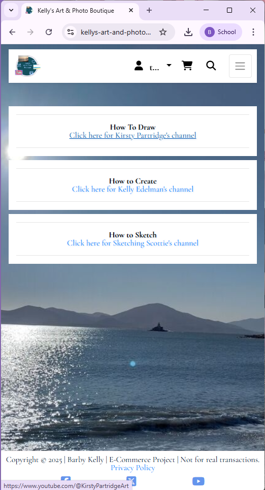
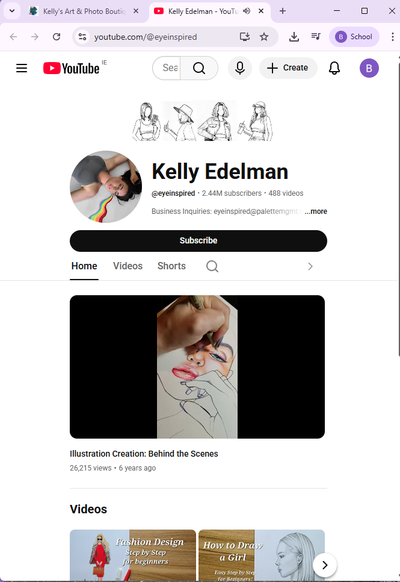
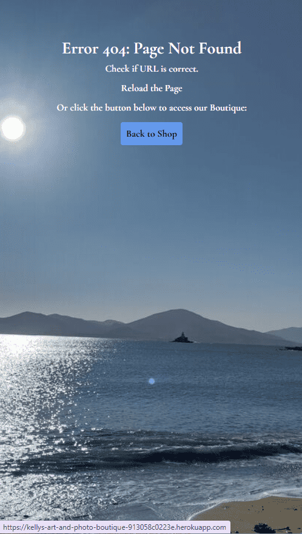

# Testing

_Frame for Testing Results adapted from ChatGPT._ 
All tests, notes, observations, and screenshots created by the developer

**Disclaimer:**
Due to late changes to website design before submission,
testing results are more compact than previous testing file (TESTING.md).

## Pages & Core Features

- [V] Favicon displays correctly
- [V] 'Back to Shop' buttons work on all pages where displayed

### Navbar & Logo

- [V] Logo displays correctly and links to Home
- [V] All Navbar NavLinks and Icons are visible, clickable, and responsive to screen size
    - [V] Collapsed Navbar/Burger Menu displayed on smaller screens
    - [V] Navbar with all NavLinks and Icons displays on larger screens
- [V] Collapsed Navbar menu works on smaller screens
    - [V] Items are highlighted on hover
- [V] Search Icon displays on all screens
- [V] Search Bar opens correctly via Search Icon
- [V] Search Bar placeholder is visible and disappears on typing
- [V] Search Bar returns correct results for valid input (except **Known Bugs** referred to in README)
- [V] Search Bar displays error message for empty/invalid input

### Home / Products Page

- [V] Products display with image, name, price, author, category badge

    

- [V] Products include categories of Art and Photos

- [V] Clicking a product opens the Product Detail page

    

- [V] Filtering products by sorting, badges, categories works

    

- [V] layout is responsive on all screen sizes

### How To...? Page

- [V] All links open the correct YouTube video in a new tab
- [V] Kelly's Art & Photo Boutique remains open in the previous tab
- [V] Layout and links responsive
- [V] Corresponding YouTube link appears bottom left when user hovers over a link

    
    

### Newsletter

- [V] Email field visible and required
- [V] Confirmation message appears after submitting
- [V] Error message displays for invalid email
- [V] Confirmation email is received
- [V] Subscribers are saved in Django, accessible only by Admin

### Contact Us Page

- [V] Form fields display: Full Name, Email, Subject, Message
- [V] Required field validation functions as expected
- [V] Confirmation message appears after submission
- [V] Messages are saved in Django, accessible only by Admin

## User Icon & Authentication

- [V] Accessible from Navbar
- [V] Dropdown menu provides options to **Sign In** and **Sign Up**

### Sign In / Sign Out

- **Sign In**

- [V] **Sign In** is accessible via **User Icon** and via link on the **Sign Up** page
- [V] **Sign Up** link opens Sign Up page
- [V] Required fields validation functions correctly
- [V] Handles incorrect credentials
- [V] **Remember Me** option functions as expected
- [V] Username displays in Navbar when signed In

- [V] **My Account** and **Sign Out** display in User menu when Signed In
- [V] **Forgot Your Password** functions as expected

- **Sign Out**

- [V] Available only when Signed In
- [V] Sign Out removes Username from Navbar
- [V] **My Account** and **Sign Out** no longer display when user is signed out

### Sign Up

- [V] Accessible via **User Icon** and via link on **Sign In** page
- [V] Required field validation functions as expected
- [V] Confirmation message appears after sign up
- [V] **Verify Your E-mail Address** page displays
    - [V] **Contact Us** link is displayed on verification page
    - [V] **Contact Us** page opens as expected via link on confirmation page

### My Profile

- [V] **Default Postage Information** fields are editable
- [V] Update notification appears after click on **Update Information**

    

- [V] Fields are not mandatory
- [V] Order history accessible
- [V] **You have no orders to date** displayed when no orders

## Cart & Checkout

### Cart

- [V] Add to Cart works
- [V] Toast notification re added to cart works correctly
- [V] Update Quantity works and updates total
- [V] Remove item works
- [V] Free postage message appears correctly

### Checkout

- [V] All required fields validated
- [V] Payment & order submission works
- [V] Confirmation page displays order summary
- [V] Buttons **Adjust Cart**, **Complete Order** work as expected
- [V] Screenshot demonstrating **Free Postage** working based on **Cart Total**
- [V] On longer pages such as **Checkout**, the fixed Navbar remains visible while the page content scrolls beneath it,
    creating an elegant scrolling effect

### 404 Page

- [V] Custom error page displayed
- [V] Hover effect on button **Back to Shop** works
- [V] Boutique's website link displayed bottom left during button hover
- [V] **Back to Shop** brings user back to Home page

    
    

## Admin / Product Management

- [V] Admin Sign In works
- [V] Product Management: add, edit, delete products, works as expected
- [V] Product images display correctly
- [V] Orders & users viewable via Django Admin
- [V] Links and navigation work as expected

## UI / Responsiveness / Visuals

- [V] Branding colors consistent
- [V] Fonts readable
- [V] Layout responsive in general on desktop, tablet, mobile (with some **Known Bugs** mentioned in README)
- [V] Buttons hover states consistent for most buttons
- [V] Navbar items lifted on hover
- [V] Forms styled consistently and following similar theme
- [V] Toasts / notifications readable, usually displayed for a few seconds
- [V] Images display correctly in galleries, products, toasts

## Automatic Testing/Validation

- [V] ESLint set up for JS testing (all steps and code learned from ChatGPT):
    ### Set up JS automatic testing:
    

    ### Check all JS files - Run ESLint:
    npx eslint .

    ### Auto-fix minor JS issues:
    npx eslint . --fix

## Extra Notes/Screenshots

### Dropdown Menus

- On smaller screens: **Burger Menu**

- On larger screens: **Art Menu** and **Photos Menu**:

    
    

- On all screens: **User Menu**

    
    

